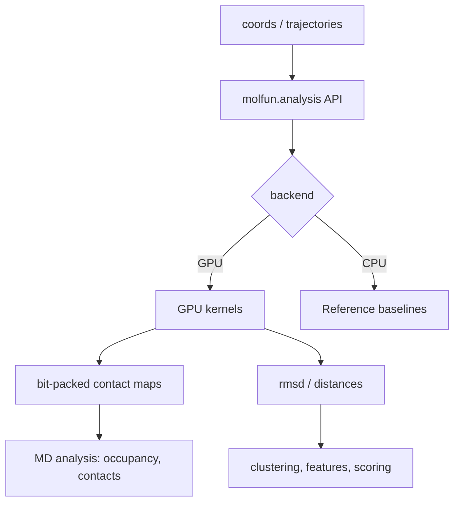

# Molfun — GPU Kernels for Molecular Modeling


[](./LICENSE)
[](#installation)
[](#requirements)
[](https://github.com/astral-sh/ruff)

**Molfun** is an open-source library that provides **high-performance GPU kernels** for **molecular modeling & molecular dynamics (MD) analysis**.

The goal is simple: accelerate a small set of foundational primitives (distances, RMSD, contact queries) so downstream tasks—trajectory analysis, clustering, docking scoring, and ML feature generation—become faster and more scalable.

---

## Why Molfun?

Molecular modeling pipelines spend a surprising amount of time on a small set of repeated operations:

- distance computation & thresholding
- RMSD / batch RMSD
- contact maps & contact occupancy
- centroids / radius of gyration
- neighbor-style queries & sparse edge lists (roadmap)

Molfun focuses on accelerating these **building blocks** with careful attention to memory bandwidth and scalable batch processing.

Beyond traditional MD analysis, Molfun's optimized kernels are essential for **training and inference of protein ML models** such as:
- **AlphaFold** and structure prediction pipelines (contact map computation, distance features)
- **ESM** (Evolutionary Scale Modeling) embeddings and protein language models
- **Protenix** and other transformer-based architectures
- Any model requiring efficient geometric features from protein structures

These models rely heavily on:
- **Geometric primitives**: contact maps, pairwise distances, and structural features—operations that Molfun accelerates with GPU-optimized kernels
- **Core neural network operations**: GELU, SwiGLU, LayerNorm, and attention mechanisms—fundamental operations that Molfun optimizes through fused kernels to reduce memory traffic and kernel launch overhead

By optimizing both geometric and neural network primitives, Molfun provides end-to-end acceleration for the entire protein ML training and inference pipeline.

---

## Highlights

- GPU-first analysis primitives with:
  - coalesced memory access patterns
  - avoiding unnecessary `sqrt` where possible (use `dist2 < cutoff2`)
  - bit-packed outputs to reduce bandwidth (contact maps)
  - batch-friendly APIs (where it matters)
- Reproducible benchmarks against:
  - PyTorch baselines
  - MDAnalysis / MDTraj (CPU baselines)
- Reference implementations for correctness and testing

---

## Optimization for Protein ML Models

Molfun's GPU kernels are specifically optimized for **training and inference workflows** in modern protein ML architectures, covering both **geometric primitives** and **core neural network operations**:

### Core Neural Network Operations

Molfun provides optimized GPU kernels for fundamental operations used across all transformer-based protein models:

- **GELU activation**: Fused `Linear + GELU` kernels reduce memory traffic and kernel launch overhead
- **SwiGLU**: Optimized gated linear units (GLU) variants used in modern architectures (LLaMA, ESM-2)
- **LayerNorm**: Efficient normalization kernels with reduced synchronization overhead
- **Attention mechanisms**: Optimized attention kernels for protein sequence and structure attention

These fused operations are **critical bottlenecks** in models like ESM, AlphaFold, and ProteinX, where they can account for 30-50% of training time.

### Structure Prediction Models

**AlphaFold** and similar structure prediction models require:
- **Contact map computation** for attention mechanisms and loss functions
- **Pairwise distance features** for geometric constraints
- **Batch processing** of multiple structures during training
- **Optimized MLP blocks** (fused Linear+GELU) in the folding trunk

Molfun's bit-packed contact maps reduce memory bandwidth by **8×**, enabling larger batch sizes and faster training iterations.

### Protein Language Models

**ESM** (Evolutionary Scale Modeling) and **ProteinX** embeddings benefit from:
- **Efficient distance computation** for structural features
- **Contact map generation** for attention masks and graph construction
- **Batch RMSD** for structure-aware training objectives
- **Fused MLP operations** (Linear+GELU/SwiGLU) in transformer layers
- **Optimized LayerNorm** for sequence normalization

### Key Optimizations

- **Fused operations**: Combine Linear+GELU/SwiGLU+LayerNorm to reduce kernel launches and memory traffic
- **Memory-efficient contact maps**: Bit-packed storage reduces GPU memory usage by **8×**, allowing larger models and batch sizes
- **Batch-friendly APIs**: Process thousands of structures in parallel without CPU-GPU synchronization overhead
- **Mixed precision support**: Optimized for `float16` inference while maintaining `float32` accuracy where needed
- **Scalable to large systems**: Efficient kernels handle systems from small peptides to large protein complexes

### Integration Example

```python
# Example 1: Fused MLP for ESM/AlphaFold transformer layers
from molfun.kernels.models import fused_linear_gelu_triton

# Replace standard MLP with fused kernel
hidden_states = fused_linear_gelu_triton(hidden_states, weight, bias)

# Example 2: Contact map features for AlphaFold-style training
from molfun.kernels.analysis import contact_map_atoms_bitpack

# Generate contact maps for a batch of structures
batch_contacts = []
for coords in training_structures:
    contacts = contact_map_atoms_bitpack(coords, cutoff=8.0)
    batch_contacts.append(contacts)  # Efficient bit-packed format

# Use in model forward pass or loss computation
```

---

## Project Status

### Analysis Kernels
- ✅ Pairwise distance (GPU)
- ✅ RMSD (raw, no alignment) (GPU)
- ✅ Atomic contact map (bit-packed) (GPU)
- ✅ Batch RMSD with superposition (Kabsch) (GPU)
- ✅ MD trajectory analysis (contact maps, RMSD)

### Model Kernels
- ✅ GELU activation (GPU)
- ✅ Fused Linear+GELU (GPU)
- ✅ ESM MLP optimization (patched)
- 🚧 SwiGLU (roadmap)
- 🚧 LayerNorm (roadmap)
- 🚧 Attention mechanisms (roadmap)

---

## Architecture



---

## Requirements

- Python **3.10+**
- NVIDIA GPU + CUDA (tested with CUDA 12+)
- PyTorch (CUDA build)

> CPU-only reference implementations can exist, but the main value is the GPU kernels.

---

## Installation

### From source (recommended)

```bash
git clone https://github.com/<ORG>/<REPO>.git
cd <REPO>
pip install -e ".[dev]"
```

### Minimal install

```bash
pip install -e .
```

---

## Quickstart

### 1) Pairwise distances (GPU)

```python
import torch
from molfun.analysis import pairwise_distances

coords = torch.randn(5000, 3, device="cuda", dtype=torch.float16)
D = pairwise_distances(coords)  # [N, N]
```

### 2) RMSD (raw, no alignment)

```python
import torch
from molfun.analysis import rmsd

A = torch.randn(100000, 3, device="cuda", dtype=torch.float16)
B = A + 0.01 * torch.randn_like(A)

val = rmsd(A, B)               # scalar tensor on GPU
print(val.item())
```

### 3) Contact map (bit-packed)

```python
import torch
from molfun.analysis import contact_map_atoms_bitpack, unpack_contact_map

coords = torch.randn(10000, 3, device="cuda", dtype=torch.float16)
packed = contact_map_atoms_bitpack(coords, cutoff=8.0)  # uint8 [N, ceil(N/8)]

# Debug/validation (small N only):
dense = unpack_contact_map(packed, N=coords.shape[0])   # bool [N, N]
```

---

## Kernels

GPU kernels live under `molfun/kernels/analysis/` and are exposed via high-level APIs in `molfun/analysis/`.

### Implemented

- **Pairwise distances**: compute `D[i,j] = ||r_i - r_j||`
- **RMSD (raw)**: compute `sqrt(mean_i ||A_i - B_i||^2)`
- **Contact map (bit-packed)**: compute contacts `dist2 < cutoff2`, packed as 1 bit per pair

### Why bit-packed contact maps?

A dense `N×N` contact map costs `O(N^2)` storage and bandwidth.  
Bit-packing stores `N×ceil(N/8)` bytes (**8× smaller**), which can materially reduce GPU memory traffic.

> Note: A full atomic contact map is still **O(N²)** compute. For very large systems, residue-level maps or sparse neighbor outputs are typically more practical (roadmap).

---

## Benchmarks

Benchmarks are in `bench/` and are designed to be reproducible and honest.

### Benchmark methodology

- GPU benchmarks include a warmup phase (to exclude one-time initialization costs).
- GPU timing synchronizes before/after the timed block.
- Results typically report **steady-state** runtime (and optionally first-run latency).

### Example: Atomic contact map (bit-packed)

> Replace with your latest validated numbers.

| Case | Baseline (ms) | GPU (ms) | Speedup | Max Diff |
|------|---------------:|---------:|--------:|---------:|
| N=500, cutoff=8.0   | 0.0476 | 0.0294 | 1.62× | 0 |
| N=1000, cutoff=8.0  | 0.0470 | 0.0269 | 1.75× | 0 |
| N=2000, cutoff=8.0  | 0.0600 | 0.0279 | 2.15× | 0 |
| N=5000, cutoff=8.0  | 0.2898 | 0.0821 | 3.53× | 0 |
| N=10000, cutoff=8.0 | 1.6459 | 0.2732 | 6.03× | 1 |

**Note on “Max Diff”:** mismatches of `1` can occur for pairs extremely close to the cutoff due to floating-point rounding. We recommend validating with:
- mismatch count (XOR sum)
- distance-to-cutoff statistics for mismatched pairs

---

## Repository Layout

```text
molfun/
  analysis/                 # high-level user-facing APIs
  kernels/
    analysis/               # GPU kernels for analysis primitives
  utils/                    # helpers (packing, validation, timing)
bench/                      # reproducible benchmarks (CPU + GPU)
tests/                      # correctness tests
docs/                       # documentation (optional)
```

---

## Roadmap

### Near-term (high leverage)

- [ ] Batch RMSD (raw): `traj [M,N,3]` vs `ref [N,3]` → `rmsd [M]`
- [ ] Contact occupancy: accumulate contacts over frames (bit-packed counts)
- [ ] Residue-level contact maps (Cα / centroid) for large systems

### Mid-term

- [ ] Aligned RMSD (Kabsch) batch pipeline:
  - centroids (GPU)
  - covariance matrices (GPU)
  - small 3×3 solve (initially via high-level linear algebra on GPU)
- [ ] Sparse neighbor / edge list generation (cutoff-based)

### Long-term

- [ ] Additional geometry primitives for ML features (edges, radial bases, etc.)
- [ ] MD-adjacent kernels (careful scope)

---

## Correctness & Testing

We prioritize correctness first, then performance.

- Unit tests compare GPU outputs against reference implementations (Torch/NumPy)
- For bit-packed outputs, validation can be performed via:
  - unpack + XOR mismatch count (small N)
  - bit population counts vs baseline (larger N)

Run tests:

```bash
pytest -q
```

Run benchmarks:

```bash
python -m bench.run_all
```

---

## Contributing

Contributions are welcome—especially:
- performance improvements with clear benchmarks
- new analysis primitives with robust tests
- documentation & examples

### Contribution standards

- Include a correctness test (`tests/`)
- Include a benchmark or microbenchmark (`bench/`) for performance-related changes
- Follow formatting/linting (ruff)

---

## Reproducibility Notes

GPU performance depends on:
- GPU architecture (SM count, memory bandwidth, cache)
- CUDA / driver versions
- dtype (fp16/fp32)
- problem sizes (N, M)

We recommend reporting:
- GPU model + driver
- CUDA version
- PyTorch version
- dtype and shapes

---

## License

MIT — see [`LICENSE`](./LICENSE).

---

## Citation

If you use Molfun in academic work, please cite:

```bibtex
@software{molfun,
  title  = {Molfun: GPU Kernels for Molecular Modeling},
  author = {<YOUR NAME>},
  year   = {2026},
  url    = {https://github.com/<ORG>/<REPO>}
}
```

---

## Acknowledgments

Inspired by the idea that domain-specific performance primitives can unlock major workflow improvements when applied to scientific computing.
