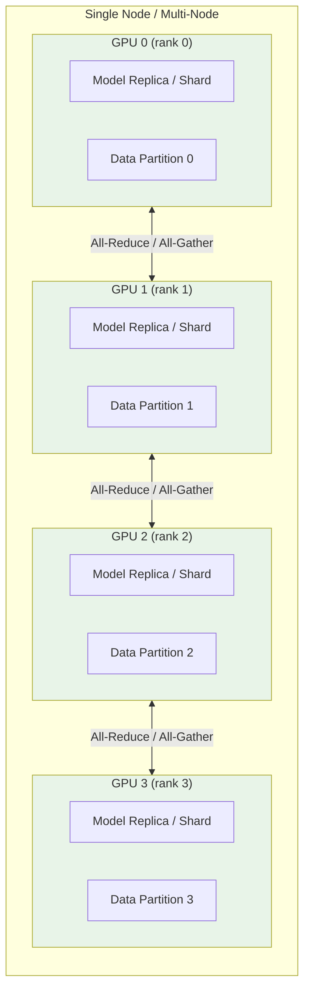
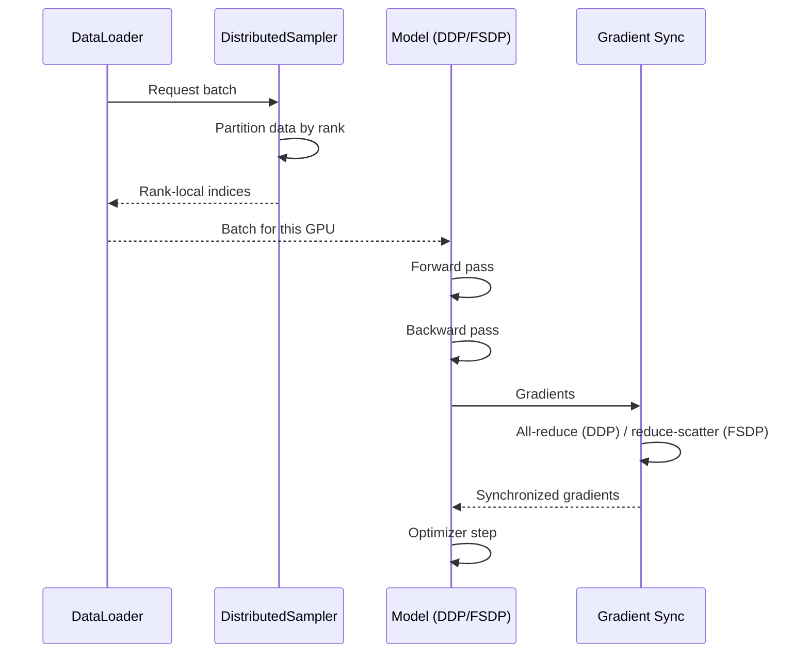

# Distributed Training

Molfun supports multi-GPU training through two strategies in `molfun.training.distributed`:

- **DDP (Distributed Data Parallel)** -- Replicates the model on each GPU and synchronizes gradients via all-reduce. Best when the model fits in a single GPU's memory.
- **FSDP (Fully Sharded Data Parallel)** -- Shards parameters, gradients, and optimizer state across GPUs. Best for large models or when maximizing per-GPU batch size.

Both strategies are decoupled from fine-tuning strategies (LoRA, Partial, Full, Head-Only) and can be combined freely.

## Architecture



## DDP -- Single Node, Multi-GPU

DDP is the simplest distributed strategy. Each GPU holds a full copy of the model; only gradients are communicated.

### Basic usage

```python
from molfun.training.distributed import DDPStrategy, launch
from molfun.training.lora import LoRAFinetune

strategy = LoRAFinetune(rank=8, lr_lora=2e-4)
dist = DDPStrategy(backend="nccl")

# Pass distributed config to fit()
strategy.fit(
    model, train_loader, val_loader,
    epochs=20,
    distributed=dist,
)
```

### Using the launcher

The `launch()` helper manages `torch.distributed` initialization and `mp.spawn` automatically:

```python
from molfun.training.distributed import DDPStrategy, launch
from molfun.training.lora import LoRAFinetune
from molfun.models import MolfunStructureModel

def train_fn(rank, world_size, dist):
    dist.setup(rank, world_size)

    model = MolfunStructureModel("openfold", weights="ckpt.pt", device=f"cuda:{rank}")
    strategy = LoRAFinetune(rank=8, lr_lora=2e-4)
    strategy.fit(model, train_loader, val_loader, epochs=20, distributed=dist)

    dist.cleanup()

launch(train_fn, DDPStrategy(backend="nccl"), world_size=4)
```

### DDPStrategy parameters

| Parameter | Default | Description |
|-----------|---------|-------------|
| `backend` | `"nccl"` | Communication backend (`nccl` for GPU, `gloo` for CPU) |
| `find_unused_parameters` | `False` | Set `True` if some parameters are not used in every forward pass |
| `gradient_as_bucket_view` | `True` | Reduces memory by viewing gradients as bucket views |
| `static_graph` | `False` | Enable optimizations when computation graph does not change between iterations |

## FSDP -- Multi-Node and Large Models

FSDP shards model parameters across GPUs, enabling training of models that exceed a single GPU's memory.

### Basic usage

```python
from molfun.training.distributed import FSDPStrategy, launch
from molfun.training.full import FullFinetune

dist = FSDPStrategy(
    backend="nccl",
    sharding_strategy="full",       # ZeRO-3: shard params + grads + optimizer
    mixed_precision="bf16",          # bf16 compute for speed
    cpu_offload=False,               # offload params to CPU between fwd/bwd
    activation_checkpointing=True,   # recompute activations to save memory
    auto_wrap_min_params=100_000,    # min params for FSDP auto-wrapping
)

strategy = FullFinetune(lr=1e-4)
strategy.fit(model, train_loader, val_loader, epochs=10, distributed=dist)
```

### Sharding strategies

| Strategy | Equivalent | What is sharded | Memory savings | Communication |
|----------|-----------|-----------------|----------------|---------------|
| `"full"` | ZeRO-3 | Params + gradients + optimizer | Maximum | Highest |
| `"shard_grad_op"` | ZeRO-2 | Gradients + optimizer | Moderate | Moderate |
| `"no_shard"` | DDP | Nothing (all replicated) | None | Lowest |

### FSDPStrategy parameters

| Parameter | Default | Description |
|-----------|---------|-------------|
| `backend` | `"nccl"` | Communication backend |
| `sharding_strategy` | `"full"` | `"full"`, `"shard_grad_op"`, or `"no_shard"` |
| `mixed_precision` | `None` | `"bf16"` or `"fp16"` for mixed-precision compute |
| `cpu_offload` | `False` | Offload parameters to CPU between forward/backward |
| `activation_checkpointing` | `False` | Recompute activations during backward to save memory |
| `auto_wrap_min_params` | `100_000` | Minimum parameter count for auto-wrapping submodules |

### Multi-node setup

For multi-node training, set the environment variables before launching:

```bash
# Node 0 (master)
export MASTER_ADDR=10.0.0.1
export MASTER_PORT=29500
torchrun --nproc_per_node=4 --nnodes=2 --node_rank=0 train.py

# Node 1
export MASTER_ADDR=10.0.0.1
export MASTER_PORT=29500
torchrun --nproc_per_node=4 --nnodes=2 --node_rank=1 train.py
```

## Gradient Checkpointing

Gradient checkpointing trades compute for memory by recomputing intermediate activations during the backward pass instead of storing them.

### With fit()

```python
strategy.fit(
    model, train_loader, val_loader,
    epochs=20,
    gradient_checkpointing=True,  # enables checkpointing on the model
)
```

### With FSDP

FSDP has built-in activation checkpointing that targets common block types (Evoformer layers, Transformer blocks, PairformerStack):

```python
dist = FSDPStrategy(
    activation_checkpointing=True,  # auto-detects block types
)
```

!!! info "Memory vs. speed trade-off"
    Gradient checkpointing typically reduces memory usage by 40--60% at the cost of ~30% slower training. This is worthwhile when it allows you to increase batch size or train larger models.

## Mixed Precision with AMP

Automatic Mixed Precision (AMP) uses lower-precision floating point (fp16/bf16) for compute while keeping master weights in fp32.

### With FSDP mixed precision

```python
dist = FSDPStrategy(
    mixed_precision="bf16",  # bf16 on Ampere+ GPUs (A100, H100)
)
```

### With training strategy AMP

```python
strategy = LoRAFinetune(
    rank=8,
    lr_lora=2e-4,
    amp=True,  # enables torch.cuda.amp.autocast + GradScaler
)
```

!!! warning "bf16 vs fp16"
    Use `bf16` on Ampere or newer GPUs (A100, H100). It has a wider dynamic range and does not require loss scaling. Use `fp16` with `GradScaler` on older GPUs (V100, T4).

## Performance Tips

### Batch size scaling

With DDP/FSDP, the effective batch size is `per_gpu_batch_size * world_size`. Scale the learning rate accordingly:

```python
world_size = 4
base_lr = 2e-4
scaled_lr = base_lr * world_size  # linear scaling rule

strategy = LoRAFinetune(rank=8, lr_lora=scaled_lr)
```

### Recommended configurations

| Model size | GPUs | Strategy | Recommended setup |
|-----------|------|----------|-------------------|
| < 500M params | 2--4 | DDP | `DDPStrategy()` + AMP |
| 500M--2B params | 4--8 | FSDP | `FSDPStrategy(sharding="shard_grad_op", mixed_precision="bf16")` |
| > 2B params | 8+ | FSDP | `FSDPStrategy(sharding="full", mixed_precision="bf16", activation_checkpointing=True)` |
| Memory-constrained | Any | FSDP | `FSDPStrategy(sharding="full", cpu_offload=True, activation_checkpointing=True)` |

### Other tips

- Set `pin_memory=True` on DataLoaders for faster host-to-device transfers.
- Use `num_workers >= 2` per GPU for data loading.
- Enable `static_graph=True` in DDP if the model graph is constant (avoids per-iteration analysis).
- Use `gradient_as_bucket_view=True` (default) to reduce DDP memory overhead.
- For FSDP, tune `auto_wrap_min_params` to match your model's block structure -- wrapping too many small modules adds communication overhead.

## Data flow


