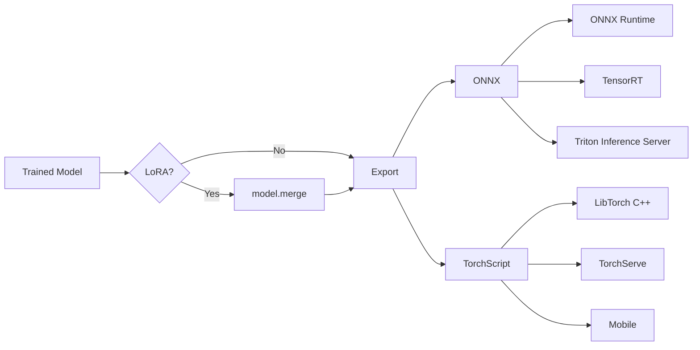

# Model Export

Molfun supports exporting trained models to **ONNX** and **TorchScript** for production deployment. Both formats enable inference without a Python runtime, on mobile devices, or with optimized serving frameworks.

## Export workflow



!!! important "Merge LoRA weights before export"
    If your model was fine-tuned with LoRA, you must call `model.merge()` before exporting. This folds the low-rank adapter weights back into the base model so the exported artifact is self-contained.

## ONNX Export

### Using the model API

```python
from molfun.models import MolfunStructureModel

model = MolfunStructureModel("openfold", weights="checkpoint.pt")
model.merge()  # if LoRA fine-tuned

path = model.export_onnx(
    "model.onnx",
    seq_len=256,        # dummy sequence length for tracing
    opset_version=17,   # ONNX opset version
    simplify=True,      # run onnx-simplifier (requires onnxsim)
    device="cpu",       # device for tracing
)
print(f"Exported to {path}")
```

### Using the functional API

```python
from molfun.export import export_onnx

path = export_onnx(
    model,
    "model.onnx",
    seq_len=256,
    opset_version=17,
    dynamic_axes={
        "aatype": {0: "batch", 1: "seq_len"},
        "residue_index": {0: "batch", 1: "seq_len"},
        "output": {0: "batch", 1: "seq_len"},
    },
    simplify=False,
    check=True,     # validate with onnx.checker
    device="cpu",
)
```

### Parameters

| Parameter | Default | Description |
|-----------|---------|-------------|
| `path` | (required) | Output `.onnx` file path |
| `seq_len` | `256` | Sequence length for the dummy tracing input |
| `opset_version` | `17` | ONNX opset version |
| `dynamic_axes` | Auto | Custom dynamic axes mapping; defaults to dynamic batch and seq_len |
| `simplify` | `False` | Run onnx-simplifier after export (requires `pip install onnxsim`) |
| `check` | `True` | Validate the exported model with `onnx.checker` |
| `device` | `"cpu"` | Device for tracing |

### Inference with ONNX Runtime

```python
import onnxruntime as ort
import numpy as np

session = ort.InferenceSession("model.onnx")

aatype = np.zeros((1, 128), dtype=np.int64)
residue_index = np.arange(128, dtype=np.int64).reshape(1, -1)

outputs = session.run(None, {
    "aatype": aatype,
    "residue_index": residue_index,
})

embeddings = outputs[0]  # shape: [1, 128, hidden_dim]
```

## TorchScript Export

### Using the model API

```python
from molfun.models import MolfunStructureModel

model = MolfunStructureModel("openfold", weights="checkpoint.pt")
model.merge()

path = model.export_torchscript(
    "model.pt",
    seq_len=256,
    mode="trace",      # "trace" or "script"
    optimize=True,     # apply torch.jit.optimize_for_inference
    device="cpu",
)
```

### Using the functional API

```python
from molfun.export import export_torchscript

path = export_torchscript(
    model,
    "model.pt",
    seq_len=256,
    mode="trace",
    optimize=True,
    check=True,     # run a validation forward pass after export
    device="cpu",
)
```

### Trace vs Script mode

| Mode | How it works | Best for |
|------|-------------|----------|
| `trace` | Records operations from a sample input | Models with fixed control flow (most protein models) |
| `script` | Analyzes Python code statically | Models with dynamic control flow (if/else on input) |

!!! tip "Use trace mode for protein models"
    Protein structure models (OpenFold, ESMFold) have largely fixed computation graphs, making `trace` the safer and more compatible option.

### Parameters

| Parameter | Default | Description |
|-----------|---------|-------------|
| `path` | (required) | Output `.pt` file path |
| `seq_len` | `256` | Sequence length for the tracing dummy input |
| `mode` | `"trace"` | `"trace"` (default, more compatible) or `"script"` |
| `optimize` | `True` | Apply `torch.jit.optimize_for_inference` |
| `check` | `True` | Run a validation forward pass after export |
| `device` | `"cpu"` | Device for tracing |

### Inference with TorchScript

```python
import torch

# Load -- no molfun installation needed
model = torch.jit.load("model.pt", map_location="cuda:0")

aatype = torch.zeros(1, 128, dtype=torch.long, device="cuda:0")
residue_index = torch.arange(128, device="cuda:0").unsqueeze(0)

with torch.no_grad():
    output = model(aatype, residue_index)
```

### C++ inference with LibTorch

```cpp
#include <torch/script.h>

int main() {
    torch::jit::script::Module model = torch::jit::load("model.pt");
    model.to(torch::kCUDA);

    auto aatype = torch::zeros({1, 128}, torch::dtype(torch::kLong).device(torch::kCUDA));
    auto residue_index = torch::arange(128, torch::dtype(torch::kLong).device(torch::kCUDA))
                            .unsqueeze(0);

    auto output = model.forward({aatype, residue_index}).toTensor();
    std::cout << "Output shape: " << output.sizes() << std::endl;
    return 0;
}
```

## Model optimization and simplification

### ONNX simplification

The `simplify=True` flag runs [onnx-simplifier](https://github.com/daquexian/onnx-simplifier), which:

- Folds constant expressions
- Eliminates redundant nodes
- Simplifies the graph structure

```bash
pip install onnxsim
```

### TorchScript optimization

The `optimize=True` flag applies `torch.jit.optimize_for_inference`, which:

- Fuses operations (Conv+BN, Linear+ReLU)
- Eliminates dead code
- Optimizes memory layout

## Deployment considerations

| Consideration | ONNX | TorchScript |
|--------------|------|-------------|
| **Runtime** | ONNX Runtime, TensorRT, OpenVINO | LibTorch (C++/Python), TorchServe |
| **Dynamic shapes** | Supported via dynamic_axes | Supported natively with trace |
| **Quantization** | ONNX Runtime quantization tools | `torch.quantization` |
| **Mobile** | ONNX Runtime Mobile | PyTorch Mobile / ExecuTorch |
| **GPU optimization** | TensorRT acceleration | `optimize_for_inference` |
| **No Python needed** | Yes | Yes (LibTorch C++) |

!!! tip "Which format to choose"
    - Use **ONNX** if you need cross-framework compatibility or TensorRT acceleration.
    - Use **TorchScript** if you are deploying within the PyTorch ecosystem or need C++ integration via LibTorch.
