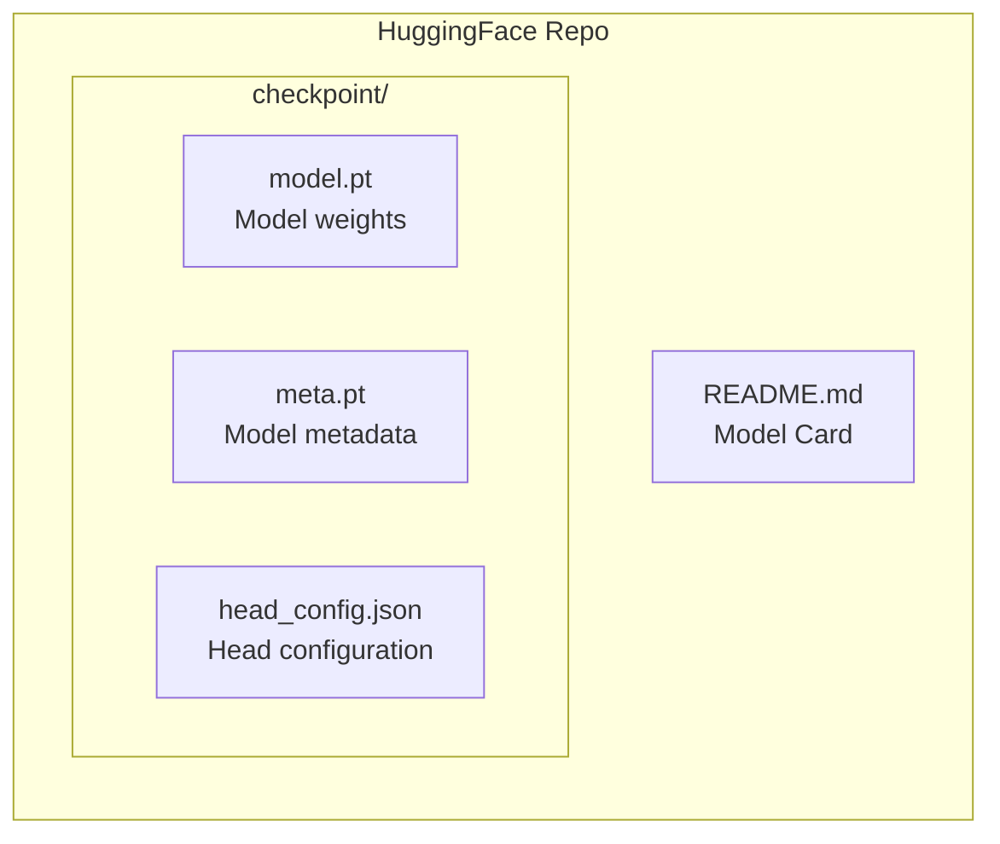

# HuggingFace Hub

Molfun integrates with [HuggingFace Hub](https://huggingface.co) for sharing and loading trained models. Push fine-tuned models with auto-generated model cards, and pull them back with a single line of code.

## Push a model to Hub

```python
from molfun.models import MolfunStructureModel

model = MolfunStructureModel("openfold", weights="checkpoint.pt", head="affinity")

# Train your model...
# strategy.fit(model, train_loader, val_loader, epochs=20)

url = model.push_to_hub(
    repo_id="username/kinase-affinity-lora",
    token="hf_...",                    # or set HF_TOKEN env var
    private=False,
    metrics={"mae": 0.42, "r2": 0.89},
    dataset_name="kinases_human",
    commit_message="LoRA fine-tune on human kinase affinity",
)
print(f"Model uploaded: {url}")
```

### Parameters

| Parameter | Default | Description |
|-----------|---------|-------------|
| `repo_id` | (required) | Hub repo in `"user/model-name"` format |
| `token` | `None` | HuggingFace API token; falls back to `HF_TOKEN` env var |
| `private` | `False` | Create the repo as private |
| `metrics` | `None` | Dict of evaluation metrics to include in the model card |
| `dataset_name` | `None` | Training dataset name for the model card |
| `commit_message` | `"Upload Molfun model"` | Git commit message for the upload |

### What gets uploaded



The upload includes:

- **Model weights** -- Full checkpoint saved by `model.save()`
- **Metadata** (`meta.pt`) -- Backend name, config preset, head type
- **Model card** (`README.md`) -- Auto-generated card with model summary, metrics, and dataset info

## Pull a model from Hub

```python
from molfun.models import MolfunStructureModel

model = MolfunStructureModel.from_hub(
    repo_id="username/kinase-affinity-lora",
    token="hf_...",         # optional for public repos
    revision="main",        # branch, tag, or commit hash
    device="cuda:0",
    head="affinity",        # override saved head (optional)
    head_config={"dim": 128},  # override head config (optional)
)

output = model.predict(batch)
```

### Parameters

| Parameter | Default | Description |
|-----------|---------|-------------|
| `repo_id` | (required) | Hub repo in `"user/model-name"` format |
| `token` | `None` | HuggingFace API token (required for private repos) |
| `revision` | `None` | Git revision -- branch name, tag, or commit hash |
| `device` | `"cpu"` | Target device for the loaded model |
| `head` | `None` | Override the saved prediction head |
| `head_config` | `None` | Override the saved head configuration |

## Model cards

Molfun auto-generates a HuggingFace model card when you push to Hub. The card includes:

- Model architecture summary (backend, parameters, head type)
- Fine-tuning strategy used
- Evaluation metrics (if provided)
- Dataset information (if provided)
- Usage example code

!!! tip "Custom model cards"
    The auto-generated card is a starting point. You can edit it directly on HuggingFace Hub or push an updated `README.md` to the repo.

## Private repositories

Create private repos by setting `private=True`:

```python
url = model.push_to_hub(
    repo_id="my-org/proprietary-model",
    private=True,
    token="hf_...",
)
```

To access private repos when loading:

```python
model = MolfunStructureModel.from_hub(
    repo_id="my-org/proprietary-model",
    token="hf_...",  # required for private repos
)
```

You can also set the token via environment variable to avoid passing it explicitly:

```bash
export HF_TOKEN=hf_...
```

## Version management with revisions

Use Git branches and tags to manage model versions on Hub:

```python
# Push to a specific branch
model.push_to_hub(
    repo_id="username/my-model",
    commit_message="v2: retrained with larger dataset",
)

# Pull a specific version
model_v1 = MolfunStructureModel.from_hub(
    "username/my-model",
    revision="v1.0",              # tag
)

model_latest = MolfunStructureModel.from_hub(
    "username/my-model",
    revision="main",              # branch (default)
)

model_exact = MolfunStructureModel.from_hub(
    "username/my-model",
    revision="a1b2c3d",           # commit hash
)
```

## Push from a pipeline

The built-in `push_step` integrates Hub uploads into pipeline workflows:

```yaml
# recipe.yaml
type: finetune
model: openfold

steps:
  - name: train
    fn: molfun.pipelines.steps.train_step
    config:
      strategy: lora
      epochs: 20

  - name: save
    fn: molfun.pipelines.steps.save_step
    config:
      checkpoint_dir: runs/my_experiment

  - name: push
    fn: molfun.pipelines.steps.push_step
    config:
      repo: username/my-model
      private: false
      message: "Pipeline upload"
```

See the [Pipeline Framework](pipelines.md) page for details on YAML recipes.

## End-to-end example

```python
from molfun.models import MolfunStructureModel
from molfun.training.lora import LoRAFinetune

# 1. Train
model = MolfunStructureModel("openfold", weights="pretrained.pt", head="affinity")
strategy = LoRAFinetune(rank=8, lr_lora=2e-4)
history = strategy.fit(model, train_loader, val_loader, epochs=20)

# 2. Evaluate
metrics = {"mae": 0.42, "pearson": 0.91}

# 3. Push
url = model.push_to_hub(
    "username/kinase-affinity-lora",
    metrics=metrics,
    dataset_name="kinases_human",
)

# 4. Someone else loads it
model = MolfunStructureModel.from_hub("username/kinase-affinity-lora", device="cuda:0")
output = model.predict(batch)
```
