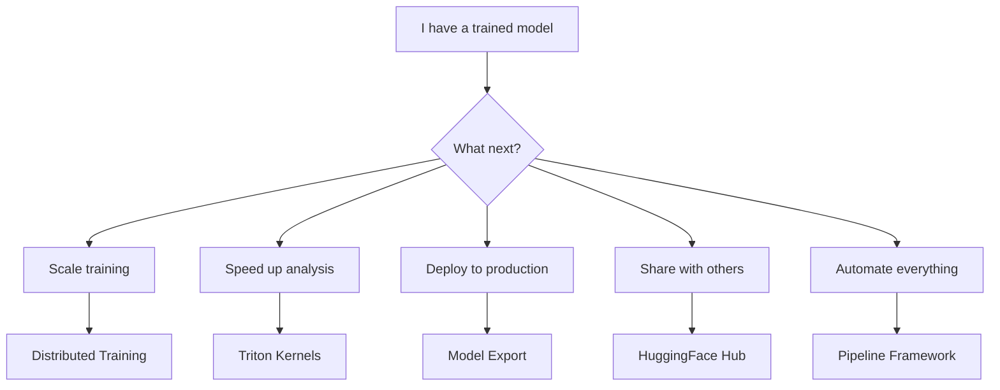

# Advanced Topics

This section covers advanced features of Molfun for scaling training, accelerating computation, deploying models, and building reproducible workflows.

## Topics

| Page | Description |
|------|-------------|
| [Distributed Training](distributed.md) | Multi-GPU training with DDP and FSDP, gradient checkpointing, mixed precision |
| [Triton Kernels](kernels.md) | Custom GPU kernels for analysis (RMSD, contact maps) and model operations (fused LayerNorm, GELU) |
| [Model Export](export.md) | Export models to ONNX and TorchScript for production deployment |
| [HuggingFace Hub](hub.md) | Push and pull models from HuggingFace Hub, model cards, versioning |
| [Pipeline Framework](pipelines.md) | Reproducible end-to-end workflows with YAML recipes |

## When to use what

!!! tip "Getting started"
    If you are new to Molfun, start with the [Getting Started](../getting-started/index.md) guide first.
    These advanced topics assume familiarity with the core API (`MolfunStructureModel`, fine-tuning strategies, and data loading).
