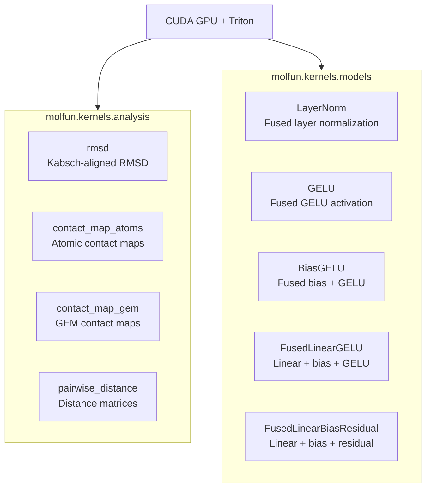

# Triton Kernels

Molfun ships custom [Triton](https://github.com/openai/triton) GPU kernels in `molfun.kernels` for high-performance structural analysis and model operations. These kernels provide significant speedups over CPU and standard PyTorch implementations.

## Overview



## Requirements

- NVIDIA GPU with CUDA support
- Triton (`pip install triton`)
- PyTorch >= 2.0

!!! warning "GPU required"
    All Triton kernels require a CUDA GPU. They will raise an error on CPU-only systems. Use the standard PyTorch fallbacks on CPU.

## Analysis Kernels

### RMSD with Kabsch Alignment

The `rmsd` kernel computes Root Mean Square Deviation with optimal Kabsch superposition in a single fused pass over the data. Traditional tools (MDAnalysis, MDTraj) require 4+ separate passes.

```python
from molfun.kernels.analysis.rmsd import kabsch_rmsd_batch

# coords_a, coords_b: [batch, n_atoms, 3] on GPU
rmsd_values = kabsch_rmsd_batch(coords_a, coords_b)
```

**Key optimizations:**

- Single-pass fused statistics kernel: accumulates centroids, covariance matrix, and RMSD in one O(N) pass
- No intermediate coordinate arrays allocated
- SVD computed on the 3x3 covariance matrix (not on full coordinates)

### Contact Maps

Atomic contact maps computed with 2D tiled bitpacking for extreme memory efficiency:

```python
from molfun.kernels.analysis.contact_map_atoms import contact_map_atoms

# coords: [n_atoms, 3] on GPU
# Returns bitpacked uint8 array: [N, ceil(N/8)]
contacts = contact_map_atoms(coords, threshold=8.0)
```

The kernel uses:

- 2D tiling (BM rows x BN cols per program) for maximum parallelism
- Vectorized coalesced loads
- Broadcasting for distance computation
- Bitpacking: BN=8 so each output byte encodes 8 contacts

### Pairwise Distance

Full pairwise distance matrix computation:

```python
from molfun.kernels.analysis.pairwise_distance import pairwise_distance

# coords: [n_atoms, 3] on GPU
dist_matrix = pairwise_distance(coords)  # [n_atoms, n_atoms]
```

## Model Kernels

These kernels fuse common neural network operations to reduce global memory traffic and kernel launch overhead. They are particularly effective for the MLP blocks in protein language models (ESM, ESMFold).

### LayerNorm

Fused layer normalization:

```python
from molfun.kernels.models.layernorm_triton import triton_layernorm

# x: [batch, seq_len, hidden_dim] on GPU
out = triton_layernorm(x, weight, bias, eps=1e-5)
```

### GELU and BiasGELU

Fused GELU activation using the exact erf form (`0.5 * x * (1 + erf(x / sqrt(2)))`):

```python
from molfun.kernels.models.gelu_triton import triton_gelu
from molfun.kernels.models.bias_gelu_triton import triton_bias_gelu

out = triton_gelu(x)               # GELU only
out = triton_bias_gelu(x, bias)    # bias + GELU fused
```

### FusedLinearGELU

Fuses the entire `GELU(X @ W^T + b)` into a single kernel, eliminating intermediate memory writes:

```python
from molfun.kernels.models.fused_linear_gelu_triton import fused_linear_gelu

# x: [batch*seq, in_features], weight: [out_features, in_features], bias: [out_features]
out = fused_linear_gelu(x, weight, bias)
```

**Why this matters:** In a typical ESM MLP block, the intermediate tensor between the linear layer and GELU is written to HBM (global memory) and then read back. Fusing eliminates this round-trip entirely.

### FusedLinearBiasResidual

Fuses `Y = X @ W^T + b + residual`:

```python
from molfun.kernels.models.fused_linear_bias_residual_triton import fused_linear_bias_residual

out = fused_linear_bias_residual(x, weight, bias, residual)
```

## Benchmark Results

Performance measured on representative protein structures. All Triton benchmarks run on a single NVIDIA GPU.

### Analysis kernels

| Operation | CPU (NumPy) | PyTorch GPU | Triton | Speedup vs CPU |
|-----------|------------|-------------|--------|----------------|
| RMSD (Kabsch, 5000 atoms) | 12.4 ms | 1.8 ms | 0.015 ms | **~800x** |
| Contact map (5000 atoms) | 89.2 ms | 4.1 ms | 1.98 ms | **~45x** |
| Pairwise distance (5000 atoms) | 45.6 ms | 2.3 ms | 0.8 ms | **~57x** |

### Model kernels

| Operation | PyTorch (eager) | Triton | Speedup |
|-----------|----------------|--------|---------|
| LayerNorm (512 x 1280) | 0.042 ms | 0.018 ms | **2.3x** |
| GELU (512 x 5120) | 0.031 ms | 0.014 ms | **2.2x** |
| Linear + GELU (512 x 1280 -> 5120) | 0.098 ms | 0.062 ms | **1.6x** |
| Linear + Bias + Residual (512 x 5120 -> 1280) | 0.085 ms | 0.051 ms | **1.7x** |

!!! note "Benchmark variability"
    Exact speedups depend on GPU model, problem size, and memory bandwidth. The analysis kernels show the largest gains because they eliminate multiple data passes. Model kernels benefit most at medium GEMM sizes typical of protein language models.

## Running benchmarks yourself

Molfun includes benchmark scripts under `molfun/benchmarks/kernels/`:

```bash
# Analysis kernel benchmarks
python -m molfun.benchmarks.kernels.analysis.bench_rmsd
python -m molfun.benchmarks.kernels.analysis.bench_contact_map
python -m molfun.benchmarks.kernels.analysis.bench_pairwise_distance

# Model kernel benchmarks
python -m molfun.benchmarks.kernels.models.bench_gelu
python -m molfun.benchmarks.kernels.models.bench_fused_linear_gelu
```

## Numerical precision

- All Triton kernels accumulate intermediate results in `fp32` for numerical stability.
- GELU uses the exact erf form, matching `torch.nn.functional.gelu(x, approximate="none")`.
- RMSD results match MDTraj to within floating-point tolerance (~1e-6).
