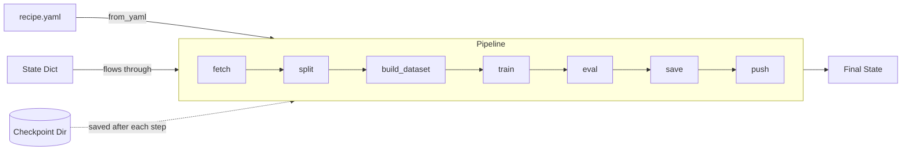
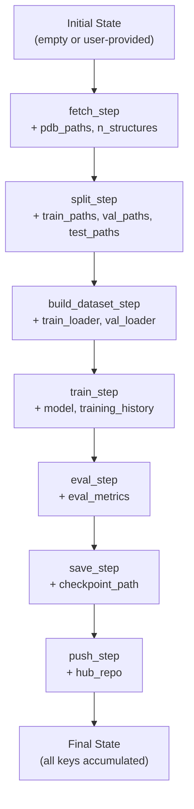

# Pipeline Framework

Molfun pipelines (`molfun.pipelines`) provide a composable, checkpointed framework for building reproducible end-to-end protein ML workflows. Define your workflow as an ordered list of steps -- either programmatically or from a YAML recipe.

## Architecture



Each step is a plain function with signature `dict -> dict`. State flows through steps, with each step receiving the merged state (previous output + step config) and returning the updated state.

## Quick start

### From YAML

```python
from molfun.pipelines import Pipeline

pipeline = Pipeline.from_yaml("recipe.yaml")
result = pipeline.run()
```

### Programmatic

```python
from molfun.pipelines import Pipeline, PipelineStep
from molfun.pipelines.steps import fetch_step, split_step, train_step, eval_step

pipeline = Pipeline([
    PipelineStep("fetch",  fetch_step,  config={"ec_number": "2.7.11"}),
    PipelineStep("split",  split_step,  config={"val_frac": 0.1}),
    PipelineStep("train",  train_step,  config={"strategy": "lora", "epochs": 20}),
    PipelineStep("eval",   eval_step),
])

result = pipeline.run()
print(result["eval_metrics"])
```

## YAML recipe format

```yaml
type: finetune            # finetune | train | inference | data | custom
model: openfold           # backend: openfold, random_forest, svm, ...
checkpoint_dir: runs/my_experiment   # optional: save state after each step

steps:
  - name: fetch
    fn: molfun.pipelines.steps.fetch_step
    config:
      ec_number: "2.7.11"
      max_structures: 200
      resolution_max: 2.5
      fmt: cif

  - name: split
    fn: molfun.pipelines.steps.split_step
    config:
      val_frac: 0.1
      test_frac: 0.1
      seed: 42

  - name: build_dataset
    fn: molfun.pipelines.steps.build_dataset_step
    config:
      max_seq_len: 256
      batch_size: 1

  - name: train
    fn: molfun.pipelines.steps.train_step
    config:
      strategy: lora
      epochs: 20
      lr: 0.0002
      rank: 8
      device: cuda

  - name: eval
    fn: molfun.pipelines.steps.eval_step

  - name: save
    fn: molfun.pipelines.steps.save_step
    config:
      checkpoint_dir: runs/my_experiment

  - name: push
    fn: molfun.pipelines.steps.push_step
    config:
      repo: username/my-model
      private: false
```

### Recipe fields

| Field | Required | Description |
|-------|----------|-------------|
| `type` | No | Pipeline type: `finetune`, `train`, `inference`, `data`, `custom` |
| `model` | No | Model backend name (auto-injected as `model_name` into step configs) |
| `checkpoint_dir` | No | Directory for saving state JSON after each step |
| `steps` | Yes | Ordered list of step definitions |

### Step fields

| Field | Required | Description |
|-------|----------|-------------|
| `name` | Yes | Unique step name |
| `fn` | Yes | Dotted import path to the step function |
| `config` | No | Static configuration merged into the state before the step runs |
| `skip` | No | Set `true` to skip this step |

## Built-in steps

### Structure fine-tuning steps

| Step | Function | Purpose |
|------|----------|---------|
| `fetch` | `molfun.pipelines.steps.fetch_step` | Download PDB structures from RCSB |
| `split` | `molfun.pipelines.steps.split_step` | Train/val/test split |
| `build_dataset` | `molfun.pipelines.steps.build_dataset_step` | Create `StructureDataset` + DataLoaders |
| `train` | `molfun.pipelines.steps.train_step` | Fine-tune with a chosen strategy (lora, partial, full, head_only) |
| `eval` | `molfun.pipelines.steps.eval_step` | Evaluate on test/validation set |
| `save` | `molfun.pipelines.steps.save_step` | Save model checkpoint to disk |
| `push` | `molfun.pipelines.steps.push_step` | Push model to HuggingFace Hub |

### Classical ML steps

| Step | Function | Purpose |
|------|----------|---------|
| `load_dataset` | `molfun.pipelines.steps.load_dataset_step` | Load a `PropertyDataset` from CSV, inline data, or fetched PDBs |
| `featurize` | `molfun.pipelines.steps.featurize_step` | Extract numerical features from protein sequences |
| `split_sklearn` | `molfun.pipelines.steps.split_sklearn_step` | Train/test split for sklearn |
| `train_sklearn` | `molfun.pipelines.steps.train_sklearn_step` | Train a classical ML model (random_forest, svm, linear) |
| `eval_sklearn` | `molfun.pipelines.steps.eval_sklearn_step` | Evaluate a trained sklearn model |
| `save_sklearn` | `molfun.pipelines.steps.save_sklearn_step` | Save sklearn model to disk (joblib) |

### Property head steps

| Step | Function | Purpose |
|------|----------|---------|
| `extract_embeddings` | `molfun.pipelines.steps.extract_embeddings_step` | Extract embeddings from a structure model backbone |
| `train_head` | `molfun.pipelines.steps.train_head_step` | Train a property prediction head on embeddings |
| `eval_head` | `molfun.pipelines.steps.eval_head_step` | Evaluate a property head |

## Custom step registration

Write your own steps by following the `dict -> dict` contract:

```python
from molfun.pipelines import Pipeline, PipelineStep

def my_custom_step(state: dict) -> dict:
    """Custom step that does something with the state."""
    sequences = state["sequences"]
    threshold = state.get("threshold", 0.5)

    # Do your work...
    filtered = [s for s in sequences if len(s) > 100]

    return {**state, "filtered_sequences": filtered, "n_filtered": len(filtered)}

pipeline = Pipeline([
    PipelineStep("fetch",  fetch_step, config={"ec_number": "2.7.11"}),
    PipelineStep("filter", my_custom_step, config={"threshold": 0.7}),
    PipelineStep("train",  train_step, config={"strategy": "lora"}),
])
```

!!! tip "Step function contract"
    A step function receives a single `dict` (merged state + config) and must return a `dict` with the updated state. Always use `{**state, ...}` to preserve existing keys.

## Pipeline operations

### Run from the beginning

```python
result = pipeline.run()
```

### Run with initial state

```python
result = pipeline.run(state={"device": "cuda", "weights": "pretrained.pt"})
```

### Resume from a specific step

```python
# Load saved state from a checkpoint
import json
saved_state = json.loads(open("runs/my_experiment/state_after_split.json").read())

# Resume from the train step
result = pipeline.run_from("train", saved_state)
```

### Dry run

```python
# See which steps would execute (excluding skipped ones)
steps = pipeline.dry_run()
print(steps)  # ['fetch', 'split', 'train', 'eval']
```

### Skip steps

```python
pipeline = Pipeline([
    PipelineStep("fetch",  fetch_step,  config={...}),
    PipelineStep("split",  split_step,  config={...}, skip=True),  # will be skipped
    PipelineStep("train",  train_step,  config={...}),
])
```

### Describe pipeline

```python
desc = pipeline.describe()
# Returns a serializable dict with type, model, and step details
```

## CLI overrides

Pass overrides to `from_yaml` that are merged into every step's config:

```python
pipeline = Pipeline.from_yaml(
    "recipe.yaml",
    device="cuda:1",       # override device for all steps
    epochs=50,             # override epochs
)
```

## Checkpointing

When `checkpoint_dir` is set, state is saved as JSON after each step:

```
runs/my_experiment/
    state_after_fetch.json
    state_after_split.json
    state_after_train.json
    state_after_eval.json
```

Non-serializable objects (models, tensors, DataLoaders) are recorded as `"<ClassName>"` placeholders. Use `run_from()` with the saved state to resume.

!!! note "Checkpoint limitations"
    JSON checkpoints only capture serializable values. Model weights and DataLoaders cannot be serialized to JSON -- only their type names are recorded. To fully resume, you need the model checkpoint saved by `save_step`.

## Hooks

Register callbacks for step lifecycle events:

```python
def on_start(name, state):
    print(f"Starting step: {name}")

def on_end(name, state, result):
    print(f"Finished {name} in {result.elapsed_s:.1f}s")

pipeline = Pipeline(
    steps=[...],
    hooks={
        "on_step_start": on_start,
        "on_step_end": on_end,
    },
)
```

## Example: end-to-end fine-tuning pipeline

```yaml
# finetune_kinases.yaml
type: finetune
model: openfold
checkpoint_dir: runs/kinase_finetune

steps:
  - name: fetch
    fn: molfun.pipelines.steps.fetch_step
    config:
      ec_number: "2.7.11"
      max_structures: 500
      resolution_max: 2.5
      deduplicate: true
      identity: 0.3

  - name: split
    fn: molfun.pipelines.steps.split_step
    config:
      val_frac: 0.1
      test_frac: 0.1

  - name: build_dataset
    fn: molfun.pipelines.steps.build_dataset_step
    config:
      max_seq_len: 256
      batch_size: 1

  - name: train
    fn: molfun.pipelines.steps.train_step
    config:
      strategy: lora
      rank: 8
      epochs: 20
      lr: 0.0002
      device: cuda

  - name: eval
    fn: molfun.pipelines.steps.eval_step
    config:
      device: cuda

  - name: save
    fn: molfun.pipelines.steps.save_step
    config:
      checkpoint_dir: runs/kinase_finetune

  - name: push
    fn: molfun.pipelines.steps.push_step
    config:
      repo: username/kinase-lora
      message: "LoRA fine-tune on human kinases (EC 2.7.11)"
```

Run it:

```python
from molfun.pipelines import Pipeline

pipeline = Pipeline.from_yaml("finetune_kinases.yaml")
result = pipeline.run()

print(f"Structures fetched: {result['n_structures']}")
print(f"Train/Val/Test: {result['n_train']}/{result['n_val']}/{result['n_test']}")
print(f"Metrics: {result['eval_metrics']}")
print(f"Hub repo: {result['hub_repo']}")
```

## Example: classical ML pipeline

```yaml
# classical_ml.yaml
type: train
model: random_forest

steps:
  - name: load_data
    fn: molfun.pipelines.steps.load_dataset_step
    config:
      source: csv
      targets_file: data/stability.csv
      sequence_col: sequence
      target_col: stability

  - name: featurize
    fn: molfun.pipelines.steps.featurize_step

  - name: split
    fn: molfun.pipelines.steps.split_sklearn_step
    config:
      val_frac: 0.2

  - name: train
    fn: molfun.pipelines.steps.train_sklearn_step
    config:
      estimator: random_forest
      n_estimators: 500
      max_depth: 20

  - name: eval
    fn: molfun.pipelines.steps.eval_sklearn_step

  - name: save
    fn: molfun.pipelines.steps.save_sklearn_step
    config:
      model_path: runs/stability_rf.joblib
```

## State flow diagram


