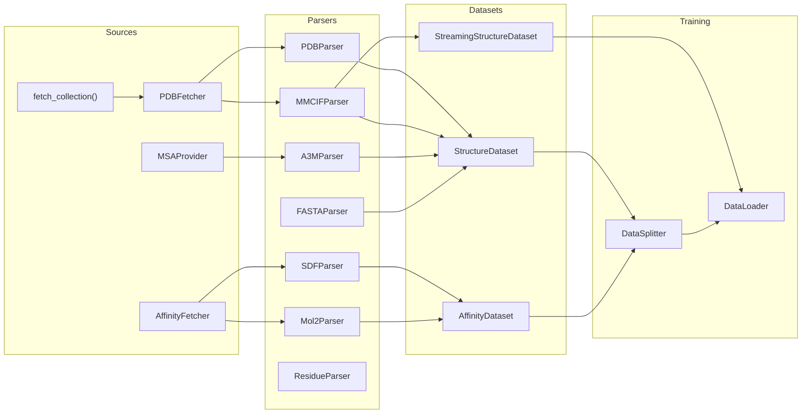
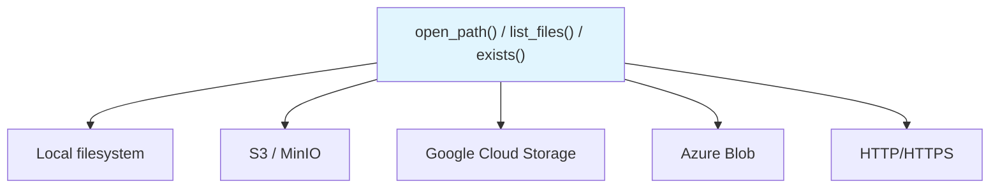

# Data Pipeline

Molfun's data pipeline transforms raw biological data into training-ready batches through four stages: **Source**, **Parser**, **Dataset**, **DataLoader**.

## Pipeline overview



---

## Stage 1: Sources

Sources fetch raw data from external services or local caches.

| Source | What it provides | Input |
|--------|-----------------|-------|
| `PDBFetcher` | PDB/mmCIF structure files | PDB IDs, RCSB search queries |
| `AffinityFetcher` | Protein-ligand binding affinity data | Target IDs, compound libraries |
| `MSAProvider` | Multiple sequence alignments | Sequences, databases |

```python
from molfun.data import PDBFetcher, AffinityFetcher, MSAProvider

# Fetch structures
fetcher = PDBFetcher(cache_dir="data/pdb_cache")
records = fetcher.fetch(["1AKE", "4HHB", "6LU7"])

# Fetch binding data
affinity = AffinityFetcher()
pairs = affinity.fetch(target_ids=["P00533"])

# Get MSAs
msa = MSAProvider(database="uniref90")
alignment = msa.search("MKFLILLFNILCLFPVLAADNH...")
```

### Collections

Collections are curated sets of PDB IDs for specific research tasks.

```python
from molfun.data import fetch_collection, list_collections

# See available collections
print(list_collections())

# Fetch a domain-specific set
records = fetch_collection("kinases")
```

---

## Stage 2: Parsers

Parsers read raw file formats and extract typed feature dictionaries.

| Parser | Input format | Key outputs |
|--------|-------------|-------------|
| `PDBParser` | `.pdb` | Coordinates, residues, chains, B-factors |
| `MMCIFParser` | `.cif` | Coordinates, residues, metadata, resolution |
| `A3MParser` | `.a3m` | MSA matrix, deletion matrix |
| `FASTAParser` | `.fasta` | Sequences, headers |
| `SDFParser` | `.sdf` | Atom coords, bonds, molecular features |
| `Mol2Parser` | `.mol2` | Atom coords, bonds, partial charges |
| `ResidueParser` | -- | Residue-level feature extraction |

```python
from molfun.data.parsers import PDBParser, A3MParser

# Parse a structure
parser = PDBParser()
features = parser.parse("data/1ake.pdb")
# features["aatype"], features["all_atom_positions"], features["residue_index"], ...

# Parse an MSA
msa_parser = A3MParser()
msa_features = msa_parser.parse("data/1ake.a3m")
# msa_features["msa"], msa_features["msa_mask"], ...
```

---

## Stage 3: Datasets

Datasets wrap parsed features into PyTorch `Dataset` objects.

### StructureDataset

Standard map-style dataset for protein structures. Each item is a feature dict ready for model consumption.

```python
from molfun.data import StructureDataset

dataset = StructureDataset(
    records=records,
    max_length=512,
)
```

### AffinityDataset

For protein-ligand binding affinity prediction. Returns `(features, target)` tuples.

```python
from molfun.data import AffinityDataset

dataset = AffinityDataset(
    records=affinity_records,
    target_column="pKd",
)
```

### StreamingStructureDataset

Iterable dataset for large-scale training. Streams data from local or remote storage without loading everything into memory.

```python
from molfun.data import StreamingStructureDataset

dataset = StreamingStructureDataset(
    index_path="s3://bucket/train_index.csv",
    storage_options={"endpoint_url": "http://minio:9000"},
)
```

---

## Stage 4: Splitting

`DataSplitter` provides static methods that return `(train, val, test)` subsets. All methods return `torch.utils.data.Subset` objects.

| Method | Strategy | When to use |
|--------|----------|-------------|
| `DataSplitter.random()` | Random shuffle | Quick experiments, non-protein tasks |
| `DataSplitter.by_sequence_identity()` | Cluster by sequence identity | Avoid homology leakage (recommended for structure tasks) |
| `DataSplitter.by_family()` | Split by protein family | Evaluate generalization to unseen families |

```python
from molfun.data import DataSplitter

# Random split (fast, ignores homology)
train, val, test = DataSplitter.random(dataset, val_frac=0.1, test_frac=0.1, seed=42)

# Identity-based split (prevents data leakage)
train, val, test = DataSplitter.by_sequence_identity(dataset, threshold=0.3)
```

!!! warning "Sequence identity leakage"
    Random splits can place homologous proteins in both train and test sets, inflating benchmark scores. For structure prediction tasks, always use `by_sequence_identity()` or `by_family()`.

---

## Storage abstraction

All data I/O goes through `molfun.data.storage`, a thin wrapper around [fsspec](https://filesystem-spec.readthedocs.io/) that transparently handles local and remote paths.



| Function | Purpose |
|----------|---------|
| `open_path(path, mode, storage_options)` | Open any path (local or remote) as a file handle |
| `list_files(glob_pattern)` | List files matching a glob on any filesystem |
| `exists(path)` | Check if a path exists |
| `ensure_dir(path)` | Create directory (local only) |
| `is_remote(path)` | Check if a path is a remote URI |

```python
from molfun.data.storage import open_path, list_files

# Local -- works without fsspec
with open_path("data/index.csv") as f:
    ...

# S3
with open_path("s3://bucket/index.csv") as f:
    ...

# MinIO (S3-compatible)
with open_path(
    "s3://bucket/index.csv",
    storage_options={"endpoint_url": "http://localhost:9000",
                     "key": "minioadmin", "secret": "minioadmin"},
) as f:
    ...

# List remote files
files = list_files("s3://bucket/pdbs/*.cif")
```

!!! note "Graceful fallback"
    Local paths work without `fsspec` installed. The library is only imported when a remote URI (`s3://`, `gs://`, etc.) is detected.
