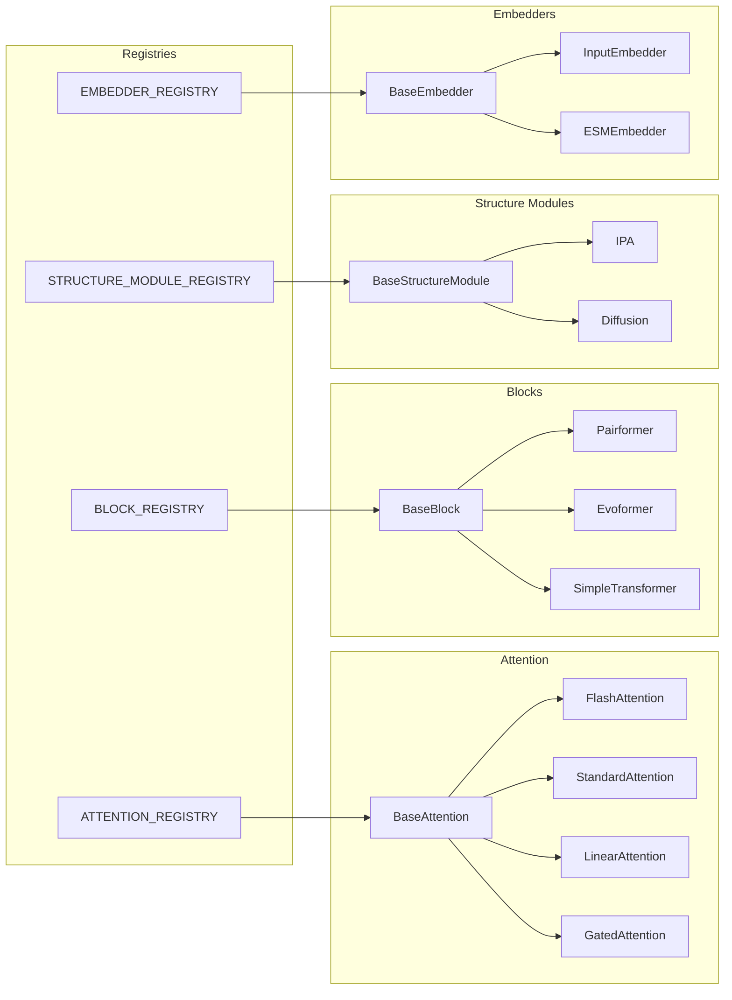
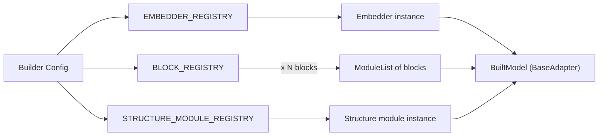

# Module System

Molfun's module system provides four families of pluggable components, each with an abstract base class, a dedicated registry, and one or more built-in implementations.

## Module families



| Family | Base class | Registry | Implementations |
|--------|-----------|----------|-----------------|
| **Attention** | `BaseAttention` | `ATTENTION_REGISTRY` | `flash`, `standard`, `linear`, `gated` |
| **Blocks** | `BaseBlock` | `BLOCK_REGISTRY` | `pairformer`, `evoformer`, `simple_transformer` |
| **Structure Modules** | `BaseStructureModule` | `STRUCTURE_MODULE_REGISTRY` | `ipa`, `diffusion` |
| **Embedders** | `BaseEmbedder` | `EMBEDDER_REGISTRY` | `input`, `esm_embedder` |

In addition, the **Loss Registry** (`LOSS_REGISTRY`) uses its own `LossRegistry` class with the same decorator pattern, registering losses like `mse`, `fape`, `mae`, `pearson`, and more.

---

## Registry mechanics

Every registry is an instance of `ModuleRegistry` (or `LossRegistry` for losses) and supports four operations:

### Register

```python
from molfun.modules.registry import ModuleRegistry
from molfun.modules.attention.base import ATTENTION_REGISTRY, BaseAttention

@ATTENTION_REGISTRY.register("my_attention")
class MyAttention(BaseAttention):
    def forward(self, q, k, v, mask=None, bias=None):
        ...
    @property
    def num_heads(self) -> int: ...
    @property
    def head_dim(self) -> int: ...
```

!!! warning "Registration constraints"
    - If the registry has a `base_class`, the decorated class must be a subclass. A `TypeError` is raised otherwise.
    - Duplicate names raise `ValueError`. Each name maps to exactly one class.

### Build

```python
attn = ATTENTION_REGISTRY.build("flash", num_heads=8, head_dim=32)
```

Resolves the class by name and calls `cls(**kwargs)`.

### Get and list

```python
cls = ATTENTION_REGISTRY.get("flash")      # returns class or None
names = ATTENTION_REGISTRY.list()           # ["flash", "gated", "linear", "standard"]
```

---

## Workflows

### 1. Build a custom model with ModelBuilder

`ModelBuilder` composes a complete model from registry components, returning a `BuiltModel` that implements `BaseAdapter`.

```python
from molfun.modules.builder import ModelBuilder
from molfun import MolfunStructureModel

built = ModelBuilder(
    embedder="input",
    embedder_config={"d_single": 256, "d_pair": 128},
    block="pairformer",
    block_config={"d_single": 256, "d_pair": 128, "attention_cls": "flash"},
    n_blocks=24,
    structure_module="ipa",
    structure_module_config={"d_single": 256, "d_pair": 128},
).build()

model = MolfunStructureModel.from_custom(
    built, head="affinity", head_config={"single_dim": 256},
)
```



### 2. Swap modules at runtime with ModuleSwapper

Replace internal components of a pre-trained model while preserving all other weights.

```python
from molfun.modules.swapper import ModuleSwapper

# Swap a single module by dotted path
ModuleSwapper.swap(model.adapter, "structure_module", MyCustomSM())

# Swap all attention modules matching a pattern
n = ModuleSwapper.swap_all(
    model.adapter,
    pattern="msa_att",
    factory=lambda name, old: FlashAttention.from_standard(old),
)

# Swap by type
n = ModuleSwapper.swap_by_type(
    model.adapter,
    old_type=nn.MultiheadAttention,
    factory=lambda name, old: FlashAttention(num_heads=old.num_heads, head_dim=64),
)

# Discover swappable modules
for name, mod in ModuleSwapper.discover(model.adapter, pattern="att"):
    print(f"{name}: {type(mod).__name__}")
```

### 3. Register a custom module

```python
from molfun.modules.attention.base import ATTENTION_REGISTRY, BaseAttention

@ATTENTION_REGISTRY.register("sparse")
class SparseAttention(BaseAttention):
    def __init__(self, num_heads: int, head_dim: int, block_size: int = 64):
        super().__init__()
        self._num_heads = num_heads
        self._head_dim = head_dim
        self.block_size = block_size

    def forward(self, q, k, v, mask=None, bias=None):
        # sparse attention logic
        ...

    @property
    def num_heads(self) -> int:
        return self._num_heads

    @property
    def head_dim(self) -> int:
        return self._head_dim
```

After registration, `"sparse"` is available everywhere: `ModelBuilder(block_config={"attention_cls": "sparse"})`, `ATTENTION_REGISTRY.build("sparse", ...)`, etc.

---

## Input/output contracts

Each module family defines a standardized output dataclass so upstream and downstream components never depend on implementation details.

### AttentionConfig

```python
@dataclass
class AttentionConfig:
    num_heads: int = 8
    head_dim: int = 32
    dropout: float = 0.0
    bias: bool = True
```

**Input**: `q, k, v` as `[B, H, Lq, D]` tensors, optional `mask` and `bias`.
**Output**: `[B, H, Lq, D]` tensor.

### BlockOutput

```python
@dataclass
class BlockOutput:
    single: torch.Tensor | None   # [B, L, D_s] or [B, N, L, D_m]
    pair: torch.Tensor | None     # [B, L, L, D_p]
```

### StructureModuleOutput

```python
@dataclass
class StructureModuleOutput:
    positions: torch.Tensor                   # [B, L, 3] or [B, L, n_atoms, 3]
    frames: torch.Tensor | None               # [B, L, 4, 4]
    confidence: torch.Tensor | None           # [B, L]
    single_repr: torch.Tensor | None          # [B, L, D]
    extra: dict
```

### EmbedderOutput

```python
@dataclass
class EmbedderOutput:
    single: torch.Tensor              # [B, L, D_s] or [B, N, L, D_msa]
    pair: torch.Tensor | None         # [B, L, L, D_p]
```

### TrunkOutput

The final adapter-level output that wraps everything:

```python
@dataclass
class TrunkOutput:
    single_repr: torch.Tensor
    pair_repr: torch.Tensor | None
    structure_coords: torch.Tensor | None
    confidence: torch.Tensor | None
    extra: dict
```
