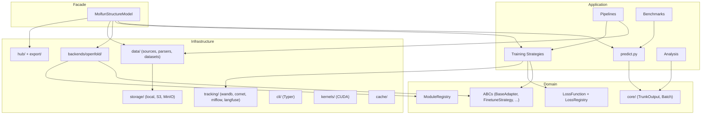
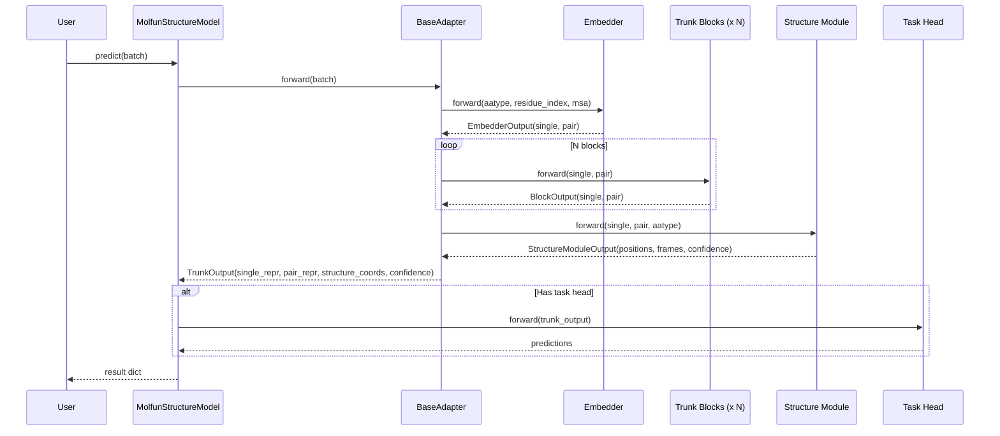

# System Overview

## Logical layers

Molfun maps to three logical layers without physically restructuring the directory tree into `domain/`, `application/`, `infrastructure/` folders. The current package layout is already clear enough.

| Layer | Responsibility | Packages |
|-------|---------------|----------|
| **Domain** | Core types, constants, abstract interfaces | `core/` (`TrunkOutput`, `Batch`), `constants.py`, ABCs in `adapters/base`, `training/base`, `tracking/base`, `losses/base`, `modules/*/base`, `modules/registry` |
| **Application** | Orchestration, business logic, facades | `models/structure.py` (`MolfunStructureModel`), `predict.py`, `training/` strategies, `pipelines/`, `benchmarks/`, `analysis/` |
| **Infrastructure** | External integrations, I/O, CLI | `backends/openfold/`, `data/`, `tracking/` implementations, `storage/`, `hub/`, `export/`, `cli/`, `kernels/`, `cache/` |

!!! info "Why no physical DDD restructure?"
    The current package layout (`adapters/`, `modules/`, `training/`, `data/`, etc.) already communicates boundaries clearly. A physical move into `domain/application/infrastructure` folders would break every import in the ecosystem for minimal gain.

## System architecture



## Request flow: predict call

A typical prediction flows through three stages -- embed, process, fold:



## Key design decisions

### Lazy imports for heavy backends

OpenFold, ESM, and tracking libraries (wandb, comet) are imported only when actually used. This keeps `import molfun` fast and avoids forcing users to install backends they do not need.

```python
# molfun/models/structure.py
def _register_adapters():
    """Lazy registration to avoid import errors for uninstalled backends."""
    if ADAPTER_REGISTRY:
        return
    from molfun.backends.openfold.adapter import OpenFoldAdapter
    ADAPTER_REGISTRY["openfold"] = OpenFoldAdapter
```

### Facade pattern at the top

`MolfunStructureModel` is the single entry point. Users never interact with adapters, registries, or strategies directly unless they want to. This keeps the 80% use case simple while leaving full power accessible.

### Adapters normalize backends

Every model backend (OpenFold, future ESMFold, future Protenix) is wrapped in a `BaseAdapter` subclass. Training strategies, heads, and losses program against the adapter interface and work with any backend without modification.
