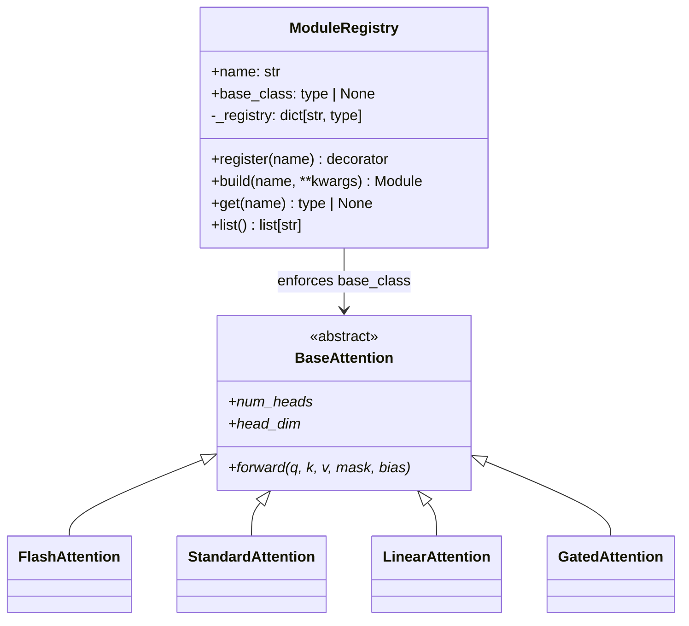
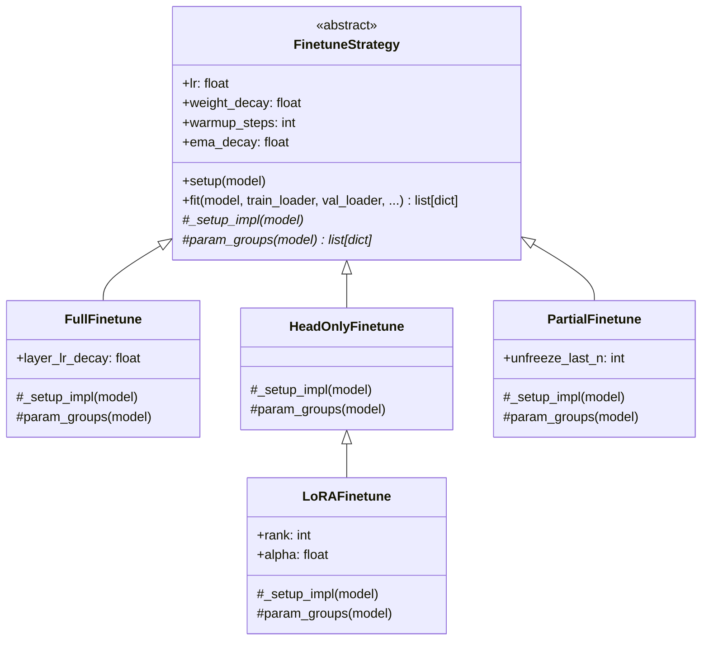
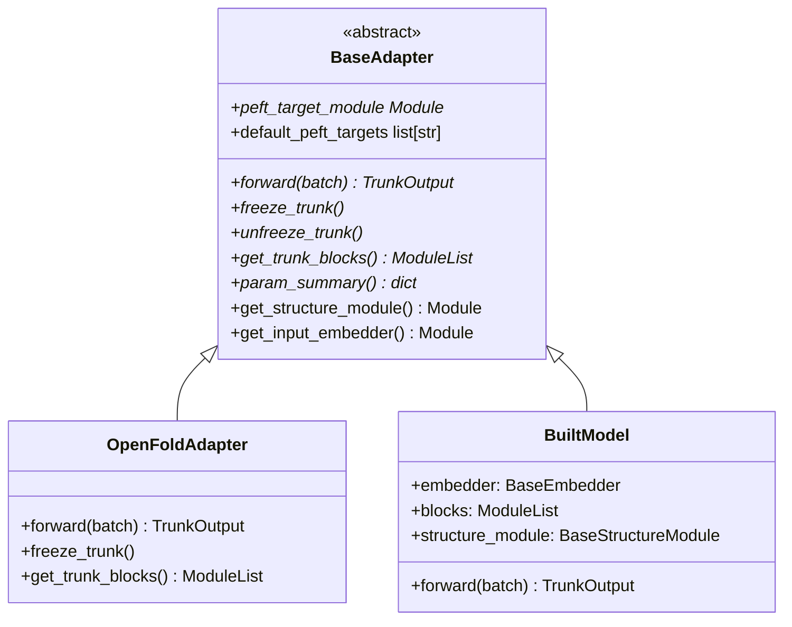
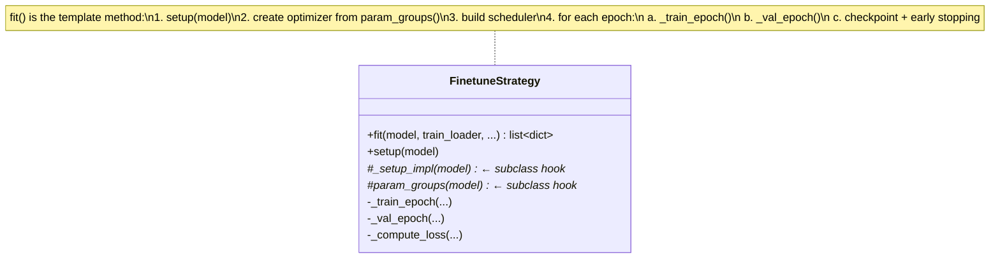
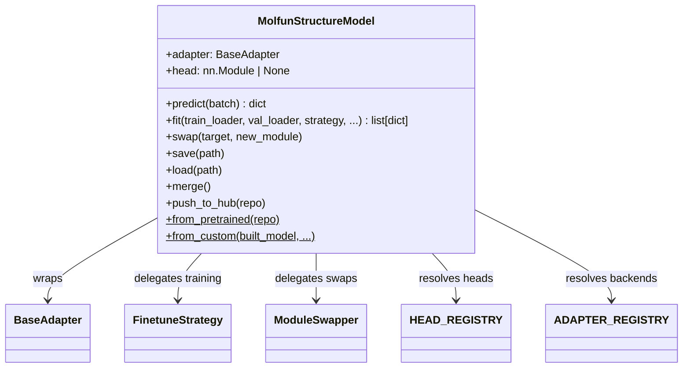

# Design Patterns

Molfun uses five core patterns. Each is described with a class diagram, a code example, and the rationale.

---

## 1. Registry

A type-safe, decorator-based plugin system used across all module families.



```python
from molfun.modules.registry import ModuleRegistry
from molfun.modules.attention.base import BaseAttention

ATTENTION_REGISTRY = ModuleRegistry("attention")

@ATTENTION_REGISTRY.register("flash")
class FlashAttention(BaseAttention):
    ...

# Build by name at runtime
attn = ATTENTION_REGISTRY.build("flash", num_heads=8, head_dim=32)
```

!!! tip "Why Registry?"
    New implementations are added with a single decorator -- no factory switch statements, no modification of existing code. The registry validates that the class inherits from the correct base and rejects duplicates at registration time.

---

## 2. Strategy

Interchangeable fine-tuning algorithms that share a common training loop.



```python
from molfun.training import LoRAFinetune

strategy = LoRAFinetune(rank=8, lr_lora=1e-4, lr_head=1e-3)
history = strategy.fit(model, train_loader, val_loader, epochs=10)
```

!!! tip "Why Strategy?"
    The training infrastructure (optimizer, scheduler, AMP, EMA, checkpointing, early stopping) is identical across strategies. Only what gets frozen and how parameters are grouped differs. The Strategy pattern avoids duplicating ~200 lines of training loop code in every variant.

---

## 3. Adapter

Normalizes different model backends behind a single interface.



```python
from molfun.adapters.base import BaseAdapter
from molfun.core.types import TrunkOutput

class ProtenixAdapter(BaseAdapter):
    def forward(self, batch: dict) -> TrunkOutput:
        ...
    def freeze_trunk(self) -> None:
        ...
    def unfreeze_trunk(self) -> None:
        ...
    def get_trunk_blocks(self) -> nn.ModuleList:
        ...
    # ... remaining abstract methods
```

!!! tip "Why Adapter?"
    Training strategies, task heads, and losses program against `BaseAdapter`. When a new backend (ESMFold, Protenix) is added, it only needs to implement the adapter interface -- every existing strategy and head works automatically.

---

## 4. Template Method

`FinetuneStrategy.fit()` defines the fixed training skeleton. Subclasses customize only the variable parts via `_setup_impl()` and `param_groups()`.



```python
class FinetuneStrategy(ABC):
    def fit(self, model, train_loader, val_loader=None, epochs=10, ...):
        self.setup(model)                    # calls _setup_impl()
        groups = self.param_groups(model)     # subclass defines groups
        optimizer = AdamW(groups, ...)
        scheduler = build_scheduler(...)
        for epoch in range(epochs):
            train_loss = self._train_epoch(...)
            val_metrics = self._val_epoch(...)
            # checkpoint, early stopping, tracker logging
        return history

    @abstractmethod
    def _setup_impl(self, model) -> None: ...

    @abstractmethod
    def param_groups(self, model) -> list[dict]: ...
```

!!! tip "Why Template Method?"
    The training loop has ~150 lines of optimizer setup, AMP scaling, gradient accumulation, EMA updates, checkpoint save/load, and early stopping. All of this is shared. Subclasses only answer two questions: *what to freeze* and *how to group parameters*.

---

## 5. Facade

`MolfunStructureModel` is the single entry point that hides the complexity of adapters, registries, strategies, heads, and export behind a clean API.



```python
from molfun import MolfunStructureModel

# Inference -- user never touches adapters
model = MolfunStructureModel("openfold", config=cfg, weights="ckpt.pt")
output = model.predict(batch)

# Fine-tuning -- user never touches optimizers
history = model.fit(train_loader, val_loader, strategy=LoRAFinetune(rank=8), epochs=10)

# Export -- user never touches state dicts
model.save("checkpoint/")
model.push_to_hub("my-org/my-model")
```

!!! tip "Why Facade?"
    Molfun has many moving parts (adapter, registry, strategy, head, loss, tracker, swapper, exporter). The facade lets 80% of users work with a single class while researchers who need fine control can reach into the internals.
