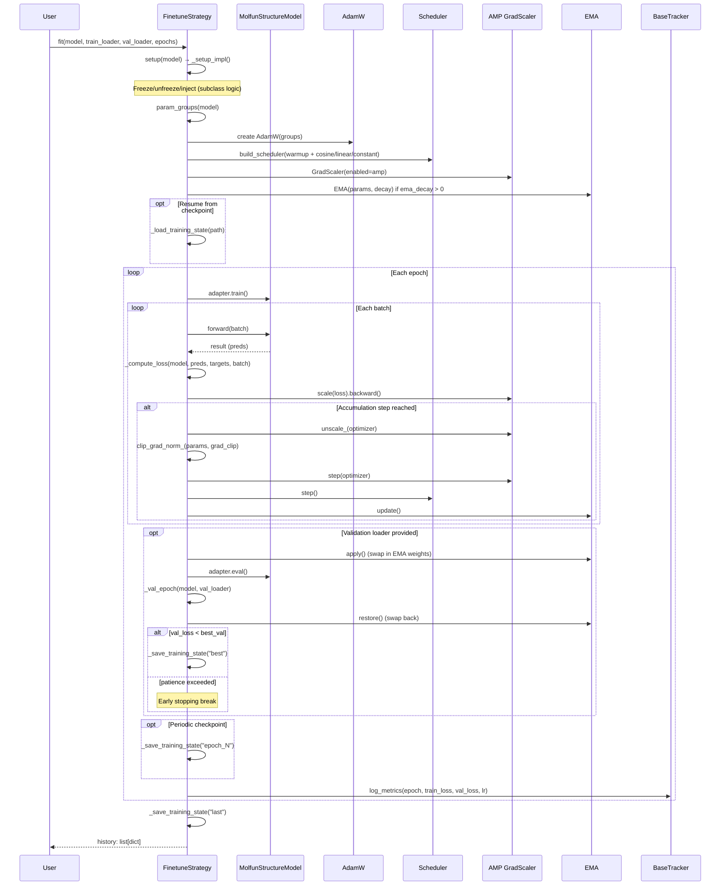

# Training Framework

Molfun's training framework separates *what to train* (strategy) from *how to train* (infrastructure). Every strategy inherits a fully featured training loop from `FinetuneStrategy` and only customizes freezing logic and parameter grouping.

## FinetuneStrategy ABC

```python
class FinetuneStrategy(ABC):
    def __init__(
        self,
        lr: float = 1e-4,
        weight_decay: float = 0.01,
        warmup_steps: int = 0,
        scheduler: str = "cosine",       # cosine | linear | constant
        min_lr: float = 1e-6,
        ema_decay: float = 0.0,          # 0 = disabled
        grad_clip: float = 1.0,
        accumulation_steps: int = 1,
        amp: bool = True,
        early_stopping_patience: int = 0, # 0 = disabled
        loss_fn: str = "mse",
    ): ...

    # --- Subclass contract ---
    @abstractmethod
    def _setup_impl(self, model) -> None: ...

    @abstractmethod
    def param_groups(self, model) -> list[dict]: ...

    # --- Provided by base ---
    def fit(self, model, train_loader, val_loader=None, epochs=10, ...) -> list[dict]: ...
    def setup(self, model) -> None: ...       # idempotent wrapper around _setup_impl
    def apply_ema(self, model) -> None: ...   # bake EMA weights into model
    def describe(self) -> dict: ...           # hyperparameter summary
```

---

## Template method: fit()

The `fit()` method is a template method that orchestrates the full training loop. Subclasses never override it -- they only provide `_setup_impl()` and `param_groups()`.



---

## Strategy comparison

| Strategy | Trainable params | Use case | Data needed | Risk |
|----------|-----------------|----------|-------------|------|
| **HeadOnlyFinetune** | Head only | Quick baseline, small datasets | < 1k samples | Low |
| **LoRAFinetune** | LoRA adapters + head | Efficient adaptation, limited compute | 1k--10k samples | Low--Medium |
| **PartialFinetune** | Last N blocks + structure module + head | Moderate adaptation | 1k--10k samples | Medium |
| **FullFinetune** | All parameters (layer-wise LR decay) | Maximum expressiveness | > 10k samples | High |

### HeadOnlyFinetune

Freezes the entire trunk. Only the task head is trained.

```python
strategy = HeadOnlyFinetune(lr=1e-3, warmup_steps=50)
```

### LoRAFinetune

Extends `HeadOnlyFinetune` by injecting LoRA layers into attention projections. The trunk remains frozen; only LoRA parameters and the head are trained.

```python
strategy = LoRAFinetune(
    rank=8, alpha=16.0,
    lr_head=1e-3, lr_lora=1e-4,
    warmup_steps=200, ema_decay=0.999,
)
```

!!! info "Automatic target detection"
    When `target_modules` is `None`, the adapter's `default_peft_targets` property provides the correct layer names. OpenFold uses `["linear_q", "linear_v"]`, while custom models use `["q_proj", "v_proj"]`.

### PartialFinetune

Unfreezes the last `N` trunk blocks, optionally the structure module, and the head. Supports separate LRs for trunk vs head.

```python
strategy = PartialFinetune(
    unfreeze_last_n=6,
    unfreeze_structure_module=True,
    lr_trunk=1e-5, lr_head=1e-3,
)
```

### FullFinetune

Unfreezes everything with layer-wise learning rate decay. Earlier layers get lower LRs to preserve general features.

```python
strategy = FullFinetune(
    lr=1e-5, lr_head=1e-3,
    layer_lr_decay=0.9,        # lr_layer_i = lr * 0.9^(N-i)
    warmup_steps=1000,
    ema_decay=0.999,
    accumulation_steps=8,
)
```

---

## Built-in training features

All strategies inherit these from the base class:

| Feature | Config parameter | Description |
|---------|-----------------|-------------|
| **LR warmup** | `warmup_steps` | Linear warmup from 0 to target LR |
| **LR scheduler** | `scheduler` | `cosine`, `linear`, or `constant` after warmup |
| **AMP** | `amp=True` | Mixed precision with `torch.amp.GradScaler` |
| **EMA** | `ema_decay` | Exponential moving average of parameters; used during validation |
| **Gradient accumulation** | `accumulation_steps` | Effective batch size = actual batch size x steps |
| **Gradient clipping** | `grad_clip` | `clip_grad_norm_` applied before each optimizer step |
| **Early stopping** | `early_stopping_patience` | Stop when val_loss has not improved for N epochs |
| **Checkpointing** | `checkpoint_dir`, `save_every` | Saves model + optimizer + scheduler + scaler state |
| **Resume** | `resume_from` | Loads full training state and continues from saved epoch |

---

## Integration with trackers

Any `BaseTracker` implementation can be passed to `fit()`:

```python
from molfun.tracking.wandb import WandbTracker

tracker = WandbTracker(project="protein-ft")
strategy.fit(model, train_loader, val_loader, tracker=tracker, epochs=10)
```

The training loop calls:

1. `tracker.log_config(strategy.describe())` before training
2. `tracker.log_metrics(metrics, step=epoch)` after each epoch

Available tracker backends: **wandb**, **Comet**, **MLflow**, **Langfuse**.

---

## Distributed training

Pass a distributed strategy to `fit()` for multi-GPU training:

```python
from molfun.training.distributed import DDPStrategy

dist = DDPStrategy(backend="nccl")
strategy.fit(model, train_loader, val_loader, distributed=dist, epochs=10)
```

The training loop handles:

- Wrapping the model with `distributed.wrap_model()`
- Wrapping data loaders with distributed samplers
- Restricting checkpoint saves and logging to the main process
