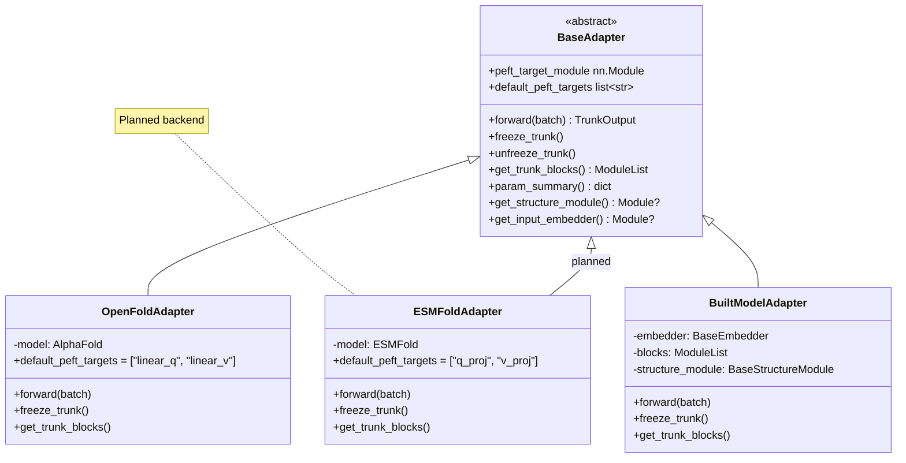

# Adding Model Backends

Model backends (adapters) are the most substantial extension point in Molfun. An adapter wraps a complete structure prediction model (OpenFold, ESMFold, Protenix, etc.) behind a normalized interface so that training strategies, module swapping, PEFT injection, and export all work identically regardless of the underlying model.

## The BaseAdapter interface

All adapters inherit from `BaseAdapter` in `molfun/adapters/base.py`:

```python
class BaseAdapter(nn.Module, ABC):
    """Normalized interface for structure prediction models."""

    @abstractmethod
    def forward(self, batch: dict) -> TrunkOutput:
        """Run the full model on a feature batch."""

    @abstractmethod
    def freeze_trunk(self) -> None:
        """Freeze all trunk parameters (for head-only or LoRA fine-tuning)."""

    @abstractmethod
    def unfreeze_trunk(self) -> None:
        """Unfreeze all trunk parameters (for full fine-tuning)."""

    @abstractmethod
    def get_trunk_blocks(self) -> nn.ModuleList:
        """Return the repeating blocks of the trunk."""

    @property
    @abstractmethod
    def peft_target_module(self) -> nn.Module:
        """Return the submodule where PEFT layers should be injected."""

    @abstractmethod
    def param_summary(self) -> dict[str, int]:
        """Return counts of total, trainable, and frozen parameters."""

    # --- Optional overrides with sensible defaults ---

    def get_structure_module(self) -> Optional[nn.Module]:
        """Return the structure module (IPA, diffusion, etc.), or None."""
        return None

    def get_input_embedder(self) -> Optional[nn.Module]:
        """Return the input embedder, or None."""
        return None

    @property
    def default_peft_targets(self) -> list[str]:
        """Layer name substrings for default PEFT injection."""
        return []
```

### Required methods explained

| Method | Purpose | Used by |
|--------|---------|---------|
| `forward(batch)` | Full model inference | Training loop, prediction API |
| `freeze_trunk()` | Disable gradients on trunk | HeadOnlyFinetune, LoRAFinetune |
| `unfreeze_trunk()` | Enable gradients on trunk | FullFinetune |
| `get_trunk_blocks()` | Access repeating blocks | PartialFinetune (unfreezes last N), FullFinetune (layer-wise LR decay), ModuleSwapper |
| `peft_target_module` | PEFT injection target | LoRAFinetune |
| `param_summary()` | Parameter counts | Model summary, logging |

### Adapter class hierarchy



## The ADAPTER_REGISTRY

Unlike module registries, the adapter registry is a simple dict in `molfun/models/structure.py` with lazy registration to avoid importing heavy backends at module load time:

```python
ADAPTER_REGISTRY: dict[str, type[BaseAdapter]] = {}

def _register_adapters():
    """Lazy registration to avoid import errors for uninstalled backends."""
    if ADAPTER_REGISTRY:
        return
    from molfun.backends.openfold.adapter import OpenFoldAdapter
    ADAPTER_REGISTRY["openfold"] = OpenFoldAdapter
```

## Example: ESMFold Adapter (conceptual)

ESMFold is a planned backend for Molfun. This example shows how to structure an adapter for it. The same pattern applies to any structure prediction model.

### Step 1: Create the backend package

```
molfun/backends/esmfold/
    __init__.py
    adapter.py
    utils.py
```

### Step 2: Implement the adapter

Create `molfun/backends/esmfold/adapter.py`:

```python
"""
ESMFold adapter for Molfun.

Wraps the ESMFold model behind the BaseAdapter interface, enabling
all Molfun training strategies, module swapping, and export tools.
"""

from __future__ import annotations
from typing import Optional

import torch
import torch.nn as nn

from molfun.adapters.base import BaseAdapter
from molfun.core.types import TrunkOutput


class ESMFoldAdapter(BaseAdapter):
    """
    Adapter for the ESMFold protein structure prediction model.

    ESMFold uses an ESM-2 language model as the trunk, followed by
    a folding module (structure module) that predicts 3D coordinates.

    Args:
        model_name: ESMFold model variant (e.g., "esmfold_v1").
        device: Device to load the model on.
    """

    def __init__(self, model_name: str = "esmfold_v1", device: str = "cpu"):
        super().__init__()
        self._model_name = model_name
        self._device = device

        # Lazy import to avoid requiring esm at import time
        self._model = self._load_model(model_name)

    @staticmethod
    def _load_model(model_name: str) -> nn.Module:
        """Load ESMFold model. Requires the `esm` package."""
        try:
            import esm
            model = esm.pretrained.esmfold_v1()
            return model
        except ImportError:
            raise ImportError(
                "ESMFold requires the `esm` package. "
                "Install with: pip install fair-esm"
            )

    def forward(self, batch: dict) -> TrunkOutput:
        """
        Run ESMFold inference.

        Expected batch keys:
            - "aatype": [B, L] amino acid indices
            - "residue_index": [B, L] residue positions
            - "mask": [B, L] valid residue mask (optional)
        """
        sequence_tokens = batch["aatype"]
        mask = batch.get("mask")

        # ESMFold takes tokenized sequences directly
        output = self._model(sequence_tokens)

        # Map ESMFold output to Molfun's TrunkOutput
        return TrunkOutput(
            single=output.get("s", None),              # single repr
            pair=output.get("z", None),                 # pair repr
            positions=output["positions"][-1],          # final coordinates
            confidence=output.get("plddt", None),
        )

    def freeze_trunk(self) -> None:
        """Freeze the ESM-2 language model trunk."""
        esm_trunk = self._get_esm_trunk()
        for param in esm_trunk.parameters():
            param.requires_grad = False

    def unfreeze_trunk(self) -> None:
        """Unfreeze the ESM-2 language model trunk."""
        esm_trunk = self._get_esm_trunk()
        for param in esm_trunk.parameters():
            param.requires_grad = True

    def get_trunk_blocks(self) -> nn.ModuleList:
        """Return the ESM-2 transformer layers."""
        esm_trunk = self._get_esm_trunk()
        # ESM-2 stores layers in model.esm.layers
        return esm_trunk.layers

    def _get_esm_trunk(self) -> nn.Module:
        """Access the ESM-2 language model within ESMFold."""
        return self._model.esm

    @property
    def peft_target_module(self) -> nn.Module:
        """PEFT is injected into the ESM-2 transformer."""
        return self._get_esm_trunk()

    @property
    def default_peft_targets(self) -> list[str]:
        """ESM-2 uses standard transformer naming."""
        return ["q_proj", "v_proj"]

    def get_structure_module(self) -> Optional[nn.Module]:
        """Return the folding/structure module."""
        if hasattr(self._model, "trunk"):
            return self._model.trunk
        return None

    def get_input_embedder(self) -> Optional[nn.Module]:
        """Return the ESM-2 embedding layer."""
        esm = self._get_esm_trunk()
        if hasattr(esm, "embed_tokens"):
            return esm.embed_tokens
        return None

    def param_summary(self) -> dict[str, int]:
        total = sum(p.numel() for p in self.parameters())
        trainable = sum(p.numel() for p in self.parameters() if p.requires_grad)
        return {
            "total": total,
            "trainable": trainable,
            "frozen": total - trainable,
        }
```

### Step 3: Register the adapter

Add to the lazy registration in `molfun/models/structure.py`:

```python
def _register_adapters():
    if ADAPTER_REGISTRY:
        return
    from molfun.backends.openfold.adapter import OpenFoldAdapter
    ADAPTER_REGISTRY["openfold"] = OpenFoldAdapter

    # Register ESMFold only if the esm package is available
    try:
        from molfun.backends.esmfold.adapter import ESMFoldAdapter
        ADAPTER_REGISTRY["esmfold"] = ESMFoldAdapter
    except ImportError:
        pass  # esm not installed; skip registration
```

## Testing

Create `tests/adapters/test_esmfold.py`:

```python
"""
Tests for the ESMFold adapter.

Since ESMFold requires the `esm` package and a large model download,
these tests use a mock model that implements the same interface.
"""

import pytest
import torch
import torch.nn as nn

from molfun.adapters.base import BaseAdapter
from molfun.core.types import TrunkOutput


class MockESMLayer(nn.Module):
    def __init__(self, d: int = 64):
        super().__init__()
        self.q_proj = nn.Linear(d, d)
        self.v_proj = nn.Linear(d, d)
        self.fc = nn.Linear(d, d)


class MockESM(nn.Module):
    def __init__(self, num_layers: int = 4, d: int = 64):
        super().__init__()
        self.layers = nn.ModuleList([MockESMLayer(d) for _ in range(num_layers)])
        self.embed_tokens = nn.Embedding(21, d)


class MockESMFoldAdapter(BaseAdapter):
    """Lightweight mock of ESMFoldAdapter for testing."""

    def __init__(self, num_layers: int = 4, d: int = 64):
        super().__init__()
        self.esm = MockESM(num_layers, d)
        self.structure_head = nn.Linear(d, 3)
        self._d = d

    def forward(self, batch: dict) -> TrunkOutput:
        tokens = batch["aatype"]
        x = self.esm.embed_tokens(tokens)
        for layer in self.esm.layers:
            x = x + layer.fc(x)
        positions = self.structure_head(x)
        return TrunkOutput(single=x, pair=None, positions=positions)

    def freeze_trunk(self):
        for p in self.esm.parameters():
            p.requires_grad = False

    def unfreeze_trunk(self):
        for p in self.esm.parameters():
            p.requires_grad = True

    def get_trunk_blocks(self) -> nn.ModuleList:
        return self.esm.layers

    @property
    def peft_target_module(self) -> nn.Module:
        return self.esm

    @property
    def default_peft_targets(self) -> list[str]:
        return ["q_proj", "v_proj"]

    def get_structure_module(self):
        return self.structure_head

    def get_input_embedder(self):
        return self.esm.embed_tokens

    def param_summary(self) -> dict[str, int]:
        total = sum(p.numel() for p in self.parameters())
        trainable = sum(p.numel() for p in self.parameters() if p.requires_grad)
        return {"total": total, "trainable": trainable, "frozen": total - trainable}


class TestESMFoldAdapter:

    @pytest.fixture
    def adapter(self):
        return MockESMFoldAdapter(num_layers=4, d=64)

    def test_forward_returns_trunk_output(self, adapter):
        batch = {"aatype": torch.randint(0, 21, (2, 10))}
        out = adapter(batch)
        assert isinstance(out, TrunkOutput)

    def test_positions_shape(self, adapter):
        batch = {"aatype": torch.randint(0, 21, (2, 10))}
        out = adapter(batch)
        assert out.positions.shape == (2, 10, 3)

    def test_freeze_trunk(self, adapter):
        adapter.freeze_trunk()
        for p in adapter.esm.parameters():
            assert not p.requires_grad
        # Structure head should still be trainable
        for p in adapter.structure_head.parameters():
            assert p.requires_grad

    def test_unfreeze_trunk(self, adapter):
        adapter.freeze_trunk()
        adapter.unfreeze_trunk()
        for p in adapter.esm.parameters():
            assert p.requires_grad

    def test_get_trunk_blocks(self, adapter):
        blocks = adapter.get_trunk_blocks()
        assert isinstance(blocks, nn.ModuleList)
        assert len(blocks) == 4

    def test_peft_targets(self, adapter):
        assert adapter.default_peft_targets == ["q_proj", "v_proj"]
        assert isinstance(adapter.peft_target_module, nn.Module)

    def test_param_summary(self, adapter):
        summary = adapter.param_summary()
        assert "total" in summary
        assert "trainable" in summary
        assert "frozen" in summary
        assert summary["total"] == summary["trainable"] + summary["frozen"]

    def test_optional_methods(self, adapter):
        assert adapter.get_structure_module() is not None
        assert adapter.get_input_embedder() is not None
```

Run the tests:

```bash
KMP_DUPLICATE_LIB_OK=TRUE pytest tests/adapters/test_esmfold.py -v
```

## Integration

### Using the adapter with MolfunStructureModel

Once registered, the adapter works like any other backend:

```python
from molfun import MolfunStructureModel

# Standard usage via registry
model = MolfunStructureModel("esmfold")

# Fine-tune with LoRA (uses default_peft_targets automatically)
from molfun.training import LoRAFinetune
strategy = LoRAFinetune(rank=8, lr=1e-4)
strategy.fit(model, train_loader, epochs=10)
```

### Using from_custom() for unregistered adapters

During development, you can bypass the registry:

```python
from molfun import MolfunStructureModel
from molfun.backends.esmfold.adapter import ESMFoldAdapter

adapter = ESMFoldAdapter(model_name="esmfold_v1")
model = MolfunStructureModel.from_custom(adapter)
```

### Checking available backends

```python
print(MolfunStructureModel.available_models())
# ['openfold', 'esmfold']  -- after registration
```

## Checklist for new backends

When implementing a new adapter, verify the following:

- [ ] `forward(batch)` returns a valid `TrunkOutput` with at least `positions`.
- [ ] `freeze_trunk()` / `unfreeze_trunk()` correctly toggle `.requires_grad` on trunk parameters only.
- [ ] `get_trunk_blocks()` returns the correct repeating blocks (used for partial fine-tuning and layer-wise LR).
- [ ] `peft_target_module` returns the module containing the attention projections.
- [ ] `default_peft_targets` lists the correct layer name substrings for the model's attention Q/V projections.
- [ ] `param_summary()` returns accurate counts.
- [ ] Heavy dependencies are lazy-imported (in `__init__` or a classmethod, not at module level).
- [ ] Registration uses the try/except pattern in `_register_adapters()` to handle missing dependencies gracefully.
