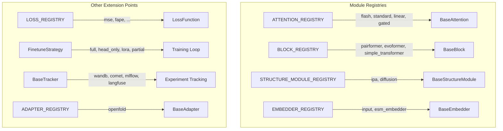

# Extending Molfun

Molfun is designed around **registries** -- a plug-and-play pattern that lets you add new components without modifying framework internals. Every major subsystem (attention, blocks, structure modules, embedders, losses, training strategies, trackers, and model backends) follows the same extension workflow:

1. **Subclass** the abstract base class for that component.
2. **Register** your implementation with the appropriate registry decorator.
3. **Use** your component by name anywhere in the framework.

```python
from molfun.modules.registry import ModuleRegistry

# Every registry supports the same core API:
REGISTRY.register("name")   # decorator to register a class
REGISTRY.build("name", **kwargs)  # instantiate by name
REGISTRY.get("name")        # get class (or None)
REGISTRY.list()              # list all registered names
```

## What can be extended?

| Component | Base Class | Registry | Guide |
|-----------|-----------|----------|-------|
| Attention mechanisms | `BaseAttention` | `ATTENTION_REGISTRY` | [attention.md](attention.md) |
| Trunk blocks | `BaseBlock` | `BLOCK_REGISTRY` | [blocks.md](blocks.md) |
| Structure modules | `BaseStructureModule` | `STRUCTURE_MODULE_REGISTRY` | [structure-modules.md](structure-modules.md) |
| Input embedders | `BaseEmbedder` | `EMBEDDER_REGISTRY` | [embedders.md](embedders.md) |
| Loss functions | `LossFunction` | `LOSS_REGISTRY` | [losses.md](losses.md) |
| Training strategies | `FinetuneStrategy` | *(class-based, no registry)* | [strategies.md](strategies.md) |
| Experiment trackers | `BaseTracker` | *(class-based, no registry)* | [trackers.md](trackers.md) |
| Model backends | `BaseAdapter` | `ADAPTER_REGISTRY` | [backends.md](backends.md) |

## Architecture at a glance



## Extension pattern

Every guide in this section follows the same structure:

1. **Interface** -- the abstract base class and its contract.
2. **Implementation** -- a complete, working example.
3. **Registration** -- how to wire it into the registry.
4. **Testing** -- how to write tests for your component.
5. **Integration** -- how to use your component in the broader Molfun pipeline.

## Quick start

If you want to jump straight to an example, the [attention guide](attention.md) is the simplest starting point. For adding an entirely new model backend (the most involved extension), see [backends](backends.md).
