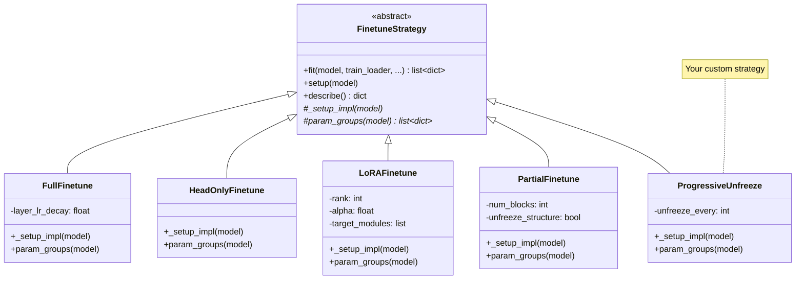

# Adding Training Strategies

Training strategies define *what to freeze*, *what learning rates to use*, and *how to group parameters* for fine-tuning. The actual training loop (optimizer, scheduler, AMP, gradient accumulation, early stopping, EMA, checkpointing) is handled by the base class via the Template Method pattern.

## The FinetuneStrategy interface

All strategies inherit from `FinetuneStrategy` in `molfun/training/base.py`:

```python
class FinetuneStrategy(ABC):

    def __init__(
        self,
        lr: float = 1e-4,
        weight_decay: float = 0.01,
        warmup_steps: int = 0,
        scheduler: str = "cosine",      # "cosine", "linear", "constant"
        min_lr: float = 1e-6,
        ema_decay: float = 0.0,
        grad_clip: float = 1.0,
        accumulation_steps: int = 1,
        amp: bool = True,
        early_stopping_patience: int = 0,
        loss_fn: str = "mse",
    ): ...

    @abstractmethod
    def _setup_impl(self, model) -> None:
        """Freeze/unfreeze/inject logic. Called once before training."""

    @abstractmethod
    def param_groups(self, model) -> list[dict]:
        """Return optimizer parameter groups with per-group LR."""

    def fit(self, model, train_loader, val_loader=None, epochs=10, ...) -> list[dict]:
        """Full training loop (provided by base class)."""
```

### How it works

The `fit()` method is a **template method** that:

1. Calls `setup(model)` (which delegates to your `_setup_impl`).
2. Calls `param_groups(model)` to build the optimizer.
3. Runs the training loop with all infrastructure (warmup, scheduling, AMP, grad clipping, EMA, early stopping, checkpointing).

You only implement the two abstract methods. Everything else is inherited.

### Strategy class hierarchy



## Example: Progressive Unfreezing Strategy

Progressive unfreezing starts with only the head trainable, then gradually unfreezes trunk blocks from the end (closest to the output) toward the beginning, one block at a time. This technique, popularized by ULMFiT, helps prevent catastrophic forgetting.

### Step 1: Create the strategy file

Create `molfun/training/progressive.py`:

```python
"""
Progressive unfreezing strategy.

Starts with only the head trainable. Every ``unfreeze_every`` epochs,
one additional trunk block is unfrozen from the end. Newly unfrozen
blocks get a lower learning rate than previously unfrozen ones.
"""

from __future__ import annotations

import torch.nn as nn

from molfun.training.base import FinetuneStrategy


class ProgressiveUnfreezeStrategy(FinetuneStrategy):
    """
    Progressive unfreezing: gradually unfreeze trunk blocks during training.

    Args:
        lr: Base learning rate for the head.
        block_lr_scale: LR multiplier for each layer of unfrozen blocks.
            Block N (from the end) gets ``lr * block_lr_scale ** N``.
        unfreeze_every: Unfreeze one more block every N epochs.
        max_unfrozen: Maximum number of blocks to unfreeze (0 = all).
        **kwargs: Passed to FinetuneStrategy (weight_decay, scheduler, etc.)
    """

    def __init__(
        self,
        lr: float = 1e-3,
        block_lr_scale: float = 0.5,
        unfreeze_every: int = 2,
        max_unfrozen: int = 0,
        **kwargs,
    ):
        super().__init__(lr=lr, **kwargs)
        self.block_lr_scale = block_lr_scale
        self.unfreeze_every = unfreeze_every
        self.max_unfrozen = max_unfrozen

        self._blocks: nn.ModuleList | None = None
        self._n_unfrozen = 0

    def _setup_impl(self, model) -> None:
        """Freeze entire trunk; only the head is trainable initially."""
        model.adapter.freeze_trunk()

        # Store reference to trunk blocks (reversed: last block first)
        self._blocks = model.adapter.get_trunk_blocks()
        self._n_unfrozen = 0

    def _unfreeze_next_block(self) -> bool:
        """
        Unfreeze the next block (from the end of the trunk).

        Returns True if a block was unfrozen, False if all allowed
        blocks are already unfrozen.
        """
        if self._blocks is None:
            return False

        total = len(self._blocks)
        limit = self.max_unfrozen if self.max_unfrozen > 0 else total

        if self._n_unfrozen >= min(total, limit):
            return False

        # Unfreeze block at position (total - 1 - n_unfrozen)
        block_idx = total - 1 - self._n_unfrozen
        block = self._blocks[block_idx]
        for param in block.parameters():
            param.requires_grad = True

        self._n_unfrozen += 1
        return True

    def param_groups(self, model) -> list[dict]:
        """
        Build parameter groups with layer-wise LR decay.

        - Head parameters: base LR
        - Most recently unfrozen block: lr * block_lr_scale
        - Second most recently unfrozen: lr * block_lr_scale^2
        - etc.
        """
        groups = []

        # Head parameters (always trainable)
        if model.head is not None:
            head_params = [p for p in model.head.parameters() if p.requires_grad]
            if head_params:
                groups.append({"params": head_params, "lr": self.lr})

        # Unfrozen block parameters with decaying LR
        if self._blocks is not None:
            total = len(self._blocks)
            for i in range(self._n_unfrozen):
                block_idx = total - 1 - i
                block = self._blocks[block_idx]
                block_params = [p for p in block.parameters() if p.requires_grad]
                if block_params:
                    block_lr = self.lr * (self.block_lr_scale ** (i + 1))
                    groups.append({"params": block_params, "lr": block_lr})

        return groups

    def fit(self, model, train_loader, val_loader=None, epochs=10, **kwargs):
        """
        Override fit to inject progressive unfreezing between epochs.

        Note: This is the one case where overriding fit() is appropriate,
        because the unfreezing schedule is inherently tied to the epoch loop.
        We still delegate the actual training to the base class by calling
        fit() with 1-epoch chunks.
        """
        self.setup(model)
        all_history = []

        for epoch in range(epochs):
            # Unfreeze a new block at the scheduled interval
            if epoch > 0 and epoch % self.unfreeze_every == 0:
                unfrozen = self._unfreeze_next_block()
                if unfrozen and kwargs.get("verbose", True):
                    print(
                        f"  Progressive unfreeze: {self._n_unfrozen} "
                        f"blocks now trainable (epoch {epoch + 1})"
                    )

            # Run a single epoch using the parent's training infrastructure
            # We set _setup_done to skip redundant setup
            self._setup_done = True
            history = super().fit(
                model, train_loader, val_loader,
                epochs=epoch + 1,  # train up to current epoch
                **{**kwargs, "verbose": kwargs.get("verbose", True)},
            )
            if history:
                all_history.append(history[-1])

        return all_history
```

### Step 2: Export from the training package

Add to `molfun/training/__init__.py`:

```python
from molfun.training.progressive import ProgressiveUnfreezeStrategy  # noqa: F401
```

## Testing

Create `tests/training/test_progressive.py`:

```python
import pytest
import torch
import torch.nn as nn

from molfun.training.progressive import ProgressiveUnfreezeStrategy


class MockBlock(nn.Module):
    def __init__(self, d: int = 32):
        super().__init__()
        self.linear = nn.Linear(d, d)


class MockAdapter(nn.Module):
    def __init__(self, num_blocks: int = 6):
        super().__init__()
        self.blocks = nn.ModuleList([MockBlock() for _ in range(num_blocks)])

    def freeze_trunk(self):
        for p in self.parameters():
            p.requires_grad = False

    def unfreeze_trunk(self):
        for p in self.parameters():
            p.requires_grad = True

    def get_trunk_blocks(self):
        return self.blocks

    def forward(self, batch):
        return {}

    def train(self, mode=True):
        return super().train(mode)

    def eval(self):
        return super().eval()


class MockHead(nn.Module):
    def __init__(self):
        super().__init__()
        self.fc = nn.Linear(32, 1)


class MockModel:
    def __init__(self):
        self.adapter = MockAdapter(num_blocks=6)
        self.head = MockHead()
        self.device = "cpu"
        self._strategy = None


class TestProgressiveUnfreezeStrategy:

    @pytest.fixture
    def strategy(self):
        return ProgressiveUnfreezeStrategy(
            lr=1e-3, block_lr_scale=0.5, unfreeze_every=2, amp=False
        )

    @pytest.fixture
    def model(self):
        return MockModel()

    def test_initial_freeze(self, strategy, model):
        """After setup, trunk is frozen but head is trainable."""
        strategy.setup(model)
        # All trunk params frozen
        for block in model.adapter.blocks:
            for p in block.parameters():
                assert not p.requires_grad
        # Head still trainable
        for p in model.head.parameters():
            assert p.requires_grad

    def test_unfreeze_order(self, strategy, model):
        """Blocks are unfrozen from the end."""
        strategy.setup(model)
        strategy._unfreeze_next_block()

        # Last block (index 5) should be unfrozen
        for p in model.adapter.blocks[5].parameters():
            assert p.requires_grad
        # Earlier blocks still frozen
        for p in model.adapter.blocks[0].parameters():
            assert not p.requires_grad

    def test_param_groups_lr_decay(self, strategy, model):
        """Each unfrozen block gets a progressively lower LR."""
        strategy.setup(model)
        strategy._unfreeze_next_block()  # block 5
        strategy._unfreeze_next_block()  # block 4

        groups = strategy.param_groups(model)
        # groups[0] = head at lr=1e-3
        # groups[1] = block 5 at lr=5e-4
        # groups[2] = block 4 at lr=2.5e-4
        assert len(groups) == 3
        assert groups[0]["lr"] == 1e-3
        assert abs(groups[1]["lr"] - 5e-4) < 1e-8
        assert abs(groups[2]["lr"] - 2.5e-4) < 1e-8

    def test_max_unfrozen_limit(self, strategy, model):
        """Respects max_unfrozen limit."""
        strategy.max_unfrozen = 2
        strategy.setup(model)
        assert strategy._unfreeze_next_block() is True   # block 5
        assert strategy._unfreeze_next_block() is True   # block 4
        assert strategy._unfreeze_next_block() is False  # limit reached

    def test_describe(self, strategy):
        desc = strategy.describe()
        assert desc["strategy"] == "ProgressiveUnfreezeStrategy"
        assert desc["lr"] == 1e-3
```

Run the tests:

```bash
KMP_DUPLICATE_LIB_OK=TRUE pytest tests/training/test_progressive.py -v
```

## Integration

### Using the strategy with MolfunStructureModel

```python
from molfun import MolfunStructureModel
from molfun.training.progressive import ProgressiveUnfreezeStrategy

model = MolfunStructureModel("openfold")

strategy = ProgressiveUnfreezeStrategy(
    lr=1e-3,
    block_lr_scale=0.5,
    unfreeze_every=3,         # unfreeze a new block every 3 epochs
    max_unfrozen=8,           # unfreeze at most 8 of the 48 Evoformer blocks
    warmup_steps=100,
    scheduler="cosine",
    early_stopping_patience=5,
    loss_fn="fape",
)

history = strategy.fit(
    model,
    train_loader,
    val_loader,
    epochs=30,
    checkpoint_dir="checkpoints/progressive",
)
```

### When to use progressive unfreezing

Progressive unfreezing is particularly effective when:

- You have a **small fine-tuning dataset** and want to minimize catastrophic forgetting.
- The pre-trained model is very large (e.g., full OpenFold with 48 Evoformer blocks).
- You want to gradually increase model capacity without destabilizing early training.

For large datasets or when starting from random initialization, `FullFinetune` or `PartialFinetune` are typically sufficient.
