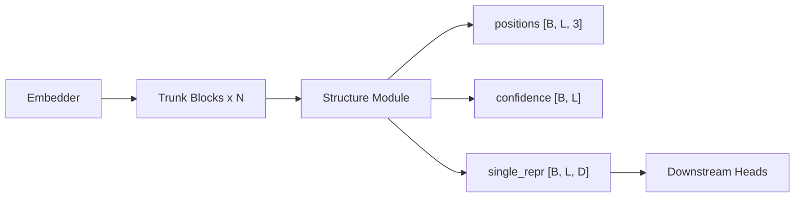

# Adding Structure Modules

The structure module is the component that converts learned single and pair representations into 3D atomic coordinates. It sits after the trunk blocks and produces the final structural prediction.

## The BaseStructureModule interface

All structure modules inherit from `BaseStructureModule` in `molfun/modules/structure_module/base.py`:

```python
class BaseStructureModule(ABC, nn.Module):
    """Maps (single_repr, pair_repr) -> 3D structure."""

    @abstractmethod
    def forward(
        self,
        single: torch.Tensor,                          # [B, L, D_single]
        pair: torch.Tensor,                             # [B, L, L, D_pair]
        aatype: Optional[torch.Tensor] = None,          # [B, L] int64
        mask: Optional[torch.Tensor] = None,            # [B, L]
        **kwargs,
    ) -> StructureModuleOutput:
        ...

    @property
    @abstractmethod
    def d_single(self) -> int:
        """Expected single representation dimension."""

    @property
    @abstractmethod
    def d_pair(self) -> int:
        """Expected pair representation dimension."""
```

### StructureModuleOutput

```python
@dataclass
class StructureModuleOutput:
    positions: torch.Tensor                          # [B, L, 3] or [B, L, n_atoms, 3]
    frames: Optional[torch.Tensor] = None            # [B, L, 4, 4] backbone frames
    confidence: Optional[torch.Tensor] = None        # [B, L] per-residue confidence
    single_repr: Optional[torch.Tensor] = None       # [B, L, D] updated single repr
    extra: dict = field(default_factory=dict)
```

The only required field is `positions`. All others are optional but recommended:

- `frames` -- rigid body transformations (rotation + translation) for each residue backbone.
- `confidence` -- per-residue confidence scores (analogous to pLDDT).
- `single_repr` -- updated single representation (useful for downstream heads).
- `extra` -- arbitrary additional outputs (e.g., auxiliary losses, intermediate states).

## Built-in implementations

| Name | Description |
|------|-------------|
| `ipa` | Invariant Point Attention (AlphaFold2-style iterative refinement) |
| `diffusion` | Denoising diffusion on rigid frames (RF-Diffusion / AF3-style) |

## Example: Equivariant Graph Neural Network Structure Module

Let's implement a structure module based on equivariant message passing on a residue graph. This is a simplified version of the SE(3)-Transformer approach.

### Step 1: Create the module file

Create `molfun/modules/structure_module/egnn.py`:

```python
"""
Equivariant Graph Neural Network (EGNN) structure module.

Uses equivariant message passing to predict 3D coordinates directly
from single and pair representations, without explicit frame updates.
"""

from __future__ import annotations
from dataclasses import field
from typing import Optional

import torch
import torch.nn as nn
import torch.nn.functional as F

from molfun.modules.structure_module.base import (
    BaseStructureModule,
    StructureModuleOutput,
    STRUCTURE_MODULE_REGISTRY,
)


class EGNNLayer(nn.Module):
    """Single layer of equivariant message passing."""

    def __init__(self, d_node: int, d_edge: int, d_coord: int = 3):
        super().__init__()
        self.message_mlp = nn.Sequential(
            nn.Linear(2 * d_node + d_edge + 1, d_node),
            nn.SiLU(),
            nn.Linear(d_node, d_node),
        )
        self.coord_mlp = nn.Sequential(
            nn.Linear(d_node, d_node),
            nn.SiLU(),
            nn.Linear(d_node, 1),  # scalar weight per edge
        )
        self.node_mlp = nn.Sequential(
            nn.Linear(2 * d_node, d_node),
            nn.SiLU(),
            nn.Linear(d_node, d_node),
        )

    def forward(
        self,
        h: torch.Tensor,      # [B, L, D] node features
        x: torch.Tensor,      # [B, L, 3] coordinates
        edge: torch.Tensor,   # [B, L, L, D_edge] edge features
        mask: Optional[torch.Tensor] = None,
    ) -> tuple[torch.Tensor, torch.Tensor]:
        B, L, D = h.shape

        # Pairwise distances
        dx = x.unsqueeze(2) - x.unsqueeze(1)            # [B, L, L, 3]
        dist_sq = (dx ** 2).sum(-1, keepdim=True)        # [B, L, L, 1]

        # Messages
        hi = h.unsqueeze(2).expand(-1, -1, L, -1)        # [B, L, L, D]
        hj = h.unsqueeze(1).expand(-1, L, -1, -1)        # [B, L, L, D]
        msg_input = torch.cat([hi, hj, edge, dist_sq], dim=-1)
        msg = self.message_mlp(msg_input)                 # [B, L, L, D]

        if mask is not None:
            pair_mask = mask.unsqueeze(2) * mask.unsqueeze(1)  # [B, L, L]
            msg = msg * pair_mask.unsqueeze(-1)

        # Coordinate update (equivariant: weighted sum of direction vectors)
        coord_weights = self.coord_mlp(msg)               # [B, L, L, 1]
        coord_update = (dx * coord_weights).sum(dim=2)    # [B, L, 3]
        x = x + coord_update

        # Node update
        agg = msg.sum(dim=2)                              # [B, L, D]
        h = h + self.node_mlp(torch.cat([h, agg], dim=-1))

        return h, x


@STRUCTURE_MODULE_REGISTRY.register("egnn")
class EGNNStructureModule(BaseStructureModule):
    """
    Predicts 3D coordinates using equivariant graph neural network layers.

    The pair representation is used as edge features. Initial coordinates
    are derived from the single representation via a linear projection.

    Args:
        d_single: Input single representation dimension.
        d_pair: Input pair representation dimension.
        num_layers: Number of EGNN message-passing layers.
        d_hidden: Hidden dimension for node features.
    """

    def __init__(
        self,
        d_single: int = 256,
        d_pair: int = 128,
        num_layers: int = 4,
        d_hidden: int = 128,
    ):
        super().__init__()
        self._d_single = d_single
        self._d_pair = d_pair

        # Project representations to hidden dim
        self.single_proj = nn.Linear(d_single, d_hidden)
        self.pair_proj = nn.Linear(d_pair, d_hidden)

        # Initial coordinate prediction from single repr
        self.coord_init = nn.Linear(d_single, 3)

        # EGNN layers
        self.layers = nn.ModuleList([
            EGNNLayer(d_hidden, d_hidden) for _ in range(num_layers)
        ])

        # Confidence head
        self.confidence_head = nn.Sequential(
            nn.Linear(d_hidden, d_hidden),
            nn.ReLU(),
            nn.Linear(d_hidden, 1),
            nn.Sigmoid(),
        )

        # Project back to single dim for downstream use
        self.out_proj = nn.Linear(d_hidden, d_single)

    def forward(
        self,
        single: torch.Tensor,
        pair: torch.Tensor,
        aatype: Optional[torch.Tensor] = None,
        mask: Optional[torch.Tensor] = None,
        **kwargs,
    ) -> StructureModuleOutput:
        # Project inputs
        h = self.single_proj(single)      # [B, L, d_hidden]
        edge = self.pair_proj(pair)        # [B, L, L, d_hidden]
        x = self.coord_init(single)       # [B, L, 3]

        # Message passing
        for layer in self.layers:
            h, x = layer(h, x, edge, mask=mask)

        # Outputs
        confidence = self.confidence_head(h).squeeze(-1)  # [B, L]
        single_repr = self.out_proj(h)                     # [B, L, d_single]

        return StructureModuleOutput(
            positions=x,
            frames=None,
            confidence=confidence,
            single_repr=single_repr,
        )

    @property
    def d_single(self) -> int:
        return self._d_single

    @property
    def d_pair(self) -> int:
        return self._d_pair
```

### Step 2: Register via __init__.py

Add the import to `molfun/modules/structure_module/__init__.py`:

```python
from molfun.modules.structure_module.egnn import EGNNStructureModule  # noqa: F401
```

## Testing

Create `tests/modules/structure_module/test_egnn.py`:

```python
import pytest
import torch

from molfun.modules.structure_module.base import (
    STRUCTURE_MODULE_REGISTRY,
    StructureModuleOutput,
)


class TestEGNNStructureModule:

    @pytest.fixture
    def module(self):
        return STRUCTURE_MODULE_REGISTRY.build(
            "egnn", d_single=64, d_pair=32, num_layers=2, d_hidden=32
        )

    def test_registry_lookup(self):
        assert "egnn" in STRUCTURE_MODULE_REGISTRY

    def test_output_type(self, module):
        single = torch.randn(2, 10, 64)
        pair = torch.randn(2, 10, 10, 32)
        out = module(single, pair)
        assert isinstance(out, StructureModuleOutput)

    def test_positions_shape(self, module):
        B, L = 2, 15
        single = torch.randn(B, L, 64)
        pair = torch.randn(B, L, L, 32)
        out = module(single, pair)
        assert out.positions.shape == (B, L, 3)

    def test_confidence_shape(self, module):
        B, L = 2, 15
        out = module(torch.randn(B, L, 64), torch.randn(B, L, L, 32))
        assert out.confidence.shape == (B, L)
        # Confidence should be in [0, 1] (sigmoid output)
        assert out.confidence.min() >= 0.0
        assert out.confidence.max() <= 1.0

    def test_single_repr_shape(self, module):
        B, L = 2, 15
        out = module(torch.randn(B, L, 64), torch.randn(B, L, L, 32))
        assert out.single_repr.shape == (B, L, 64)

    def test_with_mask(self, module):
        B, L = 2, 10
        single = torch.randn(B, L, 64)
        pair = torch.randn(B, L, L, 32)
        mask = torch.ones(B, L)
        mask[:, -2:] = 0  # mask out last 2 residues
        out = module(single, pair, mask=mask)
        assert out.positions.shape == (B, L, 3)

    def test_gradient_flow(self, module):
        single = torch.randn(2, 10, 64, requires_grad=True)
        pair = torch.randn(2, 10, 10, 32, requires_grad=True)
        out = module(single, pair)
        out.positions.sum().backward()
        assert single.grad is not None
        assert pair.grad is not None

    def test_properties(self, module):
        assert module.d_single == 64
        assert module.d_pair == 32
```

## Integration

### With ModelBuilder

```python
from molfun.modules.builder import ModelBuilder

model = (
    ModelBuilder(d_single=256, d_pair=128)
    .embedder("input")
    .blocks("pairformer", num_blocks=8)
    .structure_module("egnn", num_layers=6, d_hidden=128)
    .build()
)
```

### Pipeline overview



The `single_repr` output from the structure module can feed into downstream prediction heads (affinity, function annotation, etc.), making the structure module a critical junction point in the architecture.
