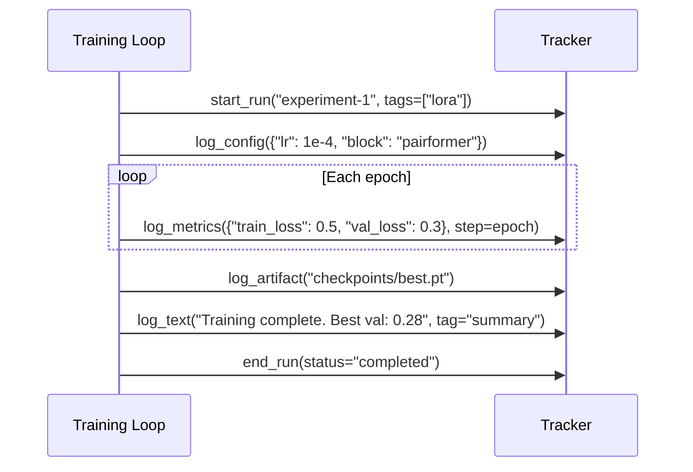

# Adding Trackers

Trackers provide a unified interface for experiment logging. Molfun's training loop, agents, and evaluation scripts all log through the `BaseTracker` interface, which means adding a new tracking backend automatically works everywhere.

## The BaseTracker interface

All trackers inherit from `BaseTracker` in `molfun/tracking/base.py`:

```python
class BaseTracker(ABC):

    @abstractmethod
    def start_run(
        self,
        name: Optional[str] = None,
        tags: Optional[list[str]] = None,
        config: Optional[dict] = None,
    ) -> None:
        """Start a new tracked run/experiment."""

    @abstractmethod
    def log_metrics(self, metrics: dict, step: Optional[int] = None) -> None:
        """Log scalar metrics (loss, accuracy, etc.)."""

    @abstractmethod
    def log_config(self, config: dict) -> None:
        """Log hyperparameters / experiment configuration."""

    @abstractmethod
    def log_artifact(self, path: str, name: Optional[str] = None) -> None:
        """Log a file artifact (checkpoint, plot, etc.)."""

    @abstractmethod
    def log_text(self, text: str, tag: str = "log") -> None:
        """Log free-form text (agent reasoning, summaries, etc.)."""

    @abstractmethod
    def end_run(self, status: str = "completed") -> None:
        """End the current run."""

    # Context manager support (calls end_run on exit)
    def __enter__(self): return self
    def __exit__(self, *args): self.end_run(status="completed")
```

### Lifecycle



## Built-in implementations

| Tracker | Backend |
|---------|---------|
| `WandbTracker` | Weights & Biases |
| `CometTracker` | Comet ML |
| `MLflowTracker` | MLflow |
| `LangfuseTracker` | Langfuse (for agent tracing) |

## Example: Slack Notification Tracker

Let's build a tracker that sends Slack messages at key moments: run start, periodic metric summaries, and run completion. This is useful as a lightweight notification layer on top of a primary tracker.

### Step 1: Create the tracker file

Create `molfun/tracking/slack.py`:

```python
"""
Slack notification tracker.

Sends formatted messages to a Slack channel via webhook at key
training events. Designed to be used alongside a primary tracker
(e.g., WandbTracker) via CompositeTracker.
"""

from __future__ import annotations
from typing import Optional
import json
import urllib.request

from molfun.tracking.base import BaseTracker


class SlackTracker(BaseTracker):
    """
    Sends training notifications to Slack via incoming webhook.

    Args:
        webhook_url: Slack incoming webhook URL.
        channel: Optional channel override (uses webhook default if None).
        notify_every: Send metric updates every N steps (0 = only start/end).
        username: Bot username shown in Slack.
    """

    def __init__(
        self,
        webhook_url: str,
        channel: Optional[str] = None,
        notify_every: int = 0,
        username: str = "Molfun Bot",
    ):
        self.webhook_url = webhook_url
        self.channel = channel
        self.notify_every = notify_every
        self.username = username

        self._run_name: Optional[str] = None
        self._step_count = 0
        self._best_val: Optional[float] = None

    def _send(self, text: str) -> None:
        """Send a message to Slack via webhook."""
        payload = {"text": text, "username": self.username}
        if self.channel:
            payload["channel"] = self.channel

        data = json.dumps(payload).encode("utf-8")
        req = urllib.request.Request(
            self.webhook_url,
            data=data,
            headers={"Content-Type": "application/json"},
        )
        try:
            urllib.request.urlopen(req, timeout=5)
        except Exception:
            # Don't let Slack failures break training
            pass

    def start_run(
        self,
        name: Optional[str] = None,
        tags: Optional[list[str]] = None,
        config: Optional[dict] = None,
    ) -> None:
        self._run_name = name or "unnamed"
        self._step_count = 0
        self._best_val = None

        tag_str = f" [{', '.join(tags)}]" if tags else ""
        self._send(f":rocket: *Training started:* `{self._run_name}`{tag_str}")

    def log_metrics(self, metrics: dict, step: Optional[int] = None) -> None:
        self._step_count += 1

        # Track best validation loss
        val_loss = metrics.get("val_loss")
        if val_loss is not None:
            if self._best_val is None or val_loss < self._best_val:
                self._best_val = val_loss

        # Send periodic updates
        if self.notify_every > 0 and self._step_count % self.notify_every == 0:
            lines = [f"*`{self._run_name}`* - Step {step or self._step_count}"]
            for k, v in sorted(metrics.items()):
                if isinstance(v, float):
                    lines.append(f"  {k}: `{v:.4f}`")
                else:
                    lines.append(f"  {k}: `{v}`")
            self._send("\n".join(lines))

    def log_config(self, config: dict) -> None:
        # Config is typically verbose; just note that it was logged
        n_params = len(config)
        self._send(
            f":gear: *Config logged* for `{self._run_name}` ({n_params} parameters)"
        )

    def log_artifact(self, path: str, name: Optional[str] = None) -> None:
        display = name or path.split("/")[-1]
        self._send(f":package: *Artifact saved:* `{display}` ({self._run_name})")

    def log_text(self, text: str, tag: str = "log") -> None:
        self._send(f":memo: *[{tag}]* {text}")

    def end_run(self, status: str = "completed") -> None:
        emoji = ":white_check_mark:" if status == "completed" else ":x:"
        best = f" | Best val: `{self._best_val:.4f}`" if self._best_val else ""
        self._send(
            f"{emoji} *Training {status}:* `{self._run_name}`{best}"
        )
```

### Step 2: Export from the tracking package

Add to `molfun/tracking/__init__.py`:

```python
from molfun.tracking.slack import SlackTracker  # noqa: F401
```

## Testing

Create `tests/tracking/test_slack.py`:

```python
import pytest
from unittest.mock import patch, MagicMock

from molfun.tracking.slack import SlackTracker


class TestSlackTracker:

    @pytest.fixture
    def tracker(self):
        return SlackTracker(
            webhook_url="https://hooks.slack.com/test",
            notify_every=2,
        )

    def test_implements_interface(self, tracker):
        """Has all required BaseTracker methods."""
        assert hasattr(tracker, "start_run")
        assert hasattr(tracker, "log_metrics")
        assert hasattr(tracker, "log_config")
        assert hasattr(tracker, "log_artifact")
        assert hasattr(tracker, "log_text")
        assert hasattr(tracker, "end_run")

    @patch("molfun.tracking.slack.urllib.request.urlopen")
    def test_start_run_sends_message(self, mock_urlopen, tracker):
        tracker.start_run(name="test-run", tags=["lora", "v2"])
        mock_urlopen.assert_called_once()

    @patch("molfun.tracking.slack.urllib.request.urlopen")
    def test_notify_every_controls_frequency(self, mock_urlopen, tracker):
        tracker.start_run(name="test")
        mock_urlopen.reset_mock()

        # notify_every=2: step 1 should NOT send, step 2 should
        tracker.log_metrics({"train_loss": 0.5}, step=1)
        assert mock_urlopen.call_count == 0

        tracker.log_metrics({"train_loss": 0.3}, step=2)
        assert mock_urlopen.call_count == 1

    @patch("molfun.tracking.slack.urllib.request.urlopen")
    def test_end_run_includes_best_val(self, mock_urlopen, tracker):
        tracker.start_run(name="test")
        tracker.log_metrics({"val_loss": 0.5}, step=1)
        tracker.log_metrics({"val_loss": 0.3}, step=2)
        tracker.log_metrics({"val_loss": 0.4}, step=3)
        tracker.end_run(status="completed")

        # Best val should be 0.3
        assert tracker._best_val == 0.3

    @patch("molfun.tracking.slack.urllib.request.urlopen")
    def test_context_manager(self, mock_urlopen, tracker):
        with tracker:
            tracker.start_run(name="ctx-test")
        # __exit__ calls end_run
        # At least 2 calls: start_run + end_run
        assert mock_urlopen.call_count >= 2

    @patch("molfun.tracking.slack.urllib.request.urlopen")
    def test_webhook_failure_does_not_raise(self, mock_urlopen, tracker):
        """Slack failures should not crash training."""
        mock_urlopen.side_effect = Exception("Network error")
        # Should not raise
        tracker.start_run(name="test")
        tracker.log_metrics({"loss": 0.5}, step=1)
        tracker.end_run()
```

Run the tests:

```bash
KMP_DUPLICATE_LIB_OK=TRUE pytest tests/tracking/test_slack.py -v
```

## Integration: Using with CompositeTracker

The typical pattern is to combine your custom tracker with a primary tracker using `CompositeTracker`:

```python
from molfun.tracking.wandb import WandbTracker
from molfun.tracking.slack import SlackTracker
from molfun.tracking.composite import CompositeTracker

tracker = CompositeTracker([
    WandbTracker(project="protein-finetune"),
    SlackTracker(
        webhook_url="https://hooks.slack.com/services/T.../B.../xxx",
        notify_every=5,  # Slack update every 5 epochs
    ),
])

# Use as a single tracker -- both backends receive all events
with tracker:
    tracker.start_run("experiment-42", tags=["progressive", "egnn"])
    strategy.fit(model, train_loader, val_loader, tracker=tracker, epochs=50)
```

### Passing trackers to the training loop

```python
from molfun import MolfunStructureModel
from molfun.training import FullFinetune

model = MolfunStructureModel("openfold")
strategy = FullFinetune(lr=1e-4)

history = strategy.fit(
    model,
    train_loader,
    val_loader,
    epochs=20,
    tracker=tracker,  # any BaseTracker implementation
)
```
