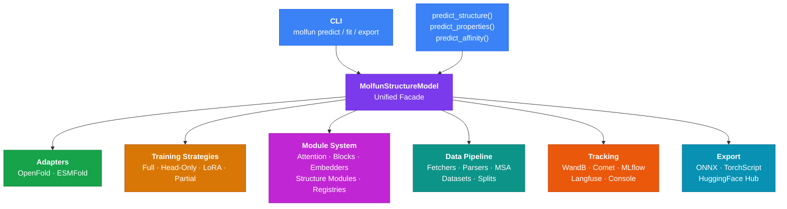

<div class="md-hero" markdown>

# Molfun

**Fine-tune protein structure prediction models with modular, plug-and-play architecture.**
Swap attention heads, plug in LoRA adapters, track experiments, and export to production
--- all from a single unified API.

<div class="hero-buttons">
  <a href="getting-started/index.md" class="primary">Get Started</a>
  <a href="https://github.com/rubencr14/molfun" class="secondary">GitHub</a>
</div>

</div>

<div class="section-header" markdown>

## Why Molfun?

Everything you need to fine-tune and deploy protein structure models, in one framework.

</div>

<div class="feature-grid" markdown>

<div class="feature-card" markdown>
<span class="feature-icon">:material-strategy:</span>

### Training Strategies

Four interchangeable fine-tuning strategies out of the box: **Full**, **Head-Only**, **LoRA**, and **Partial**.
Swap strategies in one line without touching the training loop.
</div>

<div class="feature-card" markdown>
<span class="feature-icon">:material-puzzle:</span>

### Modular Architecture

Type-safe registries for attention modules, blocks, embedders, and structure modules.
Build custom architectures with `ModelBuilder` or hot-swap components at runtime.
</div>

<div class="feature-card" markdown>
<span class="feature-icon">:material-database:</span>

### Data Pipeline

Fetch structures from RCSB PDB, parse PDB/mmCIF/A3M/FASTA/SDF/MOL2 files,
generate MSAs, and load affinity data --- all through a consistent, composable API.
</div>

<div class="feature-card" markdown>
<span class="feature-icon">:material-chart-line:</span>

### Experiment Tracking

First-class integrations with **WandB**, **Comet**, **MLflow**, **Langfuse**, and **HuggingFace**.
Or use `CompositeTracker` to log to multiple backends simultaneously.
</div>

<div class="feature-card" markdown>
<span class="feature-icon">:material-lightning-bolt:</span>

### Triton Kernels

GPU-accelerated RMSD computation (**800x** speedup) and contact map generation (**45x** speedup)
via custom Triton kernels. Automatic fallback to CPU when no GPU is available.
</div>

<div class="feature-card" markdown>
<span class="feature-icon">:material-export:</span>

### Production Export

Export trained models to **ONNX** or **TorchScript** for deployment.
Push and pull models from the **HuggingFace Hub** with a single method call.
</div>

</div>

---

<div class="section-header" markdown>

## Quick Start

Get up and running in minutes.

</div>

!!! tip "Install Molfun"

    ```bash
    pip install molfun
    ```

=== "Predict"

    Predict the 3D structure of a protein from its amino acid sequence:

    ```python
    from molfun import MolfunStructureModel

    model = MolfunStructureModel(backend="openfold")
    output = model.predict(sequence="MKFLILLFNILCLFPVLAADNH...")

    # Access coordinates, pLDDT scores, and predicted aligned error
    coords = output.atom_positions       # (N_residues, 37, 3)
    plddt = output.plddt                 # (N_residues,)
    ```

=== "Fine-tune"

    Fine-tune a pretrained model on your own dataset with LoRA:

    ```python
    from molfun import MolfunStructureModel

    model = MolfunStructureModel(backend="openfold")

    model.fit(
        train_dataset=my_dataset,
        strategy="lora",          # or "full", "head_only", "partial"
        lora_rank=8,
        epochs=10,
        lr=1e-4,
        tracker="wandb",          # experiment tracking
    )

    # Export for deployment
    model.export("onnx", path="model.onnx")
    ```

=== "Custom Architecture"

    Build a model with custom components using the module registry:

    ```python
    from molfun.modules import ModelBuilder, ATTENTION_REGISTRY

    # Register a custom attention module (or use built-in ones)
    model = (
        ModelBuilder(backend="openfold")
        .set_attention("flash_attention")
        .set_block("evoformer_v2")
        .set_embedder("esm2")
        .set_structure_module("invariant_point")
        .build()
    )

    # Wrap it for training
    from molfun import MolfunStructureModel

    molfun_model = MolfunStructureModel(model=model)
    molfun_model.fit(train_dataset=my_dataset, strategy="full")
    ```

---

<div class="section-header" markdown>

## Architecture Overview

How the pieces fit together.

</div>



---

<div class="section-header" markdown>

## Who Is This For?

</div>

<div class="feature-grid" markdown>

<div class="feature-card" markdown>
<span class="feature-icon">:material-microscope:</span>

### Computational Biologists

Use **high-level convenience functions** to predict protein structures, stability, and binding affinity
without writing training loops. Fetch data directly from RCSB PDB and run inference with pretrained models.
</div>

<div class="feature-card" markdown>
<span class="feature-icon">:material-cog:</span>

### ML Engineers

Leverage the **modular architecture** to swap model components, apply PEFT techniques like LoRA,
export to ONNX/TorchScript, and integrate with your existing MLOps stack via WandB, MLflow, or Comet.
</div>

<div class="feature-card" markdown>
<span class="feature-icon">:material-flask:</span>

### Researchers

Extend the framework with **custom attention modules**, novel loss functions, or entirely new backends.
The registry-based plugin system and strategy pattern make it straightforward to experiment with new ideas.
</div>

</div>

!!! info "Ready to dive in?"

    Head over to the **[Getting Started guide](getting-started/index.md)** to install Molfun and make your first prediction,
    or explore the **[Architecture overview](architecture/overview.md)** to understand how the system is designed.
