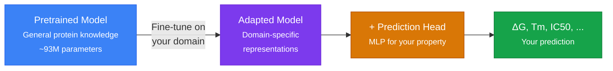
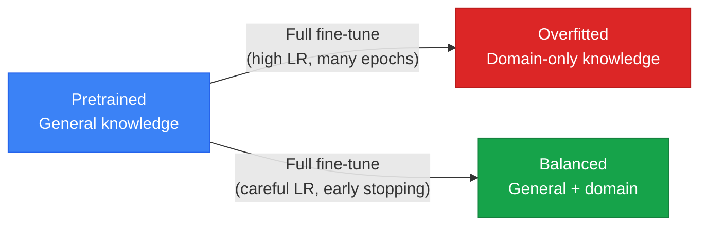
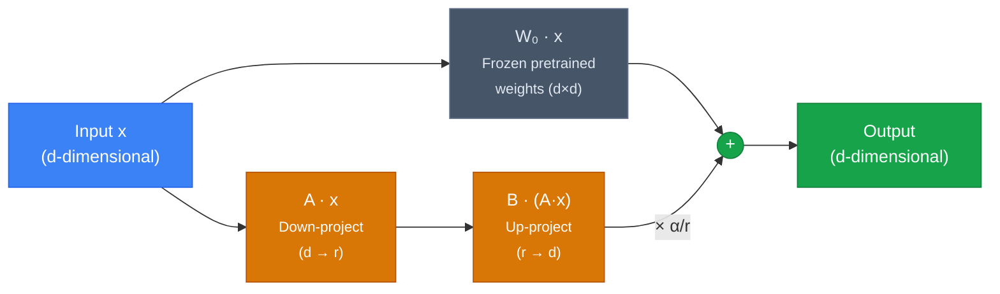
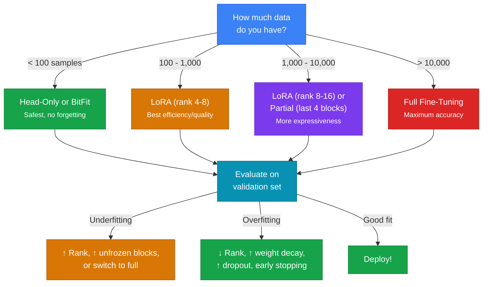
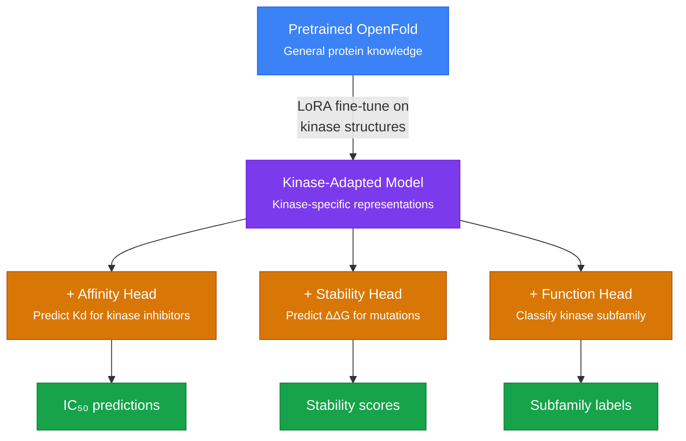

# Fine-Tuning Methods

A pretrained protein structure model (AlphaFold2 / OpenFold) has learned
general-purpose representations from hundreds of thousands of proteins. But
if you care about a **specific protein family** (kinases, antibodies, ion
channels) or a **specific property** (binding affinity, thermostability),
fine-tuning adapts those representations to your domain.

This page covers the full spectrum of fine-tuning approaches, from updating
every parameter to injecting tiny low-rank adapters, with the mathematical
foundations you need to make informed decisions.

---

## Why Fine-Tune?



The pretrained trunk encodes rich per-residue and pairwise features. But
these features were optimized for *structure prediction*, not for predicting
binding affinity or classifying enzyme function. Fine-tuning shifts the
representations so they become more informative for your downstream task.

!!! example "Analogy"

    Imagine a photographer who has mastered composition, lighting, and color
    theory (the pretrained model). You want them to specialize in
    astrophotography (your domain). You do not teach them photography from
    scratch --- you build on their existing skills and add domain-specific
    knowledge about long exposures, star trackers, and light pollution.
    That is fine-tuning.

---

## 1. Full Fine-Tuning

### How It Works

All parameters in the model are unfrozen and updated by gradient descent.
This gives the optimizer maximum freedom to adapt the model.

```python
from molfun.training import FullFinetune

strategy = FullFinetune(
    lr=1e-5,               # Small LR to preserve pretrained knowledge
    weight_decay=0.01,
    warmup_steps=500,
    lr_decay_factor=0.95,  # Layer-wise LR decay
)
```

### Layer-wise Learning Rate Decay

A critical technique for full fine-tuning: earlier layers (closer to the
input) receive a **smaller learning rate** than later layers. This preserves
the low-level features learned during pretraining while allowing the
high-level features to adapt more aggressively.

$$
\text{lr}_l = \text{lr}_{\text{base}} \times \lambda^{L - l}
$$

where $l$ is the layer index, $L$ is the total number of layers, and
$\lambda \in (0, 1)$ is the decay factor (typically 0.9--0.95).

```
Layer 48 (top):     lr = 1e-5
Layer 47:           lr = 1e-5 × 0.95 = 9.5e-6
Layer 46:           lr = 1e-5 × 0.95² = 9.0e-6
...
Layer 1 (bottom):   lr = 1e-5 × 0.95⁴⁷ = 8.8e-7
```

### Catastrophic Forgetting

The main risk of full fine-tuning is **catastrophic forgetting**: the model
overwrites its general-purpose protein knowledge with domain-specific
patterns, losing its ability to generalize.



**Mitigations:**

| Technique | How it helps |
|---|---|
| **Low learning rate** (1e-5 to 5e-6) | Limits the magnitude of weight updates |
| **Layer-wise LR decay** | Protects early layers more |
| **Warmup** (500--1000 steps) | Prevents large updates before the optimizer stabilizes |
| **EMA** (Exponential Moving Average) | Maintains a smoothed copy of weights |
| **Early stopping** | Stops training before overfitting |
| **Weight decay** (0.01--0.1) | Regularizes by penalizing large weights |

### When to Use Full Fine-Tuning

- Large dataset (> 10,000 proteins)
- Significant distribution shift from pretraining data
- Compute budget is not a concern
- You need maximum accuracy

---

## 2. Partial Fine-Tuning (Freezing)

### How It Works

**Freeze** the earlier layers of the model and only update the last $N$
blocks. This drastically reduces the number of trainable parameters and
the risk of catastrophic forgetting.

```python
from molfun.training import PartialFinetune

strategy = PartialFinetune(
    n_unfrozen_blocks=4,   # Only update last 4 of 48 Evoformer blocks
    lr=5e-5,
    warmup_steps=200,
)
```

### Why It Works

The early Evoformer blocks learn **low-level features** (local amino acid
context, secondary structure patterns) that are largely universal across
proteins. The later blocks learn **high-level features** (global contacts,
domain-specific patterns) that benefit most from adaptation.

```
Blocks 1-44:  FROZEN   (low-level, universal features)
Blocks 45-48: TRAINABLE (high-level, task-specific features)
Head:         TRAINABLE
```

### Trainable Parameters

| Configuration | Trainable params | % of total |
|---|---|---|
| Full fine-tune | ~93M | 100% |
| Last 8 blocks | ~15M | 16% |
| Last 4 blocks | ~7.5M | 8% |
| Last 1 block | ~1.9M | 2% |
| Head only | ~0.1--1M | < 1% |

### When to Use Partial Fine-Tuning

- Medium dataset (1,000--10,000 proteins)
- Moderate distribution shift
- Limited GPU memory
- Good balance of quality and efficiency

---

## 3. Head-Only Fine-Tuning

The simplest approach: freeze the entire trunk and only train a
**new prediction head** (MLP, linear layer) on top of the frozen
representations.

```python
from molfun.training import HeadOnlyFinetune

strategy = HeadOnlyFinetune(
    lr=1e-3,           # Higher LR since only head is trained
    weight_decay=0.01,
)
```

The trunk acts as a fixed feature extractor. This is fast and safe (no risk
of forgetting), but the representations may not be optimal for your task.

### When to Use

- Small dataset (< 500 proteins)
- Quick experiments
- The pretrained representations are already close to what you need

---

## 4. LoRA (Low-Rank Adaptation)

### The Core Idea

Instead of updating the full weight matrices, LoRA **freezes** all
pretrained weights and injects small, trainable **low-rank matrices** into
the attention layers. This achieves adaptation with a tiny fraction of the
parameters.

For a pretrained weight matrix $W_0 \in \mathbb{R}^{d \times d}$, LoRA
adds a low-rank update:

$$
W = W_0 + \Delta W = W_0 + B \cdot A
$$

where:

- $A \in \mathbb{R}^{r \times d}$ (down-projection)
- $B \in \mathbb{R}^{d \times r}$ (up-projection)
- $r \ll d$ is the **rank** (typically 4--16)



### Initialization

The initialization is asymmetric and critical for stable training:

- **Matrix A**: Initialized from a Gaussian distribution $\mathcal{N}(0, \sigma^2)$
- **Matrix B**: Initialized to **zeros**

This means $\Delta W = B \cdot A = 0$ at the start of training --- the
model begins *exactly* where the pretrained model left off. Training
then gradually learns a task-specific perturbation.

### Down-Projection and Up-Projection

The two matrices serve complementary roles:

| Matrix | Shape | Role | Intuition |
|---|---|---|---|
| **A** (down-projection) | $r \times d$ | Compress the input to a low-dimensional bottleneck | Find the $r$ most important directions for the task |
| **B** (up-projection) | $d \times r$ | Expand back to the original dimension | Map the task-specific signal back to the model's space |

The bottleneck rank $r$ controls the **expressiveness** of the adaptation.
A rank of 8 means the model can only modify the weight matrix along 8
directions --- but for domain adaptation, this is often sufficient because
the change from general proteins to a specific family is low-rank in nature.

### Scaling Factor: Alpha and Rank

The LoRA output is scaled by $\alpha / r$ before being added to the
pretrained output:

$$
h = W_0 x + \frac{\alpha}{r} B A x
$$

| Parameter | Typical values | Effect |
|---|---|---|
| **Rank** ($r$) | 4, 8, 16, 32 | Higher = more expressive but more parameters |
| **Alpha** ($\alpha$) | $r$, $2r$, 16, 32 | Higher = stronger adaptation signal |
| **Effective scaling** ($\alpha / r$) | 1.0, 2.0 | The actual multiplier on the LoRA output |

!!! tip "Best practices for rank and alpha"

    - **Start with rank 8, alpha 16** (effective scaling = 2.0). This is a
      robust default that works well across many tasks.
    - **Increase rank** if you see underfitting (training loss plateaus
      high). Try 16 or 32.
    - **Decrease rank** if you see overfitting on small datasets. Try 4.
    - **Alpha = 2 × rank** is a common heuristic. The scaling factor
      $\alpha / r = 2$ provides a good balance between adaptation strength
      and stability.
    - **Apply LoRA to all attention projections** (Q, K, V, and output).
      Research shows this consistently outperforms applying it to Q and V
      only.

### Parameter Efficiency

For an attention layer with $d = 256$ and 4 projections (Q, K, V, O):

| Method | Trainable params per layer | Total (48 layers) |
|---|---|---|
| Full fine-tune | $4 \times 256 \times 256 = 262\text{K}$ | 12.6M |
| LoRA (r=8) | $4 \times 2 \times 256 \times 8 = 16\text{K}$ | 786K |
| LoRA (r=4) | $4 \times 2 \times 256 \times 4 = 8\text{K}$ | 393K |

LoRA reduces trainable parameters by **16--32x** while retaining
90--95% of full fine-tuning quality.

### Merging

After training, the LoRA matrices can be **merged** back into the
pretrained weights for zero-overhead inference:

$$
W_{\text{merged}} = W_0 + \frac{\alpha}{r} B A
$$

```python
model.merge()    # Fold LoRA into base weights
model.save("merged_model/")  # No adapter overhead at inference
```

```python
from molfun.training import LoRAFinetune

strategy = LoRAFinetune(
    rank=8,
    alpha=16.0,
    lr_lora=1e-4,
    lr_head=1e-3,
    warmup_steps=100,
    ema_decay=0.999,
)
```

---

## 5. QLoRA (Quantized LoRA)

QLoRA combines LoRA with **4-bit quantization** of the base model weights,
enabling fine-tuning of large models on consumer GPUs.

### How It Works

1. **Quantize** the pretrained weights to 4-bit NormalFloat (NF4) format
2. **Freeze** the quantized weights
3. **Add LoRA adapters** in full precision (bfloat16) on top
4. During the forward pass, **dequantize** on the fly and add the LoRA
   contribution

$$
h = \text{dequant}(W_0^{\text{4bit}}) \cdot x + \frac{\alpha}{r} B A x
$$

### Key Innovations

| Innovation | Description |
|---|---|
| **4-bit NormalFloat (NF4)** | An information-theoretically optimal data type for normally distributed weights. Quantizes values into quantiles, minimizing information loss. |
| **Double quantization** | Quantizes the quantization constants themselves, saving ~0.5 bits per parameter. |
| **Paged optimizers** | Uses CPU memory as overflow when GPU memory is exhausted, preventing OOM crashes. |

### Memory Comparison

| Method | VRAM for 93M param model |
|---|---|
| Full fine-tune (fp32) | ~1.4 GB |
| Full fine-tune (fp16) | ~0.7 GB |
| LoRA (fp16) | ~0.7 GB (base) + ~3 MB (adapters) |
| QLoRA (NF4) | ~0.18 GB (base) + ~3 MB (adapters) |

!!! note "When to use QLoRA"

    QLoRA shines for very large models where even storing the base weights
    in fp16 is challenging. For protein models (~93M params), the memory
    savings are less dramatic than for LLMs (~7B+ params), but QLoRA can
    still be useful when running on limited hardware or when training
    multiple adapters simultaneously.

---

## 6. IA3 (Infused Adapter by Inhibiting and Amplifying Inner Activations)

IA3 is an even more parameter-efficient method than LoRA. Instead of
adding low-rank matrices, it learns **element-wise scaling vectors** that
modulate the model's activations.

### How It Works

For keys, values, and feed-forward layers, IA3 introduces a learned vector
$\ell \in \mathbb{R}^d$ that scales the output element-wise:

$$
h_{\text{keys}} = \ell_k \odot W_k x \qquad
h_{\text{values}} = \ell_v \odot W_v x \qquad
h_{\text{ffn}} = \ell_{ff} \odot f(W_{ff} x)
$$

where $\odot$ is element-wise multiplication and $\ell$ is initialized
to **ones** (so the model starts identical to the pretrained version).

### Comparison with LoRA

| Aspect | LoRA (r=8) | IA3 |
|---|---|---|
| Trainable params per layer | ~16K | ~768 (3 vectors of 256) |
| Total trainable params (48 layers) | ~786K | ~37K |
| Expressiveness | Can change the *direction* of transformations | Can only *scale* existing directions |
| Best for | Moderate distribution shift | Minimal distribution shift, extremely small datasets |

```python
from molfun.training.peft import MolfunPEFT

peft = MolfunPEFT.ia3(
    target_modules=["linear_q", "linear_v"],
    feedforward_modules=["ffn"],
)
adapted_model = peft.apply(model)
```

---

## 7. BitFit (Bias-Term Fine-Tuning)

BitFit fine-tunes **only the bias terms** in the model, leaving all weight
matrices frozen.

### How It Works

Every linear layer $y = Wx + b$ has a bias vector $b$. BitFit freezes $W$
and only updates $b$. Since bias vectors are much smaller than weight
matrices, this is extremely parameter-efficient.

### Parameter Count

For a linear layer with input $d_{\text{in}}$ and output $d_{\text{out}}$:

- Weight matrix: $d_{\text{in}} \times d_{\text{out}}$ parameters (frozen)
- Bias vector: $d_{\text{out}}$ parameters (trainable)

This means BitFit trains roughly $1/d_{\text{in}}$ of the parameters
compared to full fine-tuning --- typically **< 0.1%** of the total.

### When It Works

BitFit is surprisingly effective for small distribution shifts, especially
in NLP tasks. For protein models, it can work well when:

- Your domain is close to the pretraining distribution
- You have a very small dataset (< 100 samples)
- You want the absolute minimum risk of overfitting

However, for larger distribution shifts (e.g., from general proteins to
a specific enzyme family), LoRA typically outperforms BitFit.

---

## 8. Practical Training Techniques

These techniques apply across all fine-tuning strategies and are essential
for achieving good results.

### 8.1 Warmup

Gradually increase the learning rate from 0 to the target value over the
first $N$ steps. This prevents large, destructive updates when the
optimizer is still cold.

$$
\text{lr}(t) = \text{lr}_{\text{target}} \cdot \min\!\left(1, \frac{t}{T_{\text{warmup}}}\right)
$$

!!! tip "Warmup rule of thumb"

    Use 5--10% of total training steps for warmup. For 10 epochs of 100
    batches = 1000 steps, warmup for 50--100 steps.

### 8.2 EMA (Exponential Moving Average)

Maintain a **shadow copy** of the model weights that is updated as a
running average:

$$
\theta_{\text{EMA}}^{(t)} = \alpha \cdot \theta_{\text{EMA}}^{(t-1)} + (1 - \alpha) \cdot \theta^{(t)}
$$

where $\alpha$ is the decay rate (typically 0.999 or 0.9999). The EMA
weights are used for evaluation and often produce smoother, more
generalizable predictions than the raw training weights.

### 8.3 Cosine Learning Rate Schedule

After warmup, the learning rate follows a cosine decay:

$$
\text{lr}(t) = \text{lr}_{\min} + \frac{1}{2}(\text{lr}_{\text{max}} - \text{lr}_{\min})\left(1 + \cos\!\left(\frac{\pi t}{T}\right)\right)
$$

This provides a smooth annealing that empirically works better than step
decay for fine-tuning.

### 8.4 Gradient Clipping

Clip gradient norms to prevent training instability:

$$
\hat{g} = g \cdot \min\!\left(1, \frac{c}{\|g\|}\right)
$$

where $c$ is the clipping threshold (typically 1.0). This is particularly
important for full fine-tuning where large gradients can destroy pretrained
features.

### 8.5 Mixed Precision (AMP)

Train with **automatic mixed precision** (float16 forward pass, float32
for loss and optimizer state) to halve memory usage and increase
throughput. All Molfun strategies support this via `amp=True`.

---

## 9. Decision Guide



### Strategy Comparison Table

| Strategy | Trainable Params | Memory | Risk of Forgetting | Best Dataset Size | Training Speed |
|---|---|---|---|---|---|
| **Head-Only** | < 1% | Lowest | None | < 500 | Fastest |
| **BitFit** | < 0.1% | Lowest | Very low | < 100 | Fastest |
| **IA3** | ~0.04% | Low | Very low | < 500 | Fast |
| **LoRA** (r=8) | ~1% | Low | Low | 100--10K | Fast |
| **QLoRA** (r=8) | ~1% (4-bit base) | Lowest | Low | 100--10K | Moderate |
| **Partial** (4 blocks) | ~8% | Medium | Moderate | 1K--10K | Moderate |
| **Full** | 100% | Highest | High | > 10K | Slowest |

---

## 10. The Big Picture: Domain Adaptation + Custom Heads

The real power of fine-tuning in Molfun comes from combining domain
adaptation with custom prediction heads:



1. **Start** with a pretrained model that understands protein structure
2. **Fine-tune** on your domain (kinases, antibodies, GPCRs) using LoRA
   or partial fine-tuning, so the representations become domain-aware
3. **Add a head** for your specific property (affinity, stability, function)
4. **Train the head** on labeled data --- the domain-adapted representations
   make this dramatically more effective than training from scratch

This is exactly the workflow that Boltz-2 follows for binding affinity,
and it is the core pattern that Molfun makes accessible through a simple,
unified API.

---

## References

- Hu, E. J., et al. (2022). [LoRA: Low-Rank Adaptation of Large Language Models](https://arxiv.org/abs/2106.09685). *ICLR 2022*.
- Dettmers, T., et al. (2023). [QLoRA: Efficient Finetuning of Quantized Language Models](https://arxiv.org/abs/2305.14314). *NeurIPS 2023*.
- Liu, H., et al. (2022). [Few-Shot Parameter-Efficient Fine-Tuning is Better and Cheaper than In-Context Learning](https://arxiv.org/abs/2205.05638). *NeurIPS 2022*. (IA3)
- Zaken, E. B., et al. (2022). [BitFit: Simple Parameter-efficient Fine-tuning for Transformer-based Masked Language-models](https://arxiv.org/abs/2106.10199). *ACL 2022*.
- Wohlwend, J., et al. (2025). [Boltz-2: Towards Accurate and Efficient Binding Affinity Prediction](https://www.biorxiv.org/content/10.1101/2025.06.14.659707v1). *bioRxiv*.
