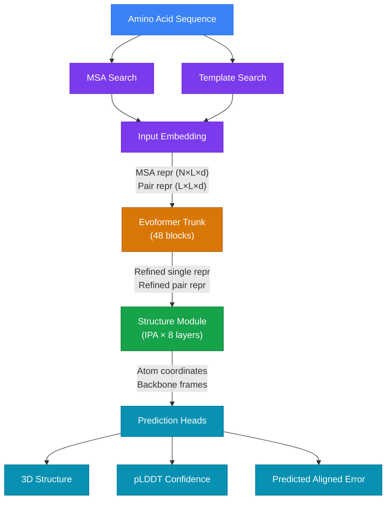
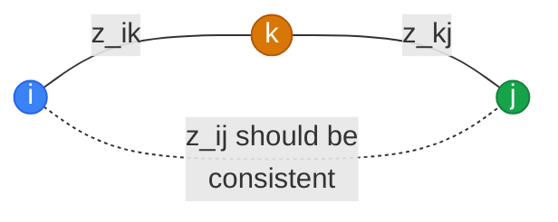
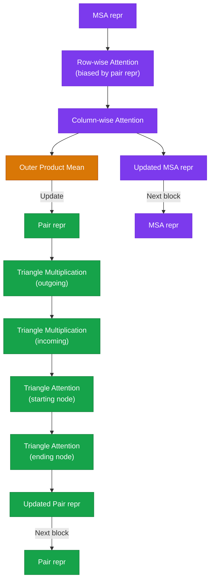

# Protein Structure Prediction

This page explains the core architecture behind AlphaFold2 and OpenFold --- the
models that Molfun wraps and fine-tunes. We cover every major component, from
input processing to 3D coordinate generation, so you can understand *what* you
are fine-tuning and *why* each piece matters.

---

## The Problem

A protein is a chain of amino acids (typically 20 types) that folds into a
specific 3D shape. That shape determines what the protein *does*: catalyze
reactions, bind drugs, transmit signals. Predicting the 3D structure from
the amino acid sequence alone --- the **protein folding problem** --- was one
of the grand challenges in biology until AlphaFold2 largely solved it in 2020.

---

## High-Level Architecture



---

## 1. Multiple Sequence Alignments (MSAs)

### What is an MSA?

A **Multiple Sequence Alignment** is a table where each row is a protein
sequence that is evolutionarily related to the target sequence, and columns
are aligned so that corresponding residues line up.

```
Target:   M K F L I L L F N I L C L G ...
Homolog1: M K F L I L L F N V L C L G ...
Homolog2: M K Y L I L L F N I L C L G ...
Homolog3: M R F L V L L F N I L C L G ...
          ↑               ↑
        conserved       variable
```

### Why MSAs matter

Proteins that share a common ancestor tend to preserve key structural
contacts across evolution. If positions *i* and *j* mutate in a correlated
way (when *i* changes, *j* tends to change too), they are likely in
physical contact in the 3D structure. This **coevolutionary signal** is
the single most powerful input for structure prediction.

!!! info "Coevolution captures 3D contacts"

    If residue 12 and residue 87 always mutate together across thousands
    of species, the model infers they are spatially close. This transforms
    a 1D sequence problem into a 2D contact prediction problem, which is
    much easier to solve.

MSAs are typically generated by searching sequence databases (UniRef,
BFD, MGnify) using tools like **JackHMMER** or **MMseqs2**. In Molfun,
the `MSAProvider` handles this via the ColabFold API or precomputed files.

---

## 2. Input Representations

The model maintains **two parallel representations** throughout its
computation:

| Representation | Shape | What it captures |
|---|---|---|
| **MSA representation** | `(N, L, d_msa)` | Per-residue features for each of the N sequences in the alignment |
| **Pair representation** | `(L, L, d_pair)` | Pairwise relationship between every pair of residues (i, j) |

where `N` is the number of MSA sequences, `L` is the sequence length, and
`d_msa` / `d_pair` are embedding dimensions (typically 256 and 128).

The **input embedder** initializes these representations from:

- **One-hot amino acid encoding** (21 classes including gap)
- **Positional encoding** (relative residue indices)
- **MSA features** (sequence profile, deletion counts)
- **Template features** (optional: backbone coordinates from known homologs)

---

## 3. The Evoformer Trunk

The Evoformer is the heart of the model. It is a stack of 48 identical blocks,
each containing operations that **refine the MSA and pair representations**
by exchanging information between them. Think of it as an iterative message-passing
system where evolutionary (MSA) and spatial (pair) signals inform each other.

### 3.1 MSA Row-wise Attention

Each row of the MSA is a different evolutionary sequence. **Row-wise attention**
applies self-attention *independently within each sequence*, allowing the
model to identify which pairs of residues are related.

```
MSA row i:  [res₁, res₂, ..., resₗ]  →  Self-Attention  →  [res₁', res₂', ..., resₗ']
```

The key innovation: the attention weights are **biased by the pair
representation**. Each pair entry $z_{ij}$ is projected to a scalar and
added to the attention logit between positions $i$ and $j$:

$$
\text{Attention}(Q, K, V) = \text{softmax}\!\left(\frac{QK^T}{\sqrt{d_k}} + \text{bias}(z_{ij})\right) V
$$

This means the pair representation directly tells the MSA attention
*how much* residue $i$ should attend to residue $j$. No information is
shared across different sequences at this stage --- each row is processed
independently.

!!! note "Gated self-attention"

    All attention operations in the Evoformer use **gating**: an additional
    linear projection produces a sigmoid gate $g$ that element-wise multiplies
    the attention output. This helps the model control information flow
    and stabilizes training.

### 3.2 MSA Column-wise Attention

**Column-wise attention** operates across the evolutionary dimension:
for a given residue position $i$, it applies attention across all $N$
sequences in the MSA.

```
MSA column j: [seq₁[j], seq₂[j], ..., seqₙ[j]]  →  Self-Attention  →  [seq₁'[j], seq₂'[j], ...]
```

This allows the model to determine **which sequences are most informative**
for a particular position. If sequence 47 has an unusual mutation at
position $j$, the model can up-weight or down-weight it relative to the
other sequences.

### 3.3 Outer Product Mean: MSA → Pair

The **outer product mean** is the critical bridge that transfers
evolutionary information from the MSA into the pair representation. For
each pair of residue positions $(i, j)$:

1. Take the MSA representations at positions $i$ and $j$ for every
   sequence: $m_{s,i}$ and $m_{s,j}$
2. Compute the outer product $m_{s,i} \otimes m_{s,j}$ for each sequence $s$
3. Average across all $N$ sequences
4. Project the result back down and add it to $z_{ij}$

$$
z_{ij} \mathrel{+}= \text{Linear}\!\left(\frac{1}{N}\sum_{s=1}^{N} m_{s,i} \otimes m_{s,j}\right)
$$

!!! tip "The key insight"

    This is the **only point in the model** where information is shared
    across evolutionary sequences. If residues $i$ and $j$ coevolve
    (their MSA columns are correlated), the outer product will be large,
    enriching the pair representation with a strong spatial signal.

### 3.4 Pair Representation Updates: Triangle Operations

The pair representation $z_{ij}$ is a 2D matrix encoding pairwise
relationships. It is updated through **triangle operations** motivated by
a geometric insight: if residue $i$ is close to $k$, and $k$ is close to
$j$, then $i$ should be somewhat close to $j$ (triangle inequality).



There are four triangle operations per Evoformer block:

| Operation | Update rule | Intuition |
|---|---|---|
| **Triangle Multiplication (outgoing)** | $z_{ij} \leftarrow \sum_k a_{ik} \odot b_{jk}$ | Row $i$ and row $j$ agree on column $k$ |
| **Triangle Multiplication (incoming)** | $z_{ij} \leftarrow \sum_k a_{ki} \odot b_{kj}$ | Column $i$ and column $j$ agree on row $k$ |
| **Triangle Attention (starting node)** | Attention over $k$ for fixed row $i$, biased by $z_{jk}$ | |
| **Triangle Attention (ending node)** | Attention over $k$ for fixed column $j$, biased by $z_{ik}$ | |

Here $a$ and $b$ are linear projections of $z$, and $\odot$ is
element-wise multiplication. A gating projection $g$ controls the output.

These operations enforce **transitive consistency**: the pairwise
distance information refines itself at every layer, becoming more
physically plausible.

### 3.5 Evoformer Summary

Each of the 48 Evoformer blocks runs the following sequence:



After 48 blocks, the first row of the MSA (corresponding to the target
sequence) becomes the **single representation** `(L, d_single)`, and the
pair representation `(L, L, d_pair)` encodes a rich distance/contact map.

---

## 4. The Structure Module: Invariant Point Attention (IPA)

The structure module converts the refined representations into **3D atomic
coordinates**. This is where geometry enters the model.

### 4.1 Backbone Frames

Each residue is assigned a **local reference frame** (also called a rigid
body or rigid frame), defined by a rotation matrix $R_i \in SO(3)$ and a
translation vector $\vec{t}_i \in \mathbb{R}^3$:

$$
T_i = (R_i, \vec{t}_i)
$$

These frames are initialized as identity transforms and iteratively refined
over 8 layers of IPA. Each frame defines a local coordinate system centered
on the residue's $C_\alpha$ atom.

### 4.2 How IPA Works

Invariant Point Attention extends standard attention with **3D point
queries and keys** that are computed in each residue's local frame and
then transformed to the global frame for comparison:

$$
\text{IPA}(s, z, T) = \text{softmax}\!\left(\frac{1}{\sqrt{d_k}} q_i^T k_j
+ \text{bias}(z_{ij})
- \gamma \sum_p \| T_i \circ \vec{q}_{i,p} - T_j \circ \vec{k}_{j,p} \|^2
\right) v_j
$$

Where:

- $q_i, k_j, v_j$ are standard attention queries, keys, and values from the
  single representation
- $z_{ij}$ provides pair bias (just like in the Evoformer)
- $\vec{q}_{i,p}$ and $\vec{k}_{j,p}$ are **3D point queries/keys** predicted
  in the local frame of each residue
- $T_i \circ \vec{q}_{i,p}$ transforms the point from local frame $i$ to
  global coordinates: $R_i \vec{q}_{i,p} + \vec{t}_i$
- $\gamma$ is a learned weight

!!! info "SE(3) Invariance"

    The key property is **SE(3) invariance**: if you rotate and translate the
    entire protein, the attention weights and output do not change. This is
    because the distance $\|T_i \circ \vec{q} - T_j \circ \vec{k}\|$ is
    invariant to global rigid motions. The model learns to reason about
    *relative* geometry, not absolute positions.

### 4.3 Frame Update

After each IPA layer, the frames are updated using a predicted rotation
and translation update:

$$
T_i^{(l+1)} = T_i^{(l)} \circ \Delta T_i^{(l)}
$$

where $\Delta T_i^{(l)} = (\Delta R_i, \Delta \vec{t}_i)$ is predicted
from the updated single representation. The composition $\circ$ applies
the update in the current local frame, ensuring equivariance.

Over 8 layers, the frames converge from identity to the predicted backbone
geometry. The final atom positions ($C_\alpha$, $C$, $N$, $O$, and all
side-chain atoms) are computed from these frames using known bond geometries.

### 4.4 Local Frame to Global Frame

The transformation from local to global coordinates follows:

$$
\vec{x}_{\text{global}} = R_i \cdot \vec{x}_{\text{local}} + \vec{t}_i
$$

This means each residue predicts its atoms in its own local coordinate
system (where the $C_\alpha$--$N$ bond always points the same way), and the
frame parameters place them correctly in 3D space. This decomposition makes
the problem much easier: the model only needs to predict *rotations* and
*translations*, not absolute coordinates.

---

## 5. AlphaFold3: The Diffusion Approach

AlphaFold3 (2024) replaced IPA with a **diffusion-based structure module**,
representing a fundamental shift in approach.

### 5.1 What Changed

| Aspect | AlphaFold2 (IPA) | AlphaFold3 (Diffusion) |
|---|---|---|
| **Equivariance** | Built into the architecture (SE(3)-invariant attention) | Learned through data augmentation (random rotations/translations) |
| **Trunk** | Evoformer (MSA + pair) | Pairformer (pair only, MSA processed separately) |
| **Structure generation** | Iterative frame refinement (8 layers) | Denoising diffusion over atom clouds |
| **Output** | Backbone frames → side chains | All-atom coordinates directly |
| **Scope** | Proteins only | Proteins, nucleic acids, ligands, ions |

### 5.2 Pairformer vs Evoformer

AlphaFold3 replaces the Evoformer with the **Pairformer**, which only
operates on the pair representation (no MSA track). The MSA information
is distilled into the pair representation in a preprocessing step, and
the Pairformer then refines it with the same triangle operations.

This is simpler and more memory-efficient, and avoids the $O(N \times L)$
cost of processing deep MSAs.

### 5.3 How Diffusion Works

Instead of iterative frame refinement, AlphaFold3 frames the problem as
**denoising**:

1. **Forward process**: During training, add Gaussian noise to the true
   atom coordinates at a random noise level $t$
2. **Denoiser**: A neural network predicts the clean coordinates from
   the noisy ones, conditioned on the pair representation from the
   Pairformer
3. **Reverse process**: At inference, start from pure noise and
   iteratively denoise, gradually revealing the structure

$$
\hat{x}_0 = f_\theta(x_t, t, z_{\text{pair}})
$$

The denoiser applies random rotations and translations as **data
augmentation** during training, which teaches the network SE(3)
equivariance *implicitly* rather than encoding it in the architecture.
This is simpler than IPA but requires more training data.

!!! note "All-atom generation"

    A major advantage of diffusion is that it generates **all atom**
    positions simultaneously (including ligands, nucleic acids, and ions),
    rather than predicting backbone frames and then adding side chains.
    This is what allows AlphaFold3 to handle protein-ligand and
    protein-DNA complexes natively.

---

## 6. Prediction Heads

After the structure module produces coordinates, several **prediction
heads** extract useful quantities from the representations.

### 6.1 pLDDT (predicted Local Distance Difference Test)

The pLDDT head predicts the **local confidence** of each residue's
predicted position, scored from 0 to 100:

- A linear layer projects the single representation to 50 bins
- Softmax produces a probability distribution over distance error bins
- The expected lDDT is computed as a weighted sum

$$
\text{pLDDT}_i = \sum_{b=1}^{50} p_{i,b} \cdot \text{lDDT}_b
$$

| pLDDT Score | Interpretation |
|---|---|
| > 90 | Very high confidence (typically correct backbone and side chains) |
| 70--90 | Confident backbone (side chains may be less accurate) |
| 50--70 | Low confidence (possibly flexible or disordered region) |
| < 50 | Very low confidence (likely disordered / no stable structure) |

### 6.2 PAE (Predicted Aligned Error)

The PAE head predicts the **expected positional error** for residue $j$
when the prediction is aligned on residue $i$. It operates on the pair
representation:

$$
\text{PAE}_{ij} = \text{Linear}(z_{ij}) \rightarrow 64 \text{ bins (0--31 Å)}
$$

PAE is crucial for assessing **domain boundaries** and **interface quality**
in multimeric predictions.

### 6.3 Distogram Head

The distogram head predicts the distribution of $C_\beta$--$C_\beta$
distances for every pair of residues. It operates on the pair
representation and outputs 64 bins covering 2--22 Å. This was the
original output in earlier AlphaFold versions and is still used as an
auxiliary loss during training.

### 6.4 Custom Prediction Heads

This is where Molfun's fine-tuning story becomes powerful. The
representations learned by the trunk contain rich information about
protein function, not just structure. By adding **custom heads** on top
of the single or pair representation, you can predict:

| Property | Head Architecture | Input |
|---|---|---|
| **Binding affinity** (ΔG) | MLP on pooled single repr | Single representation |
| **Thermostability** (ΔΔG) | MLP on pooled single repr | Single representation |
| **Protein-protein interface** | MLP on pair repr at interface | Pair representation |
| **Function classification** | Linear on [CLS]-like pooled repr | Single representation |
| **Per-residue properties** | Per-token MLP | Single representation |

#### How Boltz-2 Does It

[Boltz-2](https://www.biorxiv.org/content/10.1101/2025.06.14.659707v1)
is a recent example of adding a binding affinity head to a structure
prediction model:

1. The single and pairwise representations from the Pairformer trunk
   are passed to an **affinity module**
2. The affinity module consists of a further distance-conditioned
   Pairformer stack (4--8 layers)
3. Cross-pair pooling aggregates information across the interface
4. MLP readouts predict the binding affinity (ΔG in kcal/mol)

In Molfun, the same pattern is available through the `head="affinity"`
option:

```python
from molfun import MolfunStructureModel

model = MolfunStructureModel.from_pretrained(
    "openfold",
    head="affinity",
    head_config={"single_dim": 384, "hidden_dim": 128},
)
```

The trunk learns general protein representations, and the head
specializes them for your task. This is exactly why fine-tuning on a
specific protein domain (kinases, antibodies, GPCRs) and then adding
a property head is so effective: the trunk adapts its representations
to your domain, and the head reads off the signal.

---

## 7. Connecting Theory to Molfun

Understanding the architecture helps you make better fine-tuning
decisions:

| What you want | What to fine-tune | Why |
|---|---|---|
| Better structures for your domain | Evoformer blocks (partial or LoRA) | The trunk learns domain-specific coevolutionary patterns |
| Property prediction (ΔG, Tm) | Freeze trunk, train head only | The pretrained representations already encode rich information |
| Both structure + properties | LoRA on trunk + train head | Best of both worlds with minimal overfitting |
| Novel architecture research | Custom blocks via ModelBuilder | Replace Evoformer blocks with Pairformer, axial attention, etc. |

!!! tip "The representations are the key"

    The single representation after the Evoformer encodes a per-residue
    "summary" of evolutionary, structural, and functional information.
    The pair representation encodes all pairwise relationships. These
    representations are what make fine-tuning so powerful: even a small
    head trained on top of them can predict complex properties, because
    the trunk has already done the hard work of understanding the protein.

---

## References

- Jumper, J., et al. (2021). [Highly accurate protein structure prediction with AlphaFold](https://www.nature.com/articles/s41586-021-03819-2). *Nature*, 596, 583--589.
- Abramson, J., et al. (2024). [Accurate structure prediction of biomolecular interactions with AlphaFold 3](https://www.nature.com/articles/s41586-024-07487-w). *Nature*, 630, 493--500.
- Ahdritz, G., et al. (2022). [OpenFold: Retraining AlphaFold2 yields new insights into its learning mechanisms and capacity for generalization](https://www.nature.com/articles/s41592-024-02272-z). *Nature Methods*.
- Wohlwend, J., et al. (2025). [Boltz-2: Towards Accurate and Efficient Binding Affinity Prediction](https://www.biorxiv.org/content/10.1101/2025.06.14.659707v1). *bioRxiv*.
- Simon, E. (2024). [The Illustrated AlphaFold](https://elanapearl.github.io/blog/2024/the-illustrated-alphafold/).
