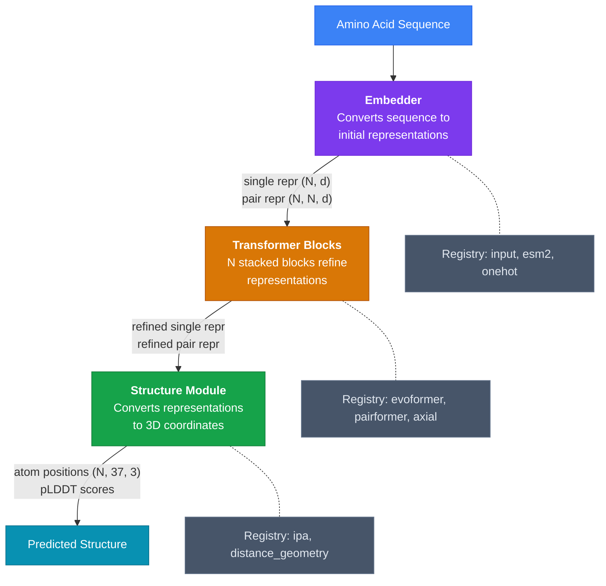
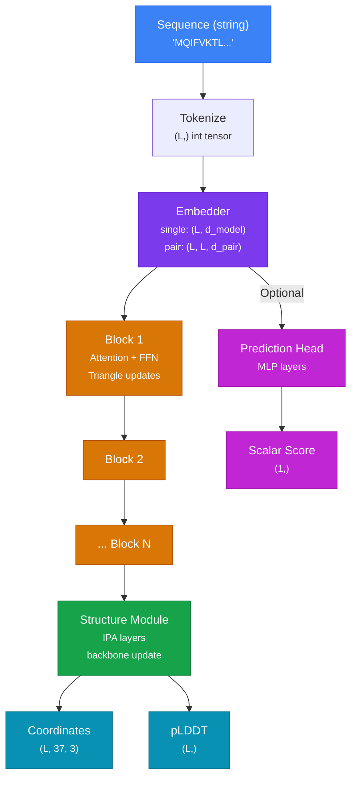

# Building Custom Architectures

<span class="badge badge-advanced">Advanced</span> &nbsp; ~45 min

Molfun's modular architecture lets you compose models from interchangeable components.
In this tutorial you will use `ModelBuilder` to assemble a custom model with specific
embedders, transformer blocks, and structure modules, then train it on a structure
prediction task.

---

## What You Will Learn

- Use `ModelBuilder` to compose a model from registry components
- Understand the data flow through a structure prediction model
- Configure custom embedder, block, and structure module parameters
- Train a custom model with `MolfunStructureModel.from_custom()`
- Combine custom architectures with any fine-tuning strategy

## Prerequisites

- Molfun installed: `pip install molfun`
- Familiarity with protein structure prediction concepts
- GPU with at least 16 GB memory recommended

---

## Architecture Overview

A Molfun structure model is composed of four stages. Each stage is a pluggable component
from the module registry.



---

## Step 1: Explore Available Components

Before building, inspect what components are available in each registry.

```python
from molfun.modules import (
    ATTENTION_REGISTRY,
    BLOCK_REGISTRY,
    EMBEDDER_REGISTRY,
    STRUCTURE_MODULE_REGISTRY,
)

print("Attention modules:", list(ATTENTION_REGISTRY.keys()))
print("Block types:      ", list(BLOCK_REGISTRY.keys()))
print("Embedders:        ", list(EMBEDDER_REGISTRY.keys()))
print("Structure modules:", list(STRUCTURE_MODULE_REGISTRY.keys()))
```

??? example "Expected output"

    ```
    Attention modules: ['standard', 'flash_attention', 'linear', 'gated']
    Block types:       ['evoformer', 'pairformer', 'axial']
    Embedders:         ['input', 'esm2', 'onehot']
    Structure modules: ['ipa', 'distance_geometry']
    ```

---

## Step 2: Build a Model with ModelBuilder

`ModelBuilder` provides a fluent API to compose a model from these components.

```python
from molfun.modules import ModelBuilder

adapter = ModelBuilder(
    embedder="input",                # (1)!
    block="pairformer",              # (2)!
    n_blocks=8,                      # (3)!
    structure_module="ipa",          # (4)!
    embedder_config={
        "d_model": 256,
        "max_seq_len": 512,
    },
    block_config={
        "d_model": 256,
        "d_pair": 128,
        "n_heads": 8,
        "dropout": 0.1,
    },
).build()
```

1. **Embedder**: `"input"` is the standard learned embedding. Use `"esm2"` to initialize
   from ESM-2 pretrained weights.
2. **Block**: `"pairformer"` processes both single and pair representations with row/column
   attention and triangular updates. Alternative: `"evoformer"` (AlphaFold2 style).
3. **n_blocks**: Number of stacked transformer blocks. More blocks = more capacity but
   more memory. 8 is a good default.
4. **Structure module**: `"ipa"` (Invariant Point Attention) converts representations to
   3D coordinates using SE(3)-equivariant operations.

---

## Step 3: Wrap with MolfunStructureModel

Use `from_custom()` to wrap your built adapter in the standard `MolfunStructureModel`
interface, which gives you access to `fit()`, `predict()`, `save()`, and all other
methods.

```python
from molfun import MolfunStructureModel

model = MolfunStructureModel.from_custom(
    adapter=adapter,
    device="cuda",
    head="affinity",                  # Optional: attach a prediction head
    head_config={
        "hidden_dim": 256,
        "num_layers": 2,
        "dropout": 0.1,
    },
)

# Check parameter count
total_params = sum(p.numel() for p in model.parameters())
trainable_params = sum(p.numel() for p in model.parameters() if p.requires_grad)
print(f"Total params:     {total_params:,}")
print(f"Trainable params: {trainable_params:,}")
```

---

## Step 4: Alternative Configurations

Here are some example configurations for different use cases.

=== "Lightweight (fast iteration)"

    ```python
    adapter = ModelBuilder(
        embedder="onehot",
        block="pairformer",
        n_blocks=4,               # Fewer blocks
        structure_module="ipa",
        embedder_config={"d_model": 128},
        block_config={
            "d_model": 128,
            "d_pair": 64,
            "n_heads": 4,
            "dropout": 0.15,
        },
    ).build()
    ```

=== "ESM2-initialized (transfer learning)"

    ```python
    adapter = ModelBuilder(
        embedder="esm2",          # Start from ESM-2 weights
        block="evoformer",        # AlphaFold2-style blocks
        n_blocks=8,
        structure_module="ipa",
        embedder_config={
            "d_model": 320,       # Match ESM-2 hidden dim
            "esm_model": "esm2_t6_8M_UR50D",
        },
        block_config={
            "d_model": 320,
            "d_pair": 128,
            "n_heads": 8,
            "dropout": 0.1,
        },
    ).build()
    ```

=== "High capacity"

    ```python
    adapter = ModelBuilder(
        embedder="input",
        block="pairformer",
        n_blocks=12,              # More blocks
        structure_module="ipa",
        embedder_config={"d_model": 512},
        block_config={
            "d_model": 512,       # Wider
            "d_pair": 256,
            "n_heads": 16,
            "dropout": 0.05,
        },
    ).build()
    ```

---

## Step 5: Train the Custom Model

Once wrapped in `MolfunStructureModel`, your custom model works with all training
strategies and data utilities.

```python
from molfun.data import StructureDataset, DataSplitter, PDBFetcher
from molfun.training import FullFinetune
from torch.utils.data import DataLoader

# Fetch training data
fetcher = PDBFetcher()
structures = fetcher.fetch(
    pdb_ids=["1ubq", "1crn", "2gb1", "1l2y", "3nir"],  # Example PDB IDs
    include_sequences=True,
    include_coordinates=True,
)

dataset = StructureDataset(
    sequences=[s.sequence for s in structures],
    structures=[s.coordinates for s in structures],
    max_length=512,
)

splitter = DataSplitter(test_size=0.2, random_state=42)
train_ds, val_ds = splitter.split(dataset)

train_loader = DataLoader(train_ds, batch_size=2, shuffle=True)
val_loader = DataLoader(val_ds, batch_size=2)

# Train with full fine-tune (custom models are randomly initialized)
strategy = FullFinetune(
    lr=1e-4,
    weight_decay=0.01,
    warmup_steps=500,
    lr_decay_factor=0.95,
)

model.fit(
    train_loader=train_loader,
    val_loader=val_loader,
    strategy=strategy,
    epochs=50,
    checkpoint_dir="checkpoints/custom_model",
)
```

!!! warning "Training from scratch"

    Custom models built with `ModelBuilder` are **randomly initialized** (unless using
    `"esm2"` embedder). They require significantly more data and epochs to converge
    compared to fine-tuning a pretrained model. For most practical tasks, start with
    `from_pretrained()` and use a fine-tuning strategy.

---

## Step 6: Run Inference

```python
import torch

model.eval()
with torch.no_grad():
    output = model.predict("MQIFVKTLTGKTITLEVEPS...")

    print(f"Atom positions shape: {output.atom_positions.shape}")
    print(f"Mean pLDDT: {output.plddt.mean():.1f}")
```

---

## Data Flow Reference

A detailed view of tensor shapes flowing through the model:



---

## Full Script

??? abstract "Complete runnable code"

    ```python
    """Build and train a custom architecture with ModelBuilder."""
    import torch
    from torch.utils.data import DataLoader

    from molfun import MolfunStructureModel
    from molfun.modules import ModelBuilder
    from molfun.data import StructureDataset, DataSplitter, PDBFetcher
    from molfun.training import FullFinetune

    # ── Build Custom Model ────────────────────────────────
    adapter = ModelBuilder(
        embedder="input",
        block="pairformer",
        n_blocks=8,
        structure_module="ipa",
        embedder_config={"d_model": 256, "max_seq_len": 512},
        block_config={
            "d_model": 256, "d_pair": 128,
            "n_heads": 8, "dropout": 0.1,
        },
    ).build()

    model = MolfunStructureModel.from_custom(
        adapter=adapter,
        device="cuda",
    )

    # ── Data ──────────────────────────────────────────────
    fetcher = PDBFetcher()
    structures = fetcher.fetch(
        pdb_ids=["1ubq", "1crn", "2gb1", "1l2y", "3nir"],
        include_sequences=True,
        include_coordinates=True,
    )

    dataset = StructureDataset(
        sequences=[s.sequence for s in structures],
        structures=[s.coordinates for s in structures],
        max_length=512,
    )

    splitter = DataSplitter(test_size=0.2, random_state=42)
    train_ds, val_ds = splitter.split(dataset)

    train_loader = DataLoader(train_ds, batch_size=2, shuffle=True)
    val_loader = DataLoader(val_ds, batch_size=2)

    # ── Train ─────────────────────────────────────────────
    strategy = FullFinetune(
        lr=1e-4, weight_decay=0.01,
        warmup_steps=500, lr_decay_factor=0.95,
    )

    model.fit(
        train_loader=train_loader,
        val_loader=val_loader,
        strategy=strategy,
        epochs=50,
        checkpoint_dir="checkpoints/custom_model",
    )

    # ── Inference ─────────────────────────────────────────
    model.eval()
    with torch.no_grad():
        output = model.predict("MQIFVKTLTGKTITLEVEPS")
        print(f"Coordinates: {output.atom_positions.shape}")
        print(f"Mean pLDDT:  {output.plddt.mean():.1f}")

    model.save("models/custom_pairformer_ipa")
    ```

---

## Next Steps

- **New to the module system?** Read the [Module System](../architecture/module-system.md)
  architecture guide for the full registry API.
- **Want to add your own module?** See [Extending: Attention](../extending/attention.md)
  or [Extending: Blocks](../extending/blocks.md).
- **Automate architecture search?** Combine with [YAML Pipelines](yaml-pipelines.md) to
  define multiple configurations as recipes.
