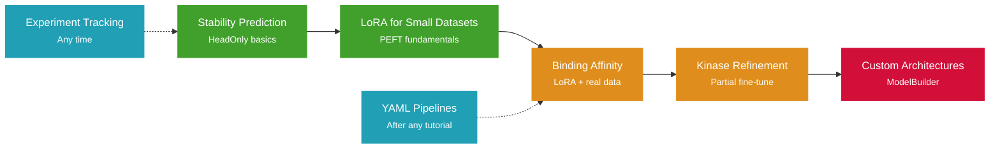

# Tutorials

Hands-on guides that walk you through real-world protein modeling tasks with Molfun.
Each tutorial is self-contained and includes runnable code.

---

:material-thermometer:{ .lg } **[Stability Prediction](stability-prediction.md)**
{ .tutorial-card-title }

Predict protein thermostability from sequence using a **HeadOnly** fine-tuning strategy. Load a CSV of sequences with stability labels, train, and evaluate with a scatter plot.

Beginner ~20 min

:material-link-variant:{ .lg } **[Binding Affinity Prediction](binding-affinity.md)**
{ .tutorial-card-title }

Fetch PDBbind affinity data, apply **LoRA** fine-tuning, and predict binding affinity (Kd/Ki). Compare LoRA against full fine-tuning on a real benchmark.

Intermediate ~30 min

:material-dna:{ .lg } **[Kinase Structure Refinement](kinase-refinement.md)**
{ .tutorial-card-title }

Use the built-in `kinases_human` collection with **PartialFinetune** to refine predicted kinase structures using FAPE loss and evaluate structural quality.

Intermediate ~30 min

:material-scale-balance:{ .lg } **[LoRA for Small Datasets](lora-small-datasets.md)**
{ .tutorial-card-title }

When you only have ~50 proteins, full fine-tuning overfits. Learn when to use **LoRA** vs **HeadOnly**, compare overfitting curves, and tune rank and alpha.

Beginner ~15 min

:material-puzzle-edit:{ .lg } **[Building Custom Architectures](custom-architectures.md)**
{ .tutorial-card-title }

Compose models from scratch with **ModelBuilder**: choose embedders, transformer blocks, and structure modules. Train a fully custom architecture on structure prediction.

Advanced ~45 min

:material-chart-timeline-variant:{ .lg } **[Experiment Tracking](experiment-tracking.md)**
{ .tutorial-card-title }

Set up **WandB**, **Comet**, or **MLflow** tracking in one line. Use `CompositeTracker` to log to multiple backends simultaneously and compare runs.

Beginner ~15 min

:material-pipe:{ .lg } **[YAML Pipelines](yaml-pipelines.md)**
{ .tutorial-card-title }

Define reproducible end-to-end workflows with `Pipeline.from_yaml()`. Fetch data, preprocess, train, and evaluate --- all from a single YAML recipe file.

Intermediate ~20 min

---

## Learning Path

If you are new to Molfun, we recommend following the tutorials in this order:

!!! tip "Prerequisites"

    All tutorials assume you have Molfun installed. If you have not done so yet, follow
    the [Installation guide](../getting-started/installation.md) first.
