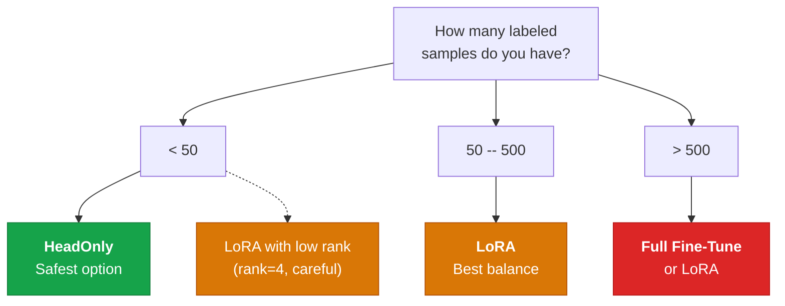

# LoRA for Small Datasets

<span class="badge badge-beginner">Beginner</span> &nbsp; ~15 min

When your dataset is small (fewer than ~100 proteins), full fine-tuning almost always
overfits. This tutorial shows how **LoRA** provides an effective middle ground, compares
it side-by-side with HeadOnly, and gives practical guidelines for choosing rank and alpha.

---

## What You Will Learn

- When to use LoRA vs HeadOnly vs Full fine-tuning
- Run a side-by-side comparison on a small dataset (~50 proteins)
- Use `MolfunPEFT.lora()` with different ranks
- Interpret overfitting curves
- Practical guidelines for rank and alpha selection

---

## When to Use Which Strategy



!!! summary "Rule of thumb"

    | Dataset size | Recommended strategy | Why |
    |:------------:|---------------------|-----|
    | < 50 | HeadOnly | Prevents overfitting; trunk stays frozen |
    | 50 -- 200 | LoRA (rank 4--8) | Adapts trunk with minimal parameters |
    | 200 -- 1000 | LoRA (rank 8--16) | More capacity, still efficient |
    | > 1000 | Full or LoRA (rank 16+) | Enough data to support full updates |

---

## Step 1: Create a Small Dataset

For this demonstration, we will simulate a small labeled dataset of 50 proteins.

```python
import pandas as pd
from molfun.data import StructureDataset, DataSplitter
from torch.utils.data import DataLoader

# Load a small dataset (50 proteins with activity labels)
df = pd.read_csv("small_activity_data.csv")  # 50 rows
print(f"Dataset size: {len(df)} proteins")

dataset = StructureDataset(
    sequences=df["sequence"].tolist(),
    labels=df["activity"].values,
    max_length=512,
)

splitter = DataSplitter(test_size=0.3, random_state=42)  # (1)!
train_ds, val_ds = splitter.split(dataset)

train_loader = DataLoader(train_ds, batch_size=4, shuffle=True)
val_loader = DataLoader(val_ds, batch_size=4)

print(f"Train: {len(train_ds)} | Val: {len(val_ds)}")
```

1. With only 50 samples, we use a larger validation fraction (30%) to get a more
   reliable estimate of generalization performance.

---

## Step 2: Compare HeadOnly vs LoRA

Let us train both strategies on the same data and compare their learning curves.

=== "HeadOnly"

    ```python
    from molfun import MolfunStructureModel
    from molfun.training import HeadOnlyFinetune

    head_model = MolfunStructureModel.from_pretrained(
        "openfold_v1", device="cuda",
        head="affinity",
        head_config={"hidden_dim": 128, "num_layers": 2, "dropout": 0.2},
    )

    head_strategy = HeadOnlyFinetune(lr=1e-3, weight_decay=1e-3)

    head_model.fit(
        train_loader=train_loader,
        val_loader=val_loader,
        strategy=head_strategy,
        epochs=30,
    )
    ```

=== "LoRA (rank=4)"

    ```python
    from molfun import MolfunStructureModel
    from molfun.training import LoRAFinetune

    lora_model = MolfunStructureModel.from_pretrained(
        "openfold_v1", device="cuda",
        head="affinity",
        head_config={"hidden_dim": 128, "num_layers": 2, "dropout": 0.2},
    )

    lora_strategy = LoRAFinetune(
        rank=4,            # Low rank for small data
        alpha=8.0,         # alpha = 2 * rank is a good default
        lr_lora=5e-5,      # Conservative LR for LoRA
        lr_head=1e-3,
        warmup_steps=50,
    )

    lora_model.fit(
        train_loader=train_loader,
        val_loader=val_loader,
        strategy=lora_strategy,
        epochs=30,
    )
    ```

=== "Full Fine-Tune (overfits!)"

    ```python
    from molfun import MolfunStructureModel
    from molfun.training import FullFinetune

    full_model = MolfunStructureModel.from_pretrained(
        "openfold_v1", device="cuda",
        head="affinity",
        head_config={"hidden_dim": 128, "num_layers": 2, "dropout": 0.2},
    )

    full_strategy = FullFinetune(lr=5e-5, weight_decay=0.01)

    full_model.fit(
        train_loader=train_loader,
        val_loader=val_loader,
        strategy=full_strategy,
        epochs=30,
    )
    ```

---

## Step 3: Interpret the Learning Curves

After training, plot the training and validation loss for each strategy:

```python
import matplotlib.pyplot as plt

fig, axes = plt.subplots(1, 3, figsize=(15, 4), sharey=True)

strategies = [
    ("HeadOnly", head_history),
    ("LoRA (rank=4)", lora_history),
    ("Full Fine-Tune", full_history),
]

for ax, (name, history) in zip(axes, strategies):
    ax.plot(history["train_loss"], label="Train")
    ax.plot(history["val_loss"], label="Validation")
    ax.set_title(name)
    ax.set_xlabel("Epoch")
    ax.legend()

axes[0].set_ylabel("Loss")
plt.suptitle("Learning Curves on 50-Protein Dataset", fontweight="bold")
plt.tight_layout()
plt.savefig("lora_comparison.png", dpi=150)
plt.show()
```

!!! warning "Overfitting with full fine-tuning"

    On a 50-protein dataset, full fine-tuning typically shows:

    - **Training loss** drops to near zero within 5--10 epochs
    - **Validation loss** increases after a few epochs (classic overfitting)
    - The gap between train and val loss grows over time

    LoRA constrains the update space through its low-rank structure, acting as an
    implicit regularizer.

---

## Step 4: Tune LoRA Rank

The rank controls how many parameters LoRA adds. Lower rank = more regularization.

```python
from molfun.peft import MolfunPEFT

# Try different ranks
results = {}
for rank in [2, 4, 8, 16]:
    model = MolfunStructureModel.from_pretrained(
        "openfold_v1", device="cuda",
        head="affinity",
        head_config={"hidden_dim": 128, "num_layers": 2, "dropout": 0.2},
    )

    # Apply LoRA with specific rank
    peft = MolfunPEFT.lora(rank=rank, alpha=rank * 2)  # (1)!

    strategy = LoRAFinetune(
        rank=rank,
        alpha=rank * 2,
        lr_lora=5e-5,
        lr_head=1e-3,
    )

    model.fit(
        train_loader=train_loader,
        val_loader=val_loader,
        strategy=strategy,
        epochs=30,
    )

    results[rank] = model  # Store for evaluation
```

1. A common heuristic is to set `alpha = 2 * rank`. This keeps the effective learning
   rate roughly constant across different rank values.

### Rank Selection Guide

| Rank | Added params | Best for |
|:----:|:-----------:|----------|
| 2 | ~50K | Very small data (< 30 samples), maximum regularization |
| 4 | ~100K | Small data (30--100 samples) |
| 8 | ~200K | Medium data (100--500 samples), general default |
| 16 | ~400K | Larger data (500+), complex tasks |
| 32 | ~800K | Approaching full fine-tune capacity |

---

## Step 5: Alpha Tuning

The alpha parameter scales the LoRA contribution: `output = base_output + (alpha/rank) * lora_output`.

```python
# Compare alpha values with fixed rank=4
for alpha in [4.0, 8.0, 16.0, 32.0]:
    strategy = LoRAFinetune(rank=4, alpha=alpha, lr_lora=5e-5, lr_head=1e-3)
    # ... train and evaluate
```

!!! tip "Alpha guidelines"

    - **`alpha = rank`**: Conservative, smaller updates per step
    - **`alpha = 2 * rank`**: Balanced default (recommended starting point)
    - **`alpha = 4 * rank`**: Aggressive, larger updates --- risk of instability

    If training is unstable (loss spikes), reduce alpha. If learning is too slow,
    increase it.

---

## Summary

??? abstract "Decision checklist"

    Before choosing your strategy, ask:

    - [x] **How many samples?** < 50 favors HeadOnly, 50+ favors LoRA
    - [x] **How different is the target domain?** More different = more capacity needed
    - [x] **GPU budget?** LoRA uses ~3x less memory than full fine-tuning
    - [x] **Do you need to iterate quickly?** LoRA trains faster than full
    - [x] **Deployment constraints?** After `model.merge()`, LoRA adds zero overhead

```python
# The recommended starting configuration for small datasets
from molfun.training import LoRAFinetune

strategy = LoRAFinetune(
    rank=4,            # Start low
    alpha=8.0,         # 2x rank
    lr_lora=5e-5,      # Conservative
    lr_head=1e-3,      # Head can learn faster
    warmup_steps=50,   # Warmup helps stability
    ema_decay=0.999,   # EMA smooths training
)
```

---

## Next Steps

- **Ready for real data?** Apply these techniques to
  [Binding Affinity Prediction](binding-affinity.md).
- **Want to track rank experiments?** Use
  [Experiment Tracking](experiment-tracking.md) to log and compare.
- **Automate the whole thing?** See [YAML Pipelines](yaml-pipelines.md).
